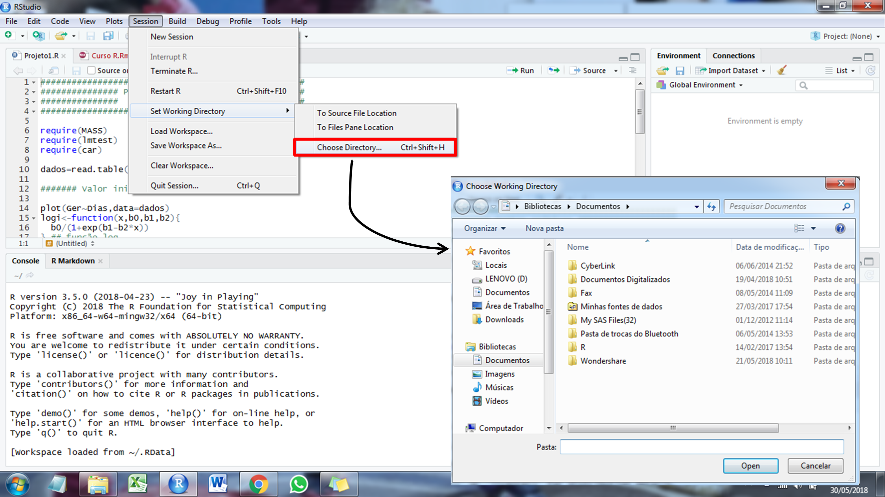
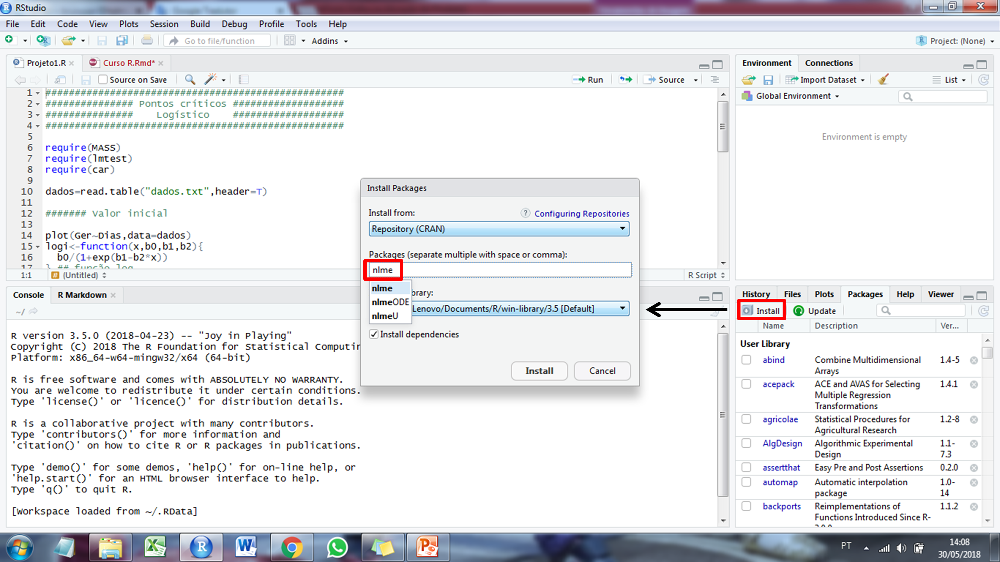
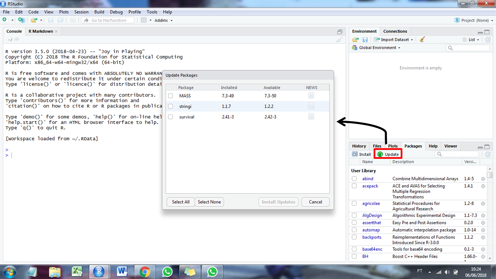

# (PART) Parte I o ambiente R {-}

# Introdução ao ambiente *R* {#intro}
## O software R

O artigo [R: A Language for Data Analysis and Graphics](https://www.jstor.org/stable/1390807?seq=1#page_scan_tab_contents)^[https://www.jstor.org/stable/1390807?seq=1#page_scan_tab_contents] marca o início de uma nova era no processamento e análise de dados: o desenvolvimento do software R. O R é uma linguagem e ambiente estatístico que traz muitas vantagens para o usuário, embora elas não sejam tão obvias inicialmente: (i) o R é um Software Livre (livre no sentido de liberdade) distribuído sob a [Licença Pública Geral](https://www.gnu.org/licenses/quick-guide-gplv3.html)^[https://www.gnu.org/licenses/quick-guide-gplv3.html], podendo ser livremente copiado, distribuído, e instalado em diversos computadores livremente. Isso contrasta com softwares comerciais, que têm licenças altamente restritivas, que não permitem que cópias sejam distribuídas ou instaladas em mais de um computador sem a devida licença (que obviamente é paga!); (ii) a grande maioria dos Softwares livres são grátis, e o R não é uma exceção; (iii) os códigos-fontes R estão disponíveis para os usuários, e atualmente são gerenciados por um grupo chamado [R Development Core Team](https://www.r-project.org/)^[https://www.r-project.org/]. A vantagem de ter o código aberto é que falhas podem ser detectadas e rapidamente corrigidas. Este sistema de revisão depende da participação dos usuários. Em contraste, em muitos pacotes comerciais, as falhas não são corrigidas até o lançamento da próxima versão, o que pode levar vários anos; (iv) o R fornece um interface de entrada por linha de comando (ELC).


No \indt{software} R, todos os comandos são digitados e o mouse é pouco usado. Pode parecer antigo, pouco amigável ou até pobre em recursos visuais, mas isso faz com que nos deparemos com o melhor recurso do R: a sua flexibilidade. Para usuários familiarizados, a linguagem do R se torna clara e simples. Com poucos comandos, funções poderosas podem ser criadas e o usuário é sempre consciente do que foi pedido através da ELC (Meus dados, minhas análises!). Isso contrasta com pacotes que possuem uma interface amigável (Windows-based), mas escondem a dinâmica dos cálculos e, potencialmente, os seus erros. Finalmente, o R fornece uma ampla variedade de procedimentos estatísticos básicos ou que exigem grande esforço computacional (modelagem linear e não linear, testes estatísticos clássicos, análise de séries temporais, classificação, agrupamento, etc.) e recursos gráficos elegantes. Um dos pontos fortes de R é a facilidade com que gráficos de qualidade podem ser produzidos, incluindo símbolos matemáticos e fórmulas, quando necessário. O software R está disponível em uma ampla variedade de plataformas UNIX e sistemas similares (incluindo FreeBSD e Linux), Windows e MacOS.


## O software RStudio
Quem ja é usuário de softwares por linhas de comando, como o SAS, provavelmente não notou nenhuma grande diferença até aqui. Toda análise se resume à seguinte sequência *dados > códigos > saída*. A experiência do usuário com o R, no entanto, pode ser mais atrativa utilizando o [RStudio](https://www.rstudio.com/)^[https://www.rstudio.com/]. O Rstudio é um produto de código aberto disponível publicamente em 28/02/2011 que está disponível gratuitamente. Ele é um ambiente de desenvolvimento integrado para R que inclui (i) janelas de edição de texto a partir das quais o código pode ser enviado para o console e/ou salvo no sistema operacional, (ii) listas de objetos em sua área de trabalho, (iii) histórico infinito dos comandos facilmente pesquisável com capacidade de inserir, a partir do histórico, um comando no console novamente; (iv); interface com o sistema operacional para acesso a arquivos; (v) janela de ajuda com botões de voltar e avançar; (vi) download de pacotes. Apesar de todas estas capacidades, o RStudio é muito fácil de utilizar.

Nesta seção serão abordados alguns aspectos básicos para que o usuário do R possa desenvolver as suas análises. Será dado enfoque para áreas básicas da interface, cujo conhecimento é necessário para que um usuário inicante possa realizar sua primeira análisee. A figura abaixo mostra as principais janelas do **Rstudio**, incluindo o *script*, o *console*, a *"área de trabalho"* e o *output* para gráficos.


Antes de iniciar as análises, recomenda-se escolher um diretório \indt{diretório} onde devem estar os *inputs* (dados) e para onde serão enviados os *outputs* (gráficos, arquivos .txt, .xlsx, etc) \indt{imputs}\indt{outputs}. Para selecionar o diretório, basta seguir o caminho *Session > Set Working Directory > Choosing diretory* ou utilizar as teclas de atalho *Ctrl+Shift+H*.



Posteriormente, um *R Script* é iniciado conforme a figura abaixo ou pelas teclas de atalho *Ctrl+Shift+N*. No canto inferior direito, além de servir como *output* para gráficos (*Plots*), também é o local onde os pacotes utilizados nas análises (*Packages*) são instalados e maiores informações sobre as funções podem ser encontradas (*Help*).

## Meu primeiro script
Se você realizou o download do software R pela primeira vez e achou um tanto quanto "estranho" o pequeno tamanho do arquivo (~80 Mb), provalemente deve ter se perguntado  como um software estatistico tão poderoso pode ser comprimido em um arquivo tão pequeno (pequeno em comparação com os +20 GB do SAS). A resposta é simples, somente os pacote básicos do R são baixados com o arquivo de instalação. Na medida em que o usuário necessita realizar uma análise específica, a instalação de um pacote que contém uma função específica para realizar tal análise é necessária.

A instalação dos pacotes pode ser realizada conforme a figura abaixo, ou através da função `install.packages()`. Após a instalação do pacote, o usuário deve utilizar as funções `require()` ou `library()` \indt{require} \indt{library}para que o pacote seja carregado e as  suas funções possam ser utilizadas. Quando o usuário tenta utilizar uma função pertencente a um determinado pacote e este pacote não está instalado (ou carregado), um erro é exibido.  




Como exemplo inicial, vamos tentar selecionar a variável *Sepal.Length* do conjunto de dados base `iris` utilizando a função abaixo. **Cuidado, spoilers do pacote dplyr!** O primero passo é criar um novo script, seguindo os seguintes passos: *File > New File > R script* ou utilizando o atalho `Ctrl+Shift+N`. Posteriormente, o seguinte código é digitado e executado ao se selecionar a linha do código e clicar no botão *run* ou utilizando o atalho `Ctrl+Enter`).

```{r error=TRUE}
SL = select(iris, Sepal.Length)
```

Neste caso, um erro é exibido pois o pacote **dplyr** não está instalado ou carregado. Caso ele já estiver instalado, a mensagem de erro acima é superada ao carregar o pacote antes de executar a função.

```{r eval=FALSE}
library(dplyr)
SL = select(iris, Sepal.Length)
```

Caso o pacote **dplyr** não esteja instalado, a maneira mais fácil de instalá-lo é instalando a coleção de pacotes [tidyverse](https://www.tidyverse.org/)^[https://www.tidyverse.org/] seguindo os passos da Figura 3 ou utilizando a seguinte função.

```{r eval=FALSE, message=FALSE, warning=FALSE}
install.packages("tidyverse", dependencies = TRUE)
library(tidyverse)
```


```{r eval=TRUE, echo=FALSE, message=FALSE, warning=FALSE}
library(tidyverse)
select = dplyr::select

```

O **tidyverse** é uma coleção de pacotes R projetados para a ciência de dados, contendo, dentre outros, seguintes pacotes que serão utilizados neste material.

* **ggplot2**, para criação de gráficos.
* **dplyr**, para manipulação de dados.
* **tidyr**, para organização de dados.
* **tibble**, para criação de tibbles.

Praticamente todas as rotinas realizadas no R são baseadas em bibliotecas de códigos. Com a manipulaçao de pacotes não seria diferente. O pacote [pacman](https://github.com/trinker/pacman)^[https://github.com/trinker/pacman] é uma ferramenta de gerenciamento de pacotes R que combina a funcionalidade das funções relacionadas à biblioteca base em funções intuitivamente nomeadas, reduzindo o código para executar simultaneamente várias ações. Uma das funções mais úteis do pacote pacman é a `p_load()`\indf{p\_load} (*package load*). Esta função checa se um pacote está instalado e em caso afirmativo, carrega-o como se a função `library()` tivesse sido usada. Caso o pacote não esteja instalado, ela primeiro o instala-rá antes de carregá-lo. Vamos, agora, instalar (para quem está utilizando o R pela primeira vez) ou carregar (para quem já tem instalado) os pacotes utilizados neste material.

```{r, message=FALSE, warning=FALSE}
if (!require("pacman")){
install.packages("pacman")
}
library(pacman)
p_load(hnp, asbio, car, dplyr, devtools, emmeans, effects, multcomp,
       lme4, readxl, ExpDes, manipulate, MASS, tidyverse, agricolae,
       psych, corrplot, pvclust, factoextra, kableExtra, ggfortify)

```

O pacote [metan](https://tiagoolivoto.github.io/metan/)^[https://tiagoolivoto.github.io/metan/] é utilizado neste material e sua instalação é realizada do repositório [GitHub](https://github.com/TiagoOlivoto/metan)^[https://github.com/TiagoOlivoto/metan] utilizando a função `install_github()` do pacote [devtools](https://github.com/r-lib/devtools)^[https://github.com/r-lib/devtools].

```{r, message=FALSE, warning=FALSE, eval=FALSE}
install_github("TiagoOlivoto/metan")
library(metan)
```


```{r, message=FALSE, warning=FALSE, echo=FALSE}

library(metan)
```


Os pacotes disponibilizados no software *R* estão em constante atualização. Utilizando a função `packageStatus()` e `summary(packageStatus())` é possível verificar se os pacotes estão atualizados. Outra forma é ir em *Packages > Update* que se encontra no canto inferior direito conforme demonstrado na Figura 5. Por fim, para citar os pacotes \indt{pacotes}, recomenda-se verificar a referência através da função `citation()`. \indt{citação de pacotes} \indt{atualização}




```{r, echo = TRUE, eval = TRUE, message = FALSE, warning = FALSE, error = FALSE}
citation("metan")
```


