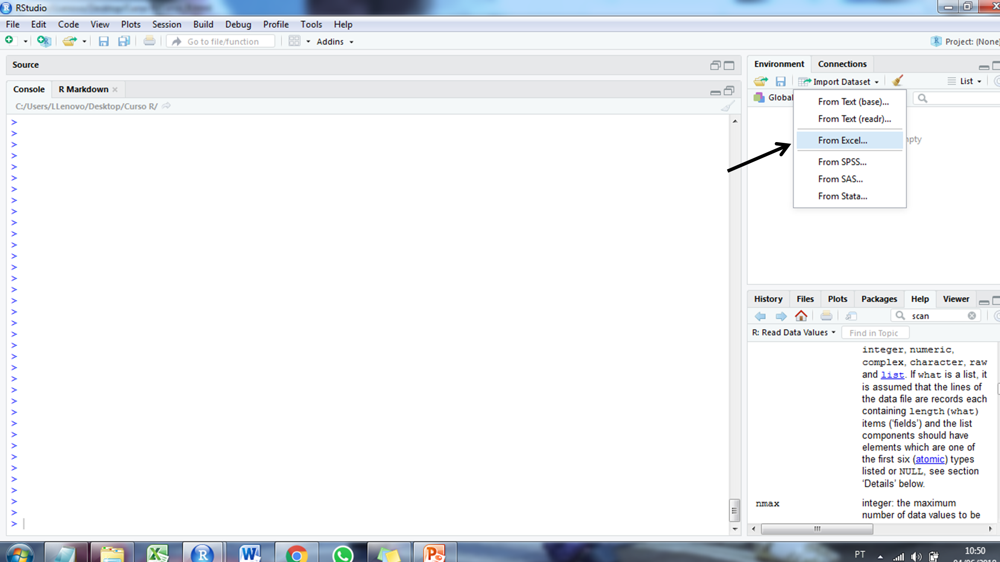
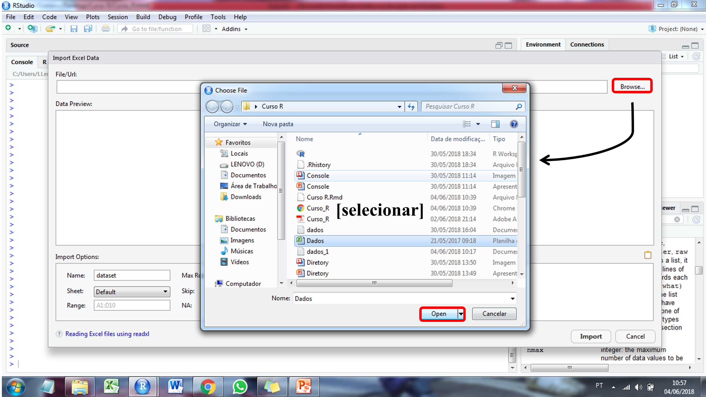
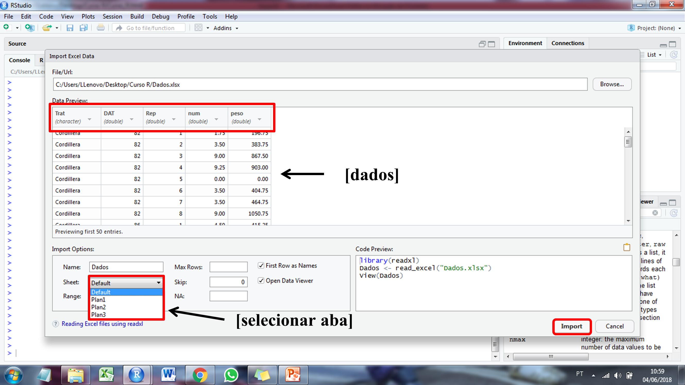

# (PART) Organização, manipulação e apresentação de dados {-}

# Entrada de dados {#entrada} 

A entrada de dados pode ser feita de várias maneiras, e em vários formatos. Porém daremos destaque as formas mais comuns. A forma mais simples (e mais trabalhosa) é digitar os dados diretamente no *console*, utilizando para isso a função `scan()`. \indf{scan} Para importar dados digitados em extensão *.txt* utiliza-se a função `read.table()`. \indt{read.table} Por fim, para carregar arquivos em extensão *.xlsx* a maneira mais simples é utilizar o *Import Dataset* que encontra-se na área de trabalho.

```{r echo = TRUE, eval = FALSE, message = FALSE, warning = FALSE}
data <- scan() #Enter
1: 10
2: 20
3: 30
4: 40
5: # Duplo enter
data
```

A função `scan()` é muito trabalhosa e pouco utilizada. Caso o usuário queira carregar dados salvos em extensão *.txt* (bloco de notas), usando a função `read.table()`, deve-se ter o cuidado de mover o arquivo para o diretório previamente indicado. Como as colunas são identificadas por espaços, é importante que o usuário não utilize nomes compostos no cabeçalho ou no corpo da tabela. Quando isso ocorre, o *R* identifica o erro no console através da mensagem `Error in read.table("Dados_1.txt", header = TRUE) : more columns than column names`.

```{r echo = TRUE, eval = FALSE, message = TRUE, warning = TRUE}
dados <- read.table("data/Dados_1.txt", header = TRUE)
# Argumento header = TRUE indica a existência de cabeçalho
```

```{r echo = TRUE, eval = TRUE, message = FALSE, warning = FALSE}
dados <- read.table("data/Dados_2.txt", header = TRUE)
# Argumento header = TRUE indica a existência de cabeçalho
dados
```

A forma mais comum do pesquisador digitar seus dados é através de planilhas eletrônicas do Excel. Para carregar esses dados, basta ir em *Import Dataset* na área de trabalho. O passo a passo está descrito abaixo: \indt{importar planílias}







Também é possível carregar dados já extistentes dentro do *software R*. Geralmente, os pacotes contém dados que são utilizados como exemplo de aplicação das suas funções.

```{r echo = TRUE, eval = TRUE, message = FALSE, warning = FALSE}
head(iris) # head() limita os valores que serão impressos no console
```

