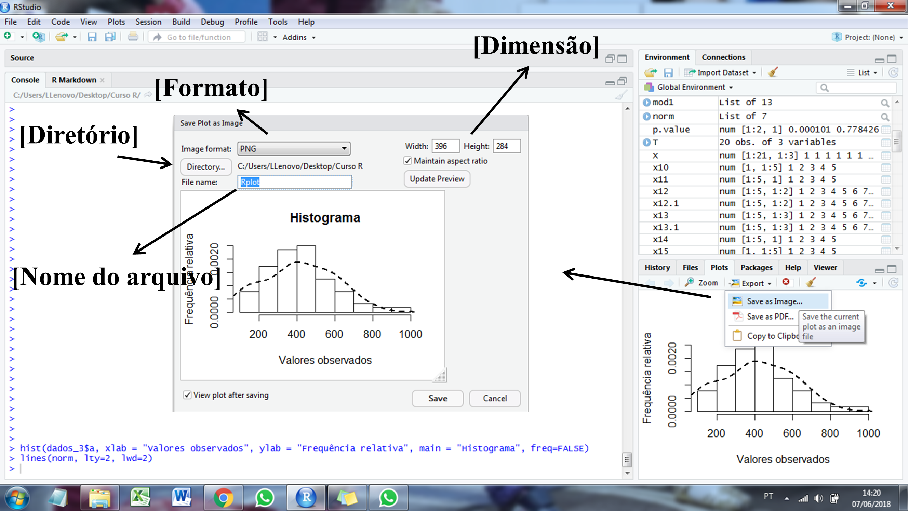
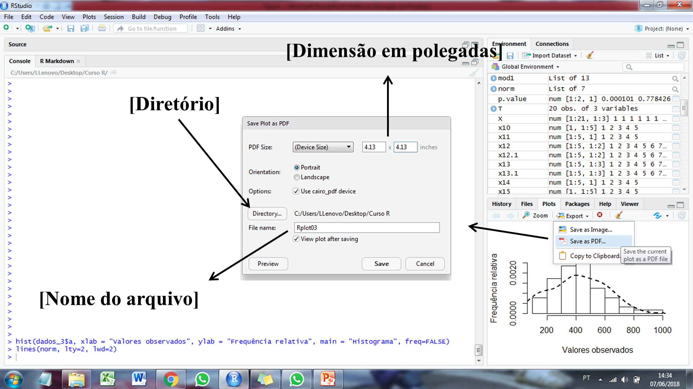

# Exportando dados {#exporta}

Será demonstrado nessa seção como exportar dados e tabelas gerados dentro do *software R*. Quanto a saída de resultados, será dado enfase a saídas com extensões `.csv`, `.txt` e `.xlsx`. Quanto aos gráficos, será mostrado como salvar figuras em alta resolução.

## Exportando com diferentes extensões
A função `export()` d pacote `rio` (https://cran.r-project.org/web/packages/rio/index.html) pode ser utilizada para exportar objetos do R em arquivos dos mais diversos formatos.

Em arquivos `.csv`, os valores são separados por vírgula. No exemplo abaixo, é mostrado como o objeto `quantitativo` pode ser salvo em um arquivo `.csv` com nome `quanti_exemplo`. Para salvar as saídas em extensão `.txt` ou `.xlsx`, basta substituir a extensão do arquivo.

```{r echo = TRUE, eval = FALSE, message = FALSE, warning = FALSE}
url <- "https://github.com/TiagoOlivoto/e-bookr/raw/master/data/data_R.xlsx"
quanti <- import(url, sheet = "QUANTI")
head(quanti)
# exportar para o diretóri padrão (csv)
export(quanti, file = "quanti_exemplo.csv")
# exportar para o diretóri padrão (txt)
export(quanti, file = "quanti_exemplo.txt")
# exportar para o diretóri padrão (xslx)
export(quanti, file = "quanti_exemplo.xlsx")
```


No formato `.xlsx` é possível informar em qual planilha o objeto será salvo. Neste caso, as planilhas existentes não serão modificadas.
```{r eval=FALSE}
export(quanti, file = "quanti_exemplo.xlsx", which = "quanti2")
```


Também é possível salvar diferentes objetos em diferentes planilhas do mesmo arquivo. Vamos considerar que cada nível do fator `TIPO` do objeto `quanti` deve ser salvo em uma planilha diferente.

```{r eval = FALSE}
linear <- subset(quanti, TIPO == "LINEAR")
quadratico <- subset(quanti, TIPO == "QUADRÁTICA")
cubico <- subset(quanti, TIPO == "CÚBICA")
export(list(linear = linear,
            quadratico = quadratico, 
            cubico = cubico),
       file = "quanti_exemplo_plan.xlsx")
```
Neste caso, um arquivo chamado `quanti_exemplo_plan.xlsx` contendo as planilhas `linear`, `quadratico` e `cubico` foi criado no diretório padrão.


## Exportanto gráficos

Os gráficos podem ser exportados clicando em *Export* \indt{exportar imagens} no *output* dos gráficos. Você pode escolher entre salvar como imagem ou como PDF. Os formatos de imagem disponíveis são: .PNG, .TIFF,\indt{.TIFF} .JPEG,\indt{.JPEG} .BMP \indt{.BMP}, .SVG \indt{.SGV} e .ESP \indt{.EPS}. A outra opção é salvar em um arquivo PDF \indt{.PDF}. A principal diferença entre estes formatos é o método de renderização utilizado na formação do gráfico. Existem basicamente dois métodos de renderização de imagens: *raster images* e *vector-based images*. Imagens rasterizadas usam muitos pixels coloridos ou blocos de construção individuais para formar uma imagem completa. JPEGs, GIFs e PNGs e TIFFs são tipos de imagem raster mais comuns. Como as imagens raster são criadas usando um número fixo de pixels coloridos, elas não podem ser redimensionadas drasticamente sem comprometer sua resolução. Quando esticados para caber em um espaço que eles não foram projetados para preencher, seus pixels ficam visivelmente granulados e a imagem é distorcida. É importante que você salve os arquivos *raster* precisamente nas dimensões necessárias e com a devida resolução para uma boa apresentação. Para salvar estas imagens é necessário informar a *Density of Pixels per Inch* (DPI) \indt{DPI}, ou seja, quantos pontos por polegada quadrada deverá conter a imagem. Quanto maior este valor, maior será a qualidade da imagem e também maior será seu tamanho (em Mb).

Imagens vetoriais (*vector-based graphics*), por outro lado, permitem mais flexibilidade. Construídos usando fórmulas matemáticas em vez de blocos coloridos individuais, os tipos de arquivos vetoriais, como .PDF e .EPS *, são excelentes para criar gráficos de alta resolução sem que seu redimensionamento prejudique a qualidade do gráfico. A maioria das revistas cintíficas aceitam todos estes tipos de formatos. Na dúvida, escolha sempre o formato .PDF (ou .EPS)!






Uma alternativa prática para salvar em pdf as imagens é através da função `pdf()`. Os argumentos `width` e `height` correspondem a dimensão da figura (em polegadas) e `pointsize` corresponde ao tamanho da fonte. \indf{pdf}

```{r echo = TRUE, eval = FALSE, message = FALSE, warning = FALSE}
pdf("Figura1.pdf", width = 5, height = 4)

p1 <- ggplot(dados_oat, aes(x = RG, y = PH, colour = AMB)) +
      geom_point()+
      geom_smooth(method = "lm", se = F)+
      my_theme()+
      labs(x = "Rendimento de grãos", y = "Peso hectolitro")
p1

dev.off()
```

A função `ggsave()` \indf{ggsave} também pode ser utilizada para salvar os gráficos para o diretório de trabalho. Por padrão, esta função salva o último gráfico mostrado. Para salvar-mos o gráfico p1, gerado anteriormente, basta executar o seguinte comando.

```{r echo = TRUE, eval = FALSE, message = FALSE, warning = FALSE}
ggsave("Figure_ggsave.pdf", p1)

```


**Exportando figuras como imagens em alta qualidade**

Com as funções `tiff()` \indf{tiff}, `png()` \indf{png}, `jpeg()` \indf{jpeg} e `bmp()` \indf{bmp} é possível salvar gráficos como imagem em alta resolução. Como na função `pdf()` \indf{pdf}, `width` e `height` correspondem a dimensão. Porém, nestas funções é possível escolher a unidade através do argumento `units` e a resolução através do argumento `res`.

```{r echo = TRUE, eval = FALSE, message = FALSE, warning = FALSE}
tiff(filename = "Figura3.tiff", width = 10, height = 8, 
     units = "cm",pointsize = 12, "lzw",res = 1200)
p1
dev.off()

png(filename = "Figura3.png",width = 10, height = 8, 
     units = "cm",pointsize = 12, "lzw",res = 1200)
p1
dev.off()

jpeg(filename = "Figura3.jpeg",width = 10, height = 8, 
     units = "cm",pointsize = 12, "lzw",res = 1200)
p1
dev.off()

bmp(filename = "Figura3.bmp",width = 10, height = 8, 
     units = "cm",pointsize = 12, "lzw",res = 1200)
p1
dev.off()
```

