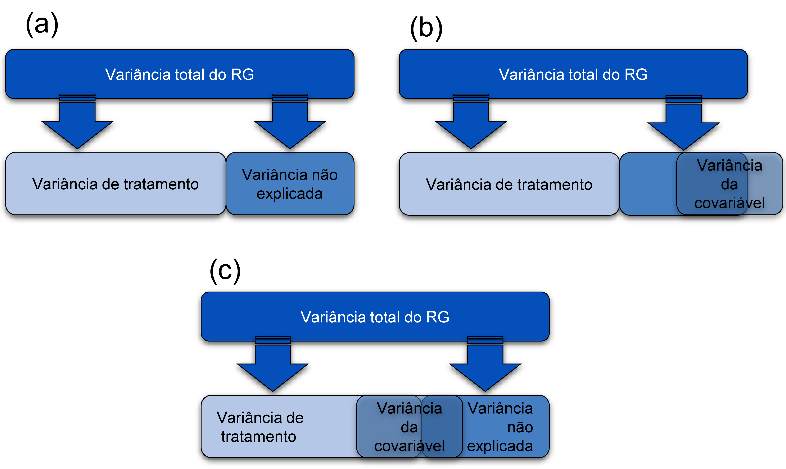

# (PART) Parte III análise de dados {-}
# Análise de dados experimentais {#analdata}

> "Muito melhor uma resposta aproximada à pergunta certa, que muitas vezes é vaga, do que uma resposta exata à pergunta errada, que sempre pode ser feita com precisão." --- John Tukey

Nesta seção será abordado aspectos relacionados a análise de experimentos agrícolas, com ênfase na utilização de testes paramétricos. Esta seção será dividida em três partes principais:

- [Parte 1: estatistica básica](#ebasic): Medidas de tendência central e de variabilidade. Intervalos de confiança para média. Testes de hipóteses para verificar a igualdade entre médias de uma ou duas amostras. 

- [Parte 2: delineamentos básicos](#dbasic): delineamentos experimentais inteiramente casualisado (DIC) e blocos ao acaso (DBC). Pressupostos \indt{pressupostos} dos modelos estatisticos. Testes complementares (média e regressão). 

- [Parte 3: análise de covariância](#ancova): Análise de covariância como uma ferramenta estatística para redução do erro experimental.

- [Parte 4: modelos lineares generalizados](#general): Modelos Lineares Generalizados aplicados a análise de dados não gaussianos.

- [Parte 5: experimentos fatoriais](#efat): experimentos fatorias e experimentos com parcelas subdivididas. 


## Estatistica básica {#ebasic}

### Medidas de tendência central

Nesta seção mostraremos como calular medidas de tendência central e medidas de variabilidade. As medidas de tendencia central são valores que representam um conjunto de dados. Entre as mais comuns podemos citar a média, mediana e moda. 

```{r echo = TRUE, eval = TRUE, message = FALSE, warning = FALSE}
set.seed(1)
Amostra1 = rnorm(100, 12, 3) # Gera uma amostra com distribuição normal
Amostra2 = rpois(100, 12) # Gera uma amostra com distribuição Poisson
mean(Amostra1) # média
median(Amostra1) # mediana
```
             
O *R* calcula a média \indt{média} e mediana \indt{mediana} através das funções `mean()` \indf{mean} e `median()` \indf{median}, porém não calcula a moda. No blog [Ridículas](https://ridiculas.wordpress.com/2011/11/18/moda-de-uma-amostra-metodo-do-histograma-vs-metodo-kernel/), mantido pelo [LEG](http://www.leg.ufpr.br/doku.php/start) da UFPR, dois métodos são dicutidos. Incentivamos a leitura do material.

### Medidas de variabilidade
As seguintes medidas de variabilidade podem ser computadas, com suas respectivas funções:

* Desvio padrão `sd()`
* Variância `var()`
* Amplitude total `range()`
* Amplitude interquartílica `IQR()`

O desvio padrão e a variância podem ser obtidas com as funções `sd()` \indf{sd} e `var()`, respectivamente. \indf{var}

```{r echo = TRUE, eval = TRUE, message = FALSE, warning = FALSE}
sd(Amostra1)
var(Amostra1)
range(Amostra1)
IQR(Amostra1)

```

Não existe no R base uma função para computar o coeficiente de variação, então vamos criá-la utilizando a abordagem `function()`: \indf{function} \indt{CV}

```{r echo = TRUE, eval = TRUE, message = FALSE, warning = FALSE}
CV = function(dados){
  if(!class(dados) == "numeric"){
    stop("Os dados precisam ser numéricos")
    } #Indica que os dados devem ser numéricos
  media = mean(dados)
  sd = sd(dados)
  CV = (sd/media) * 100
  return(CV) # Valor que será retornado pela função
}

CV(Amostra1)
```

A distribuição dos dados pode ser determinada utilizando histograma de frequências, QQ-Plos e Box-Plot (conforme visto anteriormente). Estatísticas como a amplitude, erro padrão da média, intervalo de confiança, entre outros, podem ser obtidas com a função `desc_stat()` \indf{desc\_stat} do pacote [metan](https://tiagoolivoto.github.io/metan/)^[https://tiagoolivoto.github.io/metan/]. Esta função permite computar as estatisticas para uma ou mais variáveis de um data frame ou um vetor de dados numéricos. Para um exemplo numérico, consulte a [seção 7.3.1](#dstat).

### Resumindo dados com o pacote `dplyr`
Diversos verbos do pacote `dplyr` podem ser utilizados para resumir conjuntos de dados. Iniciaremos 
com a função `count()`\indf{count} para contar valores que se repetem em uma determinada variável.  Por exemplo, é possível identificar qual é o valor de `APLA` que mais se repete utilizando 

```{r echo = TRUE, eval = TRUE, message = FALSE, warning = FALSE}
library(metan)
count(maize, APLA, sort = TRUE)

```

Para identificar quais os valores distintos de `APLA` foram observados a função `distinct()`\indf{distinct} é usada.

```{r echo = TRUE, eval = TRUE, message = FALSE, warning = FALSE}
distinct(maize, APLA)
```


Utilizando a função `summarise()`\indf{summarise} é possível criar uma ou mais variáveis escalares resumindo as variáveis de um tibble existente. Como resultado, uma linha é retornada. O seguinte código calcula a média global da MGRA e retorna o *n* utilizado na estimativa.

```{r echo = TRUE, eval = TRUE, message = FALSE, warning = FALSE}
maize %>% 
  summarise(MGRA_mean = mean(MGRA),
            n = n())
```


Muitas vezes é necessário computar uma determinada função (como a média) para cada nível de uma variável categórica. Felizmente, o pacote **dplyr** possibilita que isto seja realizado facilmente. Continuamos no mesmo exemplo anterior. Neste caso, no entanto, o objetivo é calcular a média da MGRA para cada híbrido. Utilizando a função `group_by()` \indf{group\_by} antes da função `summarise()` \indf{summarise} uma linha de resultado para cada nível do fator híbrido é retornado.


```{r echo = TRUE, eval = TRUE, message = FALSE, warning = FALSE}
maize %>% 
  group_by(HIB) %>%
  summarise(MGRA_mean = mean(MGRA),
            n = n())
```

Até aqui vimos como a média (global ou para cada híbrido) da MGRA pode ser calculada. Quase sempre, no entanto, quando calculamos a média (ou qualquer outra medida) em um conjunto de dados, queremos fazê-la para todas as variáveis numéricas. Implementar isto com **dplyr** é relativamente fácil. Existem basicamente três opções para isto, utilizando as variantes `summarise_all()`, `summarise_if()`, ou `summarise_at()`. Todos os *verbos* principais do pacote **dplyr** apresentam estas variantes, o que torna fácil aplicar a mesma função para múltiplas variáveis. Estas três variantes proporcionam: \indf{summarise\_at}

* `_all()` aplicar a função a todas as variáveis;
* `_at()` aplicar a função a variáveis selecionadas com vetores de caracteres ou utilizando `vars()`
* `_if()` aplicar a função a variáveis selecionadas com uma função, por exemplo `is.numeric()`.

Veremos como estas variantes funcionam, calculando a média para as variáveis do conjunto de dados.

```{r echo = TRUE, eval = TRUE, message = FALSE, warning = FALSE}
maize %>% 
  summarise_all(mean)
```

Note que utilizando a função `summarise_all()`\indf{summarise\_all} a média para todas as variáveis numéricas foi calculada e um valor `NA` foi retornado para as variáveis categóricas. Se o objetivo é computar a média somente para as variáveis numéricas (o que é o mais lógico), a função `summarise_if()` \indf{summarise\_if}é a melhor escolha.

```{r echo = TRUE, eval = TRUE, message = FALSE, warning = FALSE}
maize %>% 
  summarise_if(is.numeric, mean)
```

Funções próprias podem ser aplicadas dentro da função summarise para computar uma estatística personalizada. Como exemplo, vamos criar uma função chamada `mse` que retornará o valor da média e o erro padrão da média e aplicá-la para cada nível do fator AMB.

```{r echo = TRUE, eval = TRUE, message = FALSE, warning = FALSE}
mse <- function(x){
  me = round(mean(x), 3)
  se = round(sd(x)/sqrt(n()), 3)
  return(paste(me, "+-", se))
}
maize %>% 
  group_by(AMB) %>%
  summarise(MGRA_mean_se = mse(MGRA))
```


Se desejamos computar mais de uma função para variáveis específicas, então o próximo código nos ajudará. Note que para aplicar mais de uma função é necessário declarar o argumento `.funs` e criar um vetor com o nome das funções. Neste caso, os sufixos `_m` e `_sd` representam a média e o desvio padrão, respectivamente.

```{r echo = TRUE, eval = TRUE, message = FALSE, warning = FALSE}
maize %>%
  group_by(AMB) %>%
  summarise_at(vars(starts_with("M"),
                    ends_with("S"),
                    contains("GR")),
               .funs = c(m = mean, sd = sd))
```


### Estatística descritiva com pacote metan {#dstat}

O pacote `metan` fornece uma estrutura simples e intuitiva para o cálculo de estatísticas descritivas. Um [conjunto de funções](https://tiagoolivoto.github.io/metan/reference/utils_stats.html) pode ser usado para calcular rapidamente as estatísticas descritivas mais usadas. 

Para calcular os valores médios para cada nível de um fator, por exemplo para cada nível do fator `HIB` do conjunto de dados `maize`, usamos a função` means_by() `.\indf{means\_by}

```{r}
means_by(maize, HIB)

```

As seguintes funções `_by()` estão disponíveis para calcular as principais estatísticas descritivas por níveis de um fator.

* `cv_by ()` Para cálculo do coeficiente de variação.\indf{cv\_by}
* `max_by ()` Para calcular valores máximos.\indf{max\_by}
* `means_by ()` Para calcular meios aritméticos.\indf{means\_by}
* `min_by ()` Para compilar valores mínimos.\indf{min\_by}
* `n_by ()` Para obter o comprimento.\indf{n\_by}
* `sd_by ()` Para calcular o desvio padrão amostral.\indf{sd\_by}
* `sem_by ()` Para calcular o erro padrão da média.\indf{sem\_by}

#### Funções úteis

Outras funções úteis também são implementadas. Todos eles funcionam naturalmente com `%>%`, lidam com dados agrupados com `group_by()` e várias variáveis (todas as variáveis numéricas de `.data` por padrão).\indf{group\_by}

* `av_dev ()` calcula o desvio médio absoluto.\indf{av\_dev}
* `ci_mean ()` calcula o intervalo de confiança para a média.\indf{ci\_mean}
* `cv ()` calcula o coeficiente de variação.\indf{cv}
* `freq_table ()` Calcula a fábula de frequência.\indf{freq\_table}
* `hm_mean ()`, `gm_mean ()` calcula as médias harmônica e geométrica, respectivamente. A média harmônica é o recíproco da média aritmética dos recíprocos. A média geométrica é a enésima raiz de n produtos.\indf{hm\_mean}\indf{gm\_mean}
* `kurt ()` calcula a curtose como usada no SAS e no SPSS.\indf{kurt}
* `range_data ()` Calcula o intervalo dos valores.\indf{range\_data}
* `sd_amo ()`, `sd_pop ()` Calcula amostra e desvio padrão populacional, respectivamente.\indf{sd\_amo}\indf{sd\_pop}
* `sem ()` calcula o erro padrão da média.\indf{sem}
* `skew ()` calcula a assimetria usada no SAS e no SPSS.\indf{skew}
* `sum_dev ()` calcula a soma dos desvios absolutos.\indf{sum\_dev}
* `sum_sq_dev ()` calcula a soma dos desvios ao quadrado.\indf{sum\_sq\_dev}
* `var_amo ()`, `var_pop ()` calcula amostra e variação populacional.\indf{var\_amo}\indf{var\_pop}
* `valid_n ()` Retorna o comprimento válido (não NA) de um dado.\indf{valid\_n}

#### A função `desc_stat()`

Para calcular todas as estatísticas de uma só vez, podemos usar `desc_stat()`\indf{desc\_stat}. Esta função pode ser usada para calcular medidas de tendência central, posição e dispersão. Por padrão (`stats = "main"`), sete estatísticas (coeficiente de variação, máximo, média, mediana, mínimo, desvio padrão da amostra, erro padrão e intervalo de confiança da média) são calculadas. Outros valores permitidos são `"all"` para mostrar todas as estatísticas, `"robust"` para mostrar estatísticas robustas, `"quantile"` para mostrar estatísticas quantílicas ou escolher uma (ou mais) estatísticas usando um vetor separado por vírgula com os nomes das estatísticas, por exemplo, `stats = c("mean, cv")`. Também podemos usar `hist = TRUE` para criar um histograma para cada variável. Aqui, auxiliares selecionados também podem ser usados no argumento `...`.


* **Todas as estatísticas para todas as variáveis numéricas**

```{r, message = FALSE, fig.height = 5, fig.width = 10, fig.align =" center "}
desc_stat(maize, stats = "all")
```

* **Estatísticas robustas usando select helpers**
```{r, message = FALSE, fig.height = 5, fig.width = 10, fig.align =" center "}
maize%>%
  desc_stat(contains("N"),
            stats = "robust")
```

* **Funções quantílicas escolhendo nomes de variáveis**
```{r, message = FALSE, fig.height = 5, fig.width = 10, fig.align =" center "}
maize%>%
  desc_stat(APLA, AIES, CESP,
            stats = "quantile")
```

* **Crie um histograma para cada variável**
```{r, message = FALSE, fig.height = 3.33, fig.width = 10, fig.align =" center "}
maize%>%
  desc_stat(APLA, AIES, CESP,
            hist = TRUE)
```

#### Estatísticas por níveis de fatores
Para calcular as estatísticas para cada nível de um fator, use o argumento `by`. Além disso, é possível selecionar as estatísticas a serem computadas usando o argumento `stats`, que é um único nome estatístico, por exemplo,` "mean" `ou um vetor de nomes separados por vírgula com `"` no início e apenas o final do vetor. Tenha em atenção que os nomes das estatísticas **NÃO** diferenciam maiúsculas de minúsculas, por exemplo, são reconhecidos `"mean"`, `"Mean"` ou `"MEAN"`. Vírgula ou espaços podem ser usados para separar os nomes das estatísticas.

* Todas as opções abaixo funcionarão:

   * `stats = c ("mean, se, cv, max, min")`
   * `stats = c ("mean se cv max min")`
   * `stats = c ("MEAN, Se, CV max MIN")`


```{r, message = FALSE, fig.height = 5, fig.width = 5.5, fig.align =" center "}
desc_stat (maize,
          contains("C"),
          stats = ("mean, se, cv, max, min"),
          by = AMB)
```
\indf{desc\_stat}
Para calcular as estatísticas descritivas por mais de uma variável de agrupamento, precisamos passar dados agrupados para o argumento `.data` com a função` group_by() `. Vamos calcular a média, o erro padrão da média e o tamanho da amostra para as variáveis `EP` e` EL` para todas as combinações dos fatores `AMB` e` HIB`.

```{r warning = FALSE}
stats <- 
maize %>% 
  group_by(AMB, HIB) %>% 
  desc_stat(APLA, AIES, CESP,
            stats = c("mean, se, n"))
stats
```

Quando as estatísticas são calculadas para níveis de um fator, a função `desc_wider()` pode ser utilizada para converter uma estatística calculada em um conjunto de dados em formato *wide*, ou seja, variáveis nas colunas, fatores nas linhas com o valor da estatística escolhida preenchendo a tabela.
```{r}
desc_wider(stats, se)
```


### Testes de aderência
Testes de aderência a distribuições teóricas também são de grande utilizada para as ciências agrárias. O teste de Shapiro-Wilk, realizado pela função `shapiro.test()` \indt{shapiro.test}, é amplamente utilizada para realizar o teste de normalidade dos dados. Para testar a aderência a outras distribuições teóricas, o teste de Kolmolgorov-Smirnov (função `ks.test()`) \indt{ks.test()} é uma alternativa.  

```{r echo = TRUE, eval = TRUE, message = FALSE, warning = FALSE}
# Teste de Shapiro-Wilk
shapiro.test(Amostra1)
shapiro.test(Amostra2)

# Kolmogorov–Smirnov
# Amostra1 e Amostra2 provém da mesma distribuição?
ks.test(Amostra1, Amostra2)

# Amostra1 ~ N(12, 3)?
ks.test(Amostra1, "pnorm", 12, 3)
```


### Intervalos de confiança

A estimação por intervalo não fornece idéia da margem de erro cometida ao estimar um determinado parâmetro [@Ferreira2009]. Por isso, para verificar se uma dada hipótese $H_0$ (de igualdade) é ou não verdadeira, deve-se utilizar intervalos de confiança ou testes de hipóteses. A construção destes intervalos, e as particularidades dos testes de hipóteses, serão discutidos a seguir. Recomendamos como literatura o livro [Estatística Básica](http://www.editoraufv.com.br/produto/1595058/estatistica-basica)^[http://www.editoraufv.com.br/produto/1595058/estatistica-basica] escrito pelo Prof. Daniel Furtado Ferreira da UFV.
Para verificar a normalidade dos dados, as funções `shapiro.test()` e `ks.test()` e os gráficos QQ-Plot são de grande utilidade. \indf{shapiro.test} \indf{ks.test}

Será demostrado como testar hióteses para uma e duas médias pelo teste *t* de Student, o que exiege que os dados tenham distribuição normal univariada (já discutido anteriormente) ou bivariada (dados emparelhados). Para testar a normalidade bivariada, basta testar a normalidade da diferença entre as variáveis: \indt{distribuição normal}

```{r echo = TRUE, eval = TRUE, message = FALSE, warning = FALSE}
Amostra3 = Amostra1 - Amostra2
shapiro.test(Amostra3)
```

A partir de um intervalo \indt{intervalo de confiança} que tenha alta probabilidade de conter o valor paramétrico, é possível diferenciar duas estimativas [@Ferreira2009]. O intervalo de confiança de uma média amostral de 95% é dado por:

$$
P\left[ {\bar X - {t_{\alpha /2}}\frac{S}{{\sqrt n }} \le \mu  \le \bar X + {t_{\alpha /2}}\frac{S}{{\sqrt n }}} \right] = 1 - \alpha 
$$

Na expressão acima, $\bar X$ é a média, $S$ é o desvio padrão e  $-t_{\alpha /2}$ e $+t_{\alpha /2}$ são os quantis inferior e superior, respectivamente, da distribuição *t* de Student. O intervalo acima indica que o valor do parâmetro ($\mu$) tem 95% de chance de estar contido no intervalo. Ressalta-se que a expressão acima está relacionada com a precisão e não com a acurácia da estimativa. Para calcular esse intervalo, podemos utilizar a função `t.teste()` \indf{t.test}. 

```{r echo = TRUE, eval = TRUE, message = FALSE, warning = FALSE}
result = t.test(Amostra1)
result$conf.int # Intervalo de confiança
result$estimate # média
```

O intervalo de confiança é, por *default*, de 95%. Poém, pode-se modificar através do argumento `conf.level`. \indf{conf.level}

```{r echo = TRUE, eval = TRUE, message = FALSE, warning = FALSE}
result = t.test(Amostra1, conf.level = 0.99)
result1 = t.test(Amostra1, conf.level = 0.90)
result$conf.int # Intervalo de confiança
result1$conf.int # Intervalo de confiança
```

Para gerar os gráficos de intervalo de confiança será utilizada a função `ggplot()` do pacote **ggplot2**. \indf{ggplot}

```{r echo = TRUE, eval = TRUE, tidy=TRUE, message = FALSE, warning = FALSE,fig.height = 4, fig.width = 10, fig.cap = "Gráficos de intervalo de confiança (mais de uma variável)"}
set.seed(100) #Ajusta a semente para reprodução dos números
Amostra1 = rnorm(100,10,10)
Amostra2 = rnorm(100,10,24)
Amostra3 = rnorm(100,25,15)
Amostra4 = rnorm(100,20,30)

dados_IC = tibble(
    Factor = c("Amostra 1","Amostra 2", "Amostra 3", "Amostra 4"),
    LL = c(t.test(Amostra1)$conf.int[1],
           t.test(Amostra2)$conf.int[1],
           t.test(Amostra3)$conf.int[1],
           t.test(Amostra4)$conf.int[1]),
    Mean = c(t.test(Amostra1)$estimate,
             t.test(Amostra2)$estimate,
             t.test(Amostra3)$estimate,
             t.test(Amostra4)$estimate),
    UL = c(t.test(Amostra1)$conf.int[2],
           t.test(Amostra2)$conf.int[2],
           t.test(Amostra3)$conf.int[2],
           t.test(Amostra4)$conf.int[2]))

# Gráfico com barras de erros
cbPalette = c("red", "blue", "green", "pink") # armazenando as cores
err1 = ggplot(data = dados_IC, aes(y = Mean, x = Factor, colour = Factor)) + 
              geom_point(size = 2.5)+ # adiciona um ponto ao gráfico
              geom_errorbar(aes(ymax = UL, ymin = LL), width = 0.1)+
              scale_color_manual(values = cbPalette)+ 
              coord_flip()+ # "inverte" o "x" e o "y" 
              expand_limits(y = c(0.4,0.6))+
              theme(legend.position = "none")

# Gráfico de barras com barras de erros 
err2 = ggplot(data = dados_IC, aes(y = Mean, x = Factor)) + 
              geom_bar(aes(fill = Factor), stat = "identity", position = "dodge")+
              geom_errorbar(aes( ymax = UL, ymin = LL), width = 0.2)+
              expand_limits(y = c(0,30)) +
              scale_fill_manual(values = cbPalette)+
              theme(legend.position = "none")

plot_grid(err1, err2)


```


### Teste de hipóteses para amostras independentes

Os testes de hipóteses \indt{testes de hipótese} aqui demonstrados tem como objetivo **(i)** verificar se determianda amostra difrere ou não de zero (${H_0}:\mu  = 0$) e **(ii)** se duas amostras são ou não iguais (${H_0}:{\mu _1} = {\mu _2}$). Para testar as hipóteses pode-se utilizar a função `t.teste()`. Utilizaremos como amostras os dados da variável MGRA do conjunto **maize**. A primeira amostra corresponde contém os valores de **A1** e a segunda os valores de **A2**

```{r echo = TRUE, eval = TRUE, message = FALSE, warning = FALSE}
Amostra1 = maize %>% filter(AMB == "A1") %>% select(MGRA) %>% pull()
Amostra2 = maize %>% filter(AMB == "A2") %>% select(MGRA) %>% pull()

t.test(Amostra1) # testa se a amostra difere de zero
t.test(Amostra1, Amostra2) # testa se as amostras difrem entre si
```

Alternativamente, o pacote [ggstatplot](https://indrajeetpatil.github.io/ggstatsplot/index.html)^[https://indrajeetpatil.github.io/ggstatsplot/index.html] pode ser utilizado para confecionar gráficos que incluem teste de hipóteses. 

O teste *t* pode ser utilizado para testar tanto hipóteses do tipo ${H_A}:\mu  > 0$ ou ${H_A}:\mu  < 0$. Porém, para isso, devemos utilizar o argumento `alternative` para indicar que o teste utilizado é unilateral.

```{r echo = TRUE, eval = TRUE, message = FALSE, warning = FALSE}
t.test(Amostra1, alternative = "greater") # unilateral a direita
t.test(Amostra1, alternative = "less") # unilateral a esquerda
```
\indf{t.test}
Outro pressuposto para realizar o teste *t* é a homogeneidade das variâncias. Quando as variâncias são heterogêneas, o grau de liberdade utilizado é calculado pela aproximação de Welch-Satterthwaite: \indt{Welch-Satterthwaite}

$$
\nu  \cong \frac{{{{\left( {\frac{{S_1^2}}{{{n_1}}} + \frac{{S_2^2}}{{{n_2}}}} \right)}^2}}}{{\frac{{{{\left( {\frac{{S_1^2}}{{{n_1}}}} \right)}^2}}}{{{n_1} - 1}} + \frac{{{{\left( {\frac{{S_2^2}}{{{n_2}}}} \right)}^2}}}{{{n_2} - 1}}}}
$$

\indf{var.test}
```{r echo = TRUE, eval = TRUE, message = FALSE, warning = FALSE}
var.test(Amostra1, Amostra2) # Teste F para variâncias
t.test(Amostra1, Amostra2, var.equal = FALSE) # Por default, usa Welch-Satterthwaite

Amostra3 = rnorm(30, 10, 5)
Amostra4 = rnorm(30, 18, 5)
var.test(Amostra3, Amostra4)
t.test(Amostra1, Amostra2, var.equal = TRUE) # Quando variâncias são iguais
```

### Teste de hipóteses para amostras dependentes

As formas de comparação discutidas acima consideram as amostras como sendo independentes entre si. Para dados emparelhados, deve-se utiliza o argumento `paired =  TRUE`.

```{r echo = TRUE, eval = TRUE, message = FALSE, warning = FALSE}
Amostra1 = rnorm(30,10,5)
Amostra2 = rnorm(30,15,5)

var.test(Amostra1, Amostra2) # Teste F para variâncias

t.test(Amostra1, Amostra2, var.equal = TRUE) # Independentes
t.test(Amostra1, Amostra2, var.equal = TRUE, paired = TRUE) # Emparelhadas

```
\indf{rnorm}
Observa-se que existe uma diferença no valor da estatistica teste, nos graus de liberdade, no valor tabelado e, consequentemente, no *p*-valor. Para duas amostras independentes, o teste para a diferença é dado por

$$
{t_c} = \frac{{{{\bar X}_1} - {{\bar X}_2}}}{{S\sqrt {\frac{1}{{{n_1}}} + \frac{1}{{{n_2}}}} }} \sim {t_{\left( {\alpha ,\nu } \right)}}
$$

Onde $\alpha$ é a probabilidade de erro, $\nu$ é o grau de liberdade (nº total de obervações-2), $S$ é a média ponderada do desvio padrão, ${\bar X}_1$ e ${\bar X}_2$ são a média das amostras 1 e 2, respectivamente, e $n_1$ e $n_1$ e $n_2$ são os tamanhos de amostra da amostra 1 e 2, respectivamente. No resultado acima, obervamos que $\nu = 58$. 

No caso de amostras pareadas (dependentes), a estatística teste é dada por  \indt{amostras pareadas}

$$
{t_c} = \frac{{\bar d - {\mu _0}}}{{\frac{{{S_d}}}{{\sqrt n }}}} \sim {t_{\left( {\alpha ,\nu } \right)}} 
$$

Onde $\alpha$ é a probabilidade de erro, $\nu$ é o grau de liberdade (nº de diferenças-1), $\bar d$ é a média das diferenças, $S_d$ é o desvio padrão das diferenças e $n$ é o número de diferenças. No resultado acima,obervamos que $\nu = 29$. 


## Delineamentos básicos {#dbasic}

As análises realizadas até agora tinham como objetivo verificar a existência de diferenças entre as médias de duas amostras. Porém, quando deseja-se estudar o efeito de "grupos de fatores" sobre determinado fenômeno, a análise da variância (ANOVA) é indicada. A ANOVA atribui a diversos fatores partes da variabilidade dos dados [@Casella2008]. \indt{ANOVA}

Os delineamentos experimentais também são parte importante da ANOVA. Será dado mais destaque aos mais comuns: o delineamento inteiramente casualisado (DIC) \indt{DIC} e o blocos ao acaso (DBC) \indt{DBC}. O bloqueamento tem como objetivo remover parte da variabilidade. Como não se deseja encotrar diferença entre os blocos, análises complementares não são realizadas para este fator.

Nessa seção será demostrado como analisar dados experimentais utilizando estes dois delineamentos. Em um primeiro momento, serão demonstrados experimentos unifatorias e, posteriormente, experimentos bifatoriais com e sem parcelas subdivididas. Formas de como verificar se os pressupostos \indt{pressupostos} do modelo estatistico estão sendo cumpridos, e formas de contornar este problema caso estejam sendo violados, também serão demonstrados. Por fim, após a análise da variância, serão mostrados os testes complementares utilizados para tratamentos quali e quantitativos.


### Princípios básicos

Os principios básicos da experimentação são a *casualisação* e a *repetição*. A repetição possibilita que o erro seja estimado, e a casualisação que eles sejam independentes. 

### Pressupostos

Independente do delineamento, os pressupostos \indt{pressupostos} do modelo estatístico são que os erros são independentes, homocedásticos e normais:

$$
{\boldsymbol{\varepsilon }} \sim {\rm N}\left( {0,{\boldsymbol{I}}{\sigma ^2}} \right)
$$

As formas de realizar esse diagnóstico é através de testes estatísticos e gráficos de diagnósticos. Uma ferramente para contornar o problema de violação dos pressupostos é a transformação dos dados. Existem várias formas de transformar os dados (cada uma adequada a um caso específico), mas será dado enfase à transformação Box-Cox. 

### Estimação

A estimativa dos parâmetros \indt{parâmetros}é realizado pelo método dos minimos quadrados. Devido a matriz delineamento ser de posto incompleto (modelo superparametrizado), uma restrição deve ser imposta ao fator tratamentos para que a estimativa do efeito dos fatores seja única ($\sum {{t_i}} = 0$). Reparametrizações ou combinações lineares também podem ser utilizados para garantir a unicidade dos parâmetros [@Rencher2008].

### Reparametrização, condições marginais ou combinações lineares?

As funções `lm()` \indf{lm} e `aov()` \indf{aov} são usualmente utilizadas para realizar a análise da variância. Ambas utilizam a reparametrização o modelo para estimar os parâmetros. Vamos ver isso no exemplo hipotético abaixo:

```{r echo = TRUE, eval = TRUE, message = FALSE, warning = FALSE}
## Considerando os dados abaixo 
dados = tibble(
  "Tratamentos" = c(rep(1:4, each = 4)),
  "Y" = qualitativo$RG[1:16]
)
dados

## Usando a função aov()
mod1 = aov(Y ~ factor(Tratamentos), data = dados)
coefficients(mod1)
mod2 = lm(Y ~ factor(Tratamentos), data = dados)
coefficients(mod2)

## Abordagem matricial
y = as.matrix(dados$Y)
x = model.matrix(~factor(dados$Tratamentos))
beta = solve(t(x) %*% x) %*% t(x) %*% y 
beta
```

Abaixo é apresentado o calculo da ANOVA de `mod1` através de uma aboragem matricial. Portanto verifica-se que a reparametrização é o método utilizado pelas funções `aov()` e `lm()`.  

```{r echo = TRUE, eval = TRUE, message = FALSE, warning = FALSE}
# Anova com uma abrodagem matricial
SQtrat = t(beta) %*% t(x) %*% y - ((sum(y))^2)/16
SQtotal = t(y) %*% y - ((sum(y))^2)/16
SQRes = SQtotal - SQtrat
Fc = (SQtrat/3)/(SQRes/12)
p_val = pf(Fc, 3, 12, lower.tail = FALSE)

```


Demonstrar como o procedimento de estimação e cálculo da ANOVA serviu apenas para verificar de maneira didática como as funções no *R* contornam o problema da singularidade da matriz delineamento. Conforme já relatado acima, as funções `aov()` e `lm()` podem ser utilizadas para realizar a ANOVA. Porém, nesta seção será dado enfase as funções do pacote **ExpDes.pt**, \indt{ExpDes} cujas funções possibilitam analisar dados uni e bifatoriais, e este último com e sem parcelas subdivididas. Esse pacote tem dentro dele as principais funções que são necessárias para realizar a ANOVA (entre elas a `aov()`), o que facilita a obtenção dos resultados.  
\indf{lm} \indf{aov}

### Delineamento inteiramente casualizado (DIC)
#### Modelo estatístico
O delineamento inteiramente casualizado (DIC) é um delineamento adequado para áreas uniformes (parcelas são uniformes), onde não há necessidade de controle local (bloqueamento). Neste delineamento, os tratamentos devem ser distribuidos aleatoriamente nas parcelas. 

O modelo do DIC é dado por \indt{DIC}

$$
{Y_{ij}} = m + {t_i} + {\varepsilon _{ij}}
$$

Onde $m$ é a média geral do experimento, $t_i$ é o efeito de tratamentos, sendo estimado por $\hat t_i = \bar Y_{i.} - \bar Y_{..}$ com a seguinte restrição: $\sum_i \hat t_i = 0 ~~~~\forall_i$ (leia-se, o somatório dos efeitos de tratamento é zero para todo tratamento *i*). $\epsilon_{ij}$ é o erro experimental estimado por ($\hat e_{ij = Y_{ij} - m - \hat t_i}$) onde ${e_{ij}}\sim NID(0,{\sigma ^2})$.

Experimentos em DIC serão executados utilizando da função `dic()` \indt{dic()} do pacote *ExpDes.pt*. Os argumentos desta função são:

|Argumento                |Descrição
|-------------------------|-------------------------|
|`trat`                   |Objeto contendo os tratamentos
|`resp`                   |Objeto contendo a variável resposta
|`quali`                  |Se TRUE, o tratamento é qualitativo (*default*)
|`mcomp`                  |Indicar o teste complementar (Tukey é *default*)
|`nl`                     |Indica se uma regressão deve ser ajustada (FALSE é o *default*)
|`hvar`                   |Teste de homogeneidade da variância (Bartlett é o *default*)
|`sigT`                   |Significância da comparação múltipla
|`sigF`                   |Significância do teste F


Para maiores detalhes, ver o [pdf do pacote](https://cran.r-project.org/web/packages/ExpDes.pt/ExpDes.pt.pdf)^[https://cran.r-project.org/web/packages/ExpDes.pt/ExpDes.pt.pdf] ou ir em ajuda (digitar `?ExpDes.pt` no console).

#### DIC com fatores qualitativos 
\indt{fatores qualitativos}
Os dados utilizados neste exemplo estão na planilha QUALI do conjunto de dados *data/data_R.xlsx*. Os próximos códigos carregam o conjunto de dados e criam um gráfico do tipo boxplot para explorar o padrão dos dados.

```{r echo = TRUE, eval = TRUE, message = FALSE, warning = FALSE, fig.width=10, fig.height=5}
url <- "https://github.com/TiagoOlivoto/e-bookr/raw/master/data/data_R.xlsx"
qualitativo <- import(url, sheet = "QUALI")
p1 = ggplot(qualitativo, aes(HIBRIDO, RG))+
       geom_hline(yintercept = mean(qualitativo$RG), linetype = "dashed")+
       geom_boxplot()+
       stat_summary(geom = "point", fun.y = mean, shape = 23)+
       theme(axis.text.x = element_text(angle = 45, vjust = 1, hjust = 1))
p2 = ggplot(qualitativo, aes(factor(BLOCO), RG))+
       geom_hline(yintercept = mean(qualitativo$RG), linetype = "dashed")+
       geom_boxplot()+
       stat_summary(geom = "point", fun.y = mean, shape = 23)
plot_grid(p1, p2)
```
\indf{dic} \indf{geom\_boxplot}

Analizando o boxplot acima é razoável dizer que as médias dos tratamentos são diferentes, principalmente comparando o NUPEC_10 com NUPEC_1. Esta suspeita de diferença, no entanto, deve ser suportada com a realização da análise de variância. No pacote **ExpDes.pt**, quando os fatores são qualitativos, a análise complementar aplicada é a comparção de médias. A função `dic()` do pacote retorna a tabela da ANOVA, a análise de pressupostos \indt{pressupostos} (normalidade e homogeneidade) e o teste de comparação de médias. 


\indt{Dicas}

```{block2, type = "dica", eval =  FALSE}
As funções do pacote **ExpDes.pt** utilizam os dados "anexados" ao ambiente de trabalho, ou seja, um argumento `data = .` não existe para suas funções. Note que no exemplo abaixo foi utilizado a função `with(qualitativo, dic(...))`. Isto permite acessar variáveis presentes no data frame. Uma outra maneira de realizar esta mesma análise é utilizando a função `attach(qualitativo)`, qual carregará o data frame no ambiente R, assim é possível utilizar a função `dic(...)`. Após realizada a análise, é recomendado executar o comando `detach(qualitativo)` para "limpar" os dados do ambiente de trabalho.

```


```{r echo = TRUE, eval = TRUE, message = FALSE, warning = FALSE}

mod3 = with(qualitativo, dic(HIBRIDO, RG))

```
\indf{crd}

A interpretação da significância, ou seja, se as médias de produtividade dos híbridos foram significativamente diferentes a uma determinada probabilidade de erro é feita verificando-se o valor de "Pr>fc" na ANOVA. A figura abaixo mostra a distribuição *F* considerando os graus de liberdade de tratamento e erro $F_{9, 30}$ e nos ajuda a compreender um pouco melhor isto. O valor de *F* calculado em nosso exemplo foi de 2.0616, o que resulta em uma probabilidade de erro acumulada de 0.066545 (6,654%). Na figura abaixo, esta probabilidade de erro acumulada está representada pela cor vermelha. Para que uma diferença significativa a 5% de probabilidade de erro tivesse sido observada, o valor de *F* calculado deveria ter sido 2.2107 [`qf(0.05, 9, 30, lower.tail = FALSE)`], representado neste caso pela cor verde no gráfico.

```{r, echo=FALSE, fig.height=3, fig.width=6}
df1 <- 9
df2 <- 30
Alpha.des <- 0.05
Alpha.obs = 0.066545
df <- data.frame(X = seq(from = 0, to = 6, length = 1000))
ggplot(data=df, mapping=aes(x = X, y = df(x = X, df1 = df1, df2 = df2, ncp=0)))+
scale_x_continuous(breaks=seq(0, 10, 1))+
scale_y_continuous(expand = expand_scale(mult = c(0, .1))) +
geom_area(data = subset(df, X > qf(p = 1-Alpha.obs, df1 = df1, df2 = df2, ncp=0)),
          aes(x=X, y=df(x = X, df1 = df1, df2 = df2, ncp=2)), fill = "red")+
geom_area(data = subset(df, X > qf(p = 1-Alpha.des, df1 = df1, df2 = df2, ncp=0)),
                   aes(x=X, y=df(x = X, df1 = df1, df2 = df2, ncp=2)), fill = "green")+
geom_area(aes(x=X, y=df(x = X, df1 = df1, df2 = df2, ncp=2)), color="black", fill="blue", alpha = 0.1)+
labs(x = "Valor do teste F", y = "Probabilidade acumulada")
```

Em sequência a ANOVA, a função retorna o resultado da análise complementar solicitada. Neste exemplo, o teste de Tukey (5% de erro) é utilizado. Este teste realiza todas as combinações possíveis entre as médias (por isso o nome comparação múltipla de medias), comparando se a diferença entre duas médias é maior ou menor que uma diferença mínima significativa (DMS). Esta DMS é calculada pela seguinte fórmula $DMS = q \times \sqrt{QME/r}$, onde *q* é um valor tabelado, considerando o número de tratamentos e o GL do erro; *QME* é o quadrado médio do erro; e *r* é o número de repetições (ou blocos). O valor de *q* pode ser encontrado no apêndice 1. Para este caso, considerando 10 e 30 como o número de tratamentos e o GL do erro, respectivamente, o valor de q é 5,76, que aplicado na fórmula resulta em $DMS = 5,76 \times \sqrt{3.5389/4}=5.417$. Logo, a diferença mínima entre duas médias para que estas sejam significativamente diferentes (5% de erro), deve ser de 5,417 toneladas. Como a diferença entre a maior média (NUPEC_01) e a menor média (NUPEC_10), foi de 3,994 toneladas, a média de todos os tratamentos foram consideradas iguais.

Considerando nosso exemplo, parece razoável dizer que 10,27 t é uma produção maior que 6,28 t. Então, é justo perguntar: O que pode ter acontecido para que as médias não tenham sido consideradas diferentes considerando a probabilidade de erro, mesmo tendo fortes indícios de que elas seriam?  A primeira opção que nos vem a mente --e que na maioria das vezes é encontrada em artigos científicos-- é que as alterações no rendimento de grão observadas fora resultado do acaso; ou seja, neste caso, há a probabilidade de 6,65% de que uma diferença pelo menos tão grande quanto a observada no estudo possa ser gerada a partir de amostras aleatórias se os tratamentos não aferatem a variável resposta. Logo, a **recomendação estatística** neste caso, seria por optar por qualquer um dos tratamentos. Do ponto de vista prático, sabemos que esta recomendação está totalmente equivocada. Neste ponto surge uma importante (e polêmica) questão: a interpretação do *p*-valor. Um *p*-valor de 0,05 não significa que haja uma chance de 95% de que determinada hipótese esteja correta. Em vez disso, significa que se a hipótese nula for verdadeira e todas as outras suposições feitas forem válidas, haverá 5% de chance que valores ao menos tão grandes quanto as médias dos tratamentos podem ser obtidos de amostras aleatórias. É preciso ter em mente que o *p*-valor relatado pelos testes é um significado probabilístico, não biológico. Assim, em experimentos biológicos a interpretação desta estatística deve ser cautelosa, pois um *p*-valor não pode indicar a importância de uma descoberta. Por exemplo, um medicamento pode ter um efeito estatisticamente significativo nos níveis de glicose no sangue dos pacientes sem ter um efeito terapêutico. Sugerimos a leitura de cinco interessantes artigos relacionados a este assunto [@Altman2017; @Baker2016; @Chawla2017; @Krzywinski2013; @Nuzzo2014].


\indt{Curiosidade}
```{block2, type = "vcsabia"}
A fórmula da DMS descrita acima é utilizada apenas se (e somente se) o número de repetições de todos os tratamentos é igual. Caso algum tratamento apresente um número inferir de repetições, fato comumente observado em experimentos de campo devido a presença de parcelas perdidas, a DMS deste par de médias em específico deve ser corrigida. Geralmente, as análises complementares são realizadas quando a ANOVA indica significância para um determinado fator de variação, no entanto, o teste Tukey pode revelar diferença entre as médias, mesmo quando o teste F não indicar essa diferença. Isto pode ser observado, principalmente quando a probabilidade de erro for muito próxima de 5%, por exemplo, Pr>Fc = 0.0502. A recíproca também é verdadeira. O teste Tukey pode indicar que as médias não diferem, se Pr>Fc = 0.0492, por exemplo.

```


Em adição à justificativa anterior (as alterações no rendimento de grão observadas fora resultado do acaso), existem pelo menos mais três razões potenciais para a não regeição da hipótese $H_0$ em nosso exemplo: (i) um experimento mal projetado com poder insuficiente para detectar uma diferença (à 5% de erro) entre as médias; (ii) os tratamentos foram mal escolhidos e não refletiram adequadamente a hipótese inicial do estudo; ou (iii) o experimento foi indevidamente instalado e conduzido sem supervisão adequada, com baixo controle de qualidade sobre os protocolos de tratamento, coleta e análise de dados. Esta última opção parece ser a mais razoável aqui. É possivel observar no boxplot para o fator bloco que o bloco 4 parece ter uma média superior aos outros blocos. Sabe-ser que no DIC, toda diferença entre as repetições de um mesmo tratamento comporão o erro experimental. Logo, neste exemplo, a área experimental não era homogênea como se pressupunha na instalação do experimento. Isto ficará claro, posteriormente, ao analisarmos o mesmo conjunto de dados, no entanto considerando um \hypertarget{DICQUALI}{\hyperlink{DBCQUALI}{delineamento de blocos casualizados}}.


É possível extrair os erros através de `mod3$residuos`. Também é possível fazer diagnóstico dos pressupostos do modelo estatístico através de gráficos utilizando a função `plotres()`: \indf{plotres}

```{r echo = TRUE, eval = TRUE, message = FALSE, warning = FALSE,fig.height = 6, fig.cap = "Gráfico de resíduos gerado pela função plotres()"}
plotres(mod3)
```

O *p*-valor do teste de Shapiro-Wilk indicou que os resíduos \indt{resíduos} não seguem uma seguem uma distribuição normal, o que pode ser confirmado pelo QQ-Plot. O argumento `hvar = "levene"` na função é utilizado para testar a homogeneidade dos resíduos. De acordo com o resultado do teste, os resíduos podem ser considerados homogêneos.


\indf{crd}
\indt{Exercícios}
```{block2, type = "tarefa"}
**Exercício 7**
  
- Utilize os pacotes **dplyr** e **ggplot2** para confeccionar um gráfico de barras onde o eixo y é representado pelos híbridos e o eixo x pelo rendimento de grãos.
- Adicione uma linha vertical tracejada mostrando a média global do experimento.
- Adicione a letra "a" em todas as barras para identificar a não diferença entre as médias.

```
[Resposta](#exerc7)


#### DIC com fatores quantitativos

\indt{fatores quantitativos}
Vimos anteriormente que os fatores qualitativos são comparados através de comparações de médias. No caso de fatores quantitativos, o comum é utilizar regressões como análise complementar. Neste tipo de análise a $SQ_{Trat}$ é decomposta, e cada polinômio explicará parte desta soma de quadrados. O maior grau significativo do polinômio determinará qual a regressão escolhida. Para implementar essa análise, utilizando a função `dic()`, basta indicar como `FALSE` no argumentos `quali`. O arquivo de dados "QUALITATIVO.xlsx" contém três exemplos, com comportamento linear, quadrático e cúbico. Utilizando o que aprendemos no `ggplot2` até agora, vamos criar um gráfico para visualisar estes dados. \indf{ggplot} \indf{geom\_point} \indf{geom\_smooth}

```{r echo = TRUE, eval = TRUE, message = FALSE, warning = FALSE, fig.height = 3, fig.width = 5, fig.cap = "Exemplo de regressão com comportamento linear, quadrático e cúbico", fig.align = "center"}
url <- "https://github.com/TiagoOlivoto/e-bookr/raw/master/data/data_R.xlsx"
quantitativo_todos <- import(url, sheet = "QUANTI")
ggplot(quantitativo_todos, aes(DOSEN, RG, col = TIPO)) +
  geom_point() +
  geom_smooth()


```

Como exemplo didático, vamos analisar os dados que parecem ter comportamento quadrático para ver se, estatisticamente, isto é confirmado. Para isto, utilizamos a função `subset()` \indf{subset} para criar um novo conjunto de dados que contenha somente o nível "QUADRÁTICA" dos nosso dados originais. Para evitar uma longa saída, os resultados desta seção em específico não foram mostrados.

```{r echo = TRUE, results="hide", eval = TRUE, message = FALSE, warning = FALSE, fig.height = 3, fig.width = 5, fig.cap = "Exemplo de regressão com comportamento linear, quadrático e cúbico", fig.align = "center"}
quantitativo = filter(quantitativo_todos, TIPO  ==  "QUADRÁTICA")
crd_Reg = with(quantitativo, dic(DOSEN, RG, quali = FALSE, hvar = "levene"))
```

Abaixo vamos reproduzir o exemplo para os usuários das funções `aov()` ou `lm()`.
\indf{aov} \indf{lm}

```{r echo = TRUE, eval = TRUE, message = FALSE, warning = FALSE,fig.height = 7}
Reg = quantitativo
Total = aov(RG ~ 1, data = Reg)
Saturado = aov(RG ~ factor(DOSEN), data = Reg)
Linear =     lm(RG ~ DOSEN, data = Reg)
Quadratica = lm(RG ~ poly(DOSEN, 2, raw = TRUE), data = Reg)
Cubica =     lm(RG ~ poly(DOSEN, 3, raw = TRUE), data = Reg)
anova(Total, Linear, Quadratica, Cubica, Saturado) 
```


O polinômio \indt{polinômio} de segundo grau deve ser o escolhido, pois ele foi o maior grau significativo (*p*-valor menor que 0,05). Os desvios da regressão nada mais são do que a *FALTA DE AJUSTE* \indt{falta de ajuste} dos modelos. Porém, como é comum em ciências agrárias, ajusta-se apenas polinômios até a terceira ordem, devido a dificuldade de interpretção de polinômios com ordens superiores. É importante ressaltar que aqui estamos falando de **regressões polinomiais**. Como será visto posteriormente, a falta de ajuste é inaceitável para modelos de regressão múltipla. O valor de $R^2$ é dado pela razão entre a $SQ_{Regressão}$ e a $SQ_{Tratamento}$. No exemplo acima, o $R^2$ da regressão quadrática (selecionada) é:

$$
{R^2} = \frac{{S{Q_{{\rm{Regressão}}}}}}{{S{Q_{{\rm{Tratamento}}}}}} = \frac{{2,4900 + 1,5465}}{{4,0505}} = 0.9965
$$

Percebe-se claramente pelos resultados acima que a significância do grau do polinômio está diretamente relacionado com quanto ele "contribui" para explicar a $SQ_{Trat}$. 
A forma mais prática de analisar uma regressão é através de gráficos. A função `dic()` fornece essa alternativa, através da função `graphics()`.\indt{graphics()} Nesta função existe dois argumentos obrigatórios: `a`, onde indicamos o objeto que contém a saída da análise do experimento e `grau`, onde indicamos o grau do polinômio.


**Gráfico de resultados: uma proposta**

```{r echo = TRUE, eval = TRUE, message = FALSE, warning = FALSE,fig.height = 3, fig.width = 3.5, fig.cap = "Gráfico de linhas gerado pela função ggplot()"}

ggplot(quantitativo, aes(x = DOSEN, y = RG))+ # Indicar dados e variáveis
geom_point(color = "blue", size = 2) + # Adiociona e edita os pontos
geom_smooth(method = "lm",
            formula = y ~ poly(x, 2, raw = TRUE),
            color = "red",
            fill = "grey")
```

\indf{ggplot} \indf{geom\_point} \indf{geom\_smooth}
Este é um exemplo simples de uso da função `ggplot()`. Porém, como visto até aqui, esta função (mesmo em aplicações simples) tem suas complexidades. Pensando nisso, o pacote [metan](https://tiagoolivoto.github.io/metan/)^[https://tiagoolivoto.github.io/metan/] foi desenvolvido e contém funções úteis que facilitam a confeção de gráficos. A partir dos experimentos fatoriais, apenas as funções deste pacote serão utilizados para a confecção dos gráficos.

\indt{Exercícios}
```{block2, type = "tarefa"}
**Exercício 8**

- Utilize a função `plot_lines()` do pacote **metan** para confeccionar um gráfico semelhante ao anterior. Para maiores detalhes veja `?metan::plot_lines`.


```
[Resposta](#exerc8)

\indf{plot\_lines}
### Delineamento blocos ao acaso (DBC)
\indt{DBC}

No delineamento de blocos ao acaso uma restrição \indt{restrição} na casualisação é imposta visando agrupar unidades experimentais uniformes dentro de um bloco, de maneira que a heterogeneidade da área experimental fique entre os blocos. O bloquemento tem como objetivo reduzir o erro experimental, "transferindo" parte do erro experimental para efeito de bloco. O modelo do DBC é dado por

$$
{Y_{ij}} = m + {b_j} + {t_i} + {\varepsilon _{ij}}
$$

Onde $m$ é a média geral do experimento, $b_j$ é o efeito de bloco, $t_i$ é o efeito de tratamentos e $\epsilon_{ij}$ é o erro experimental. No pacote *ExpDes.pt*, este delineamento é executado pela função `dbc()`. Os argumentos desta função são:

|Argumento                |Descrição
|-------------------------|-------------------------|
|`trat`                   |Objeto contendo os tratamentos
|`bloco`                  |Objeto contendo os blocos
|`resp`                   |Objeto contendo a variável resposta
|`quali`                  |Se TRUE, o tratamento é qualitativo (*default*)
|`mcomp`                  |Indicar o teste complementar (Tukey é *default*)
|`nl`                     |Indica se uma regressão deve ser ajustada (FALSE é o *default*)
|`hvar`                   |Teste de homogeneidade da variância (ONeill e Mathews é o *default*)
|`sigT`                   |Significância da comparação múltipla
|`sigF`                   |Significância do teste F

Percebe-se que apenas um argumento foi adicionado a função: `bloco`. 

#### DBC com fatores qualitativos

Neste exemplo, vamos realizar a ANOVA com os mesmos dados do exemplo \hypertarget{DBCQUALI}{\hyperlink{DICQUALI}{DIC com fatores qualitativos}}, agrupando as médias pelo teste Scott-Knott utilizando o argumento `mcomp = "sk"`: 

```{r echo = TRUE, eval = TRUE, message = FALSE, warning = FALSE,fig.height = 7, fig.align = "center"}
mod4 = with(qualitativo, dbc(HIBRIDO, BLOCO, RG, mcomp = "sk"))

```
\indf{dbc}

Considerando o bloco como um fator de variação no experimento, pode-se afirmar que a média de produtividade difere entre os híbridos testados. Como o efeito de bloco foi significativo Pr>Fc < 0.05, conclui-se que a escolha pelo delineamento em blocos casualizados foi correta, e, principalmente, que a disposição dos blocos na área experimental possibilitou lograr a heterogeneidade entre os blocos, deixando a homogeneidade dentro de cada bloco. O Fc para o fator de tratamento "HÍBRIDOS" foi de 18.716, qual acumula uma probabilidade de erro de somente 0.0000002029.

Incluindo o bloco como fonte de variação nota-se que 3 graus de liberdade (GL) que antes compunham o erro "saíram" e passaram a compor o GL do bloco. Assim, neste exemplo, o GL do erro foi de 27. No entanto, uma grande parte da soma de quadrados do erro (aproximadamente 90%) observada no delineamento DIC era oriunda do efeito de bloco. Com isto, a soma de quadrado do erro considerando o delineamento DBC foi de apenas 10.525 e, mesmo com a "perda" de 3 GL para compor o bloco, o quadrado médio do erro foi de somente 0.390 (89% menor quando comparado com o delineamento DIC). Consequentemente o valor do F calculado para o fator HÍBRIDO foi significativo. Cabe ressaltar que a soma de quadrados para o fator de variação HÍBRIDO não muda se o delineamento for DIC ou DBC.


#### DBC com fatores quantitativos

Para realizar a análise de regressão considerando um delineamento DBC basta utilizar a função `dbc()` \indf{rbd} incluindo o seguinte argumento `quali = FALSE`.

\indt{Exercícios}
```{block2, type = "tarefa"}
**Exercício 9**

- Rode a programação para os dados quantitativos considerando o delineamento DBC e compare os resultados com aquela obtida pela função `dic()` para os mesmos dados.

- As estimativas dos parâmetros da regressão são as mesmas?

- O *p*-valor para o testes de hipótese para efeito de tratamento é o mesmo?

``` 
[Resposta](#exerc9)


#### Análise de experimentos utilizando modelos mistos
A função `gamem()` do pacote `metan` pode ser utilizada para analizar dados de experimentos unifatoriais utilizando um modelo misto de acordo com a seguinte equação:

$$
y_{ij}= \mu  + \alpha_i + \tau_j + \varepsilon_{ij}
$$

onde $y_ {ij}$ é o valor observado para o *i*-ésimo genótipo na *j*-ésima repetição (*i* = 1, 2, ... *g*; *j* = 1, 2,. ., *r*); sendo *g* e *r* o número de genótipos e repetições, respectivamente; $\alpha_i$ é o efeito aleatório do *i*-ésimo genótipo; $\tau_j$ é o efeito fixo da *j*-ésima repetição; e $\varepsilon_ {ij}$ é o erro aleatório associado a $y_{ij}$. Neste exemplo, usaremos os dados de exemplo `data_g` do pacote metan.

```{r}
gen_mod <- gamem(data_g, GEN, REP,
                 resp = c(ED, CL, CD, KW, TKW, NKR))

```

A maneira mais fácil de obter os resultados do modelo acima é usando a função `get_model_data()`. Vamos fazer isso.


* Teste de razão de máxima verossimilhança
```{r}
get_model_data(gen_mod, "pval_lrt")
```

* Componentes de variância
```{r}
get_model_data(gen_mod, "genpar")
```


* Médias preditas
```{r}
get_model_data(gen_mod, "blupg")

```


No exemplo acima, o design experimental foi o de blocos completos casualizados. Também é possível analisar um experimento conduzido em alfa-lattice com a função `gamem()`, baseado na seguinte equação:

\begin{gather}
y_{ijk}= \mu  + \alpha_i + \gamma_j + (\gamma \tau)_{jk} + \varepsilon_{ijk}
\end{gather}

onde $y_ {ijk}$ é o valor observado do *i*-ésimo genótipo no *k*-ésimo bloco da *j*- ésima repetição (*i* = 1, 2, ... *g*; *j* = 1, 2, .., *r*; *k* = 1, 2, .., *b*); respectivamente; $\alpha_i$ é o efeito aleatório do *i*-ésimo genótipo; $\gamma_j$ é o efeito fixo da *j*-ésima repetição; $(\gamma \tau)_{jk}$ é o efeito aleatório do *k*-ésimo bloco incompleto aninhado na repetição *j*; e $\varepsilon_{ijk}$ é o erro aleatório associado a $y_{ijk}$. Neste exemplo, usaremos os dados de exemplo `data_alpha` do pacote metan.


```{r}
gen_alpha <- gamem(data_alpha, GEN, REP, YIELD, block = BLOCK)
get_model_data(gen_alpha, "pval_lrt")
get_model_data(gen_alpha, "details")
get_model_data(gen_alpha, "genpar")
```


## Transformação de dados
\indt{transformação de dados}
Em todos os exemplos apresentados até aqui, os resíduos \indt{resíduos} devem cumprir os seguintes pressupsotos: normalidade, homocedasticidade e independência:

$$
{\boldsymbol{\varepsilon }} \sim {\rm N}\left( {0,{\boldsymbol{I}}{\sigma ^2}} \right)
$$

Esses pressupostos \indt{pressupostos} são necessários para que o teste F seja utilizado na análise de variância. Sob normalidade \indt{normalidade} dos resíduos e hipótese nula $H_0$, a razão entre as somas de quadrado de tratamento e resíduo tem distribuição F [@Rencher2008]. Já em condições de não normalidade dos resíduos, o poder do teste \indt{poder do teste} (probabilidade de rejeitar $H_0$) é reduzido. Apesar disso, não há grandes mudanças no erro tipo I quando a pressuposição de normalidade é violada [@Senoglu2001], e por isso ele é considerado robusto. 

Apesar do teste F de ser robusto a desvios da normalidade, é comum que ela seja cumprida para que o teste seja aplicado. Quando as pressuposições \indt{pressuposições} não são cumpridas, um dos procedimentos mais comum é transformar os dados. A transformação Box-Cox [@Box1964] \indt{Box-Cox} é uma das mais comuns. Ela consiste em transformar os valores de $Y_i$ por $Y_i(\lambda)$, sendo o valor de $\lambda$ estimado por máxima verossimilhança. Após a transformação de $Y_i$ por $Y_i(\lambda)$ os dados seguem distribuição normal com variância constante. 

A função `boxcox()` \indf{boxcox}, do pacote *MASS*, pode ser utilizada para estimar o valor de $\lambda$. Uma sequência de valores de $\lambda$ são estimados, e o escolhido é aquele que maximiza a função de log-verossimilhança. No modelo considerando o delineamento inteiramente casualizado (qualitativo), o pressuposto \indt{pressupostos} de normalidade foi violado. O próximo passo é encontrar o valor de $\lambda$ para transformar a variáveis, utilizando para isso a função `boxcox()`. 

```{r echo = TRUE, eval = TRUE, message = FALSE, warning = FALSE,fig.height = 4, fig.width = 4, fig.align = "center", fig.cap = "Gráfico gerado pela função boxcox() para identificar o valor de lambda"}
MASS::boxcox(RG ~ HIBRIDO, data = qualitativo,
             lambda = seq(-2, 2, length = 20)) # Indica os valores de lambda 
```
\indf{boxcox}
Percebe-se que o intervalo de $\lambda$ cruza pelo valor zero, indicando que a transformação *log* é a mais adequada. Uma forma mais prática de encontrar o valor de $\lambda$ que maximiza a função de log-verossimilhança \indt{log-verossimilhança} é utilizar a função `locator()` \indf{locator}. Após executar a função abaixo, basta clicar com o cursor sobre o ponto que maximiza a função para que as coordenadas sejam mostradas no console. 

```{r echo = TRUE, eval = FALSE, message = FALSE, warning = FALSE,fig.height = 7}
locator(n = 1)
```

```{r echo = TRUE, eval = TRUE, results="hide", message = FALSE, warning = FALSE,fig.height = 7}

mod5.1  = with(qualitativo, dic(HIBRIDO, log(RG)))
plotres(mod5.1)
```

Utilizando a transformação `log()`, os resíduos ainda continuaram sendo não normais, apesar de se aproximaram mais da distribuição normal neste caso. Quando a transformação não for eficiente, recomenda-se a utilização de testes não paramétricos, por exemplo, no caso de um delineamento inteiramente casualizado, o teste de Kruskal-Wallis ou de um delineamento de blocos completos casualisados, o teste de Friedman.


## Análise de covariância (ANCOVA) {#ancova}
### Introdução

Neta seção, veremos alguns conceitos estatísticos e uma aplicação numérica de uma técnica interessante que pode ser útil, se corretamente utilizada, para reduzir o erro experimental em experimentos agronômicos: a análise de covariância (ANCOVA). A ANCOVA\indt{ANCOVA} é um modelo linear geral que combina princípios de ANOVA\indt{ANOVA} e regressão para avaliar se as médias de uma variável dependente são iguais entre níveis de uma variável independente categórica (tratamento), controlando estatisticamente os efeitos de outras variáveis contínuas que não são de interesse primário. Tais variáveis contínuas são medidas em cada unidade experimental e são chamadas *covariáveis*. Idealmente, estas variáveis devem ser determinadas antes que os tratamentos tenham sido atribuídos às unidades experimentais ou, no mínimo, que os valores das covariáveis não sejam afetados pelos tratamentos aplicados [@Snedecor1967]. A ANCOVA\indt{ANCOVA} tem várias aplicações. No contexto da experimentação agronômica, ela é frequentemente utilizada reduzir a variabilidade no experimento pela contabilização da variabilidade nas unidades experimentais que não puderam ser controladas pelo design experimental.


Considere um experimento conduzido em uma área em que as unidades experimentais exibem considerável variabilidade que não pode ser controlada utilizando estratégias de bloqueio. O pesquisador acredita, digamos, baseado em experiências passadas, que uma ou mais características das unidades experimentais podem ajudar a descrever parte da variabilidade entre as unidades experimentais. Nesta condição, o pesquisador pode utilizar resultados de experimentos passados observados nas mesmas unidades experimentais --excluido o efeito de tratamento-- como uma covariável. Outra estratégia --embora um pouco distante em tempos de recursos financeiros limitados-- poderia ser a realização de uma análise de solo em cada unidade experimental e utilizar os resultados obtidos como covariáveis.  Neste sentido, ao utilizar informações relacionadas as características fisico-químicas do solo como uma covariável, o pesquisador tenta explicar a variabilidade nas unidades experimentais que não podem ser convenientemente controladas por outra técnica experimental.

### Modelo estatístico

Em uma estrura de tratamentos fixos, unifatorial, conduzidos em  delineamento inteiramente casualizado, o modelo da ANOVA\indt{ANOVA} tradicional visto anteriormente pode ser escrito da seguinte forma quando uma covariável numérica ($X$) também foi mensurada em cada unidade experimental.

\[
Y_{ij} = \mu + \tau_i + \beta(X_{ij} - \bar X_{..}) + \varepsilon_{ij}
\]


onde $Y_{ij}$ é a o valor observado do *i*-ésimo tratamento na *j*-ésima repetição; $\mu$ é a média geral; $\tau_i$ é o efeito do *i*-ésimo tratamento; $\beta$ é o coeficiente de regressão de *Y* em *X* e $\varepsilon_{ij}$ é o erro aleatório.

As pressuposições do modelo da ANCOVA\indt{ANCOVA} são as mesmas que a ANOVA, ou seja, aditividade dos efeitos de bloco e tratamento (em DBC), normalidade, homogeneidade e independêcia dos resíduos, em adição à duas importantes considerações adicionais: (i) independência entre a covariável e o efeito do tratamento; e (ii) homogeneidade dos coeficientes angulares da regressão, que serão tratados à partir daqui como *slopes*. Considerando que os pressupostos da ANOVA\indt{ANOVA} já são conhecidos, veremos com mais detalhes estes dois últimos à seguir.


### Independência entre a covariável e os efeitos de tratamento

Vimos anteriormente que covariável deve ser independente do efeito do tratamento. A figura 6 mostra três diferentes cenários. No primeiro (a) a represetação esquemática de um delineamento unifatorial conduzido em DIC é mostrada. Neste exemplo, a variância da variável resposta (RG) pode ser dividida em duas partes. Uma correspondente aos efeitos dos tratamentos e a outra devido ao erro experimental, ou variância não explicada pelos tratamentos. Aqui, vimos novamente que toda variância não explicada pelos termos do modelo irá compor o erro experimental. No segundo exemplo (b) um cenário ideal para ANCOVA\indt{ANCOVA} é representado. Nesta condição, a covariável compartilha sua variância apenas com o pouco da variância do RG que é atualmente inexplicado pelos efeitos dos tratamentos . Em outras palavras, é completamente independente dos tratamentos. Este cenário é o único em que a ANCOVA\indt{ANCOVA} tradicional é apropriada.

 

O terceiro exemplo, (c) representa uma situação em que as pessoas costumam usar a ANCOVA\indt{ANCOVA} quando não deveriam. Nesta situação, o efeito da covariável se sobrepõe ao efeito do tratamento. Em outras palavras, o efeito do tratamento é confundido com o efeito da covariável. Em situções como esta, a covariável reduzirá (estatisticamente falando) o efeito do tratamento, pois explica uma parte da variação que seria atribuída ao efeito de tratamento. Assim, efeitos espúrios de tratamento podem surgir, comprometendo a interpretação da ANCOVA\indt{ANCOVA} [@Stevens2009]. 

A ANCOVA\indt{ANCOVA} nem sempre é uma solução magica. O problema do compartilhamento da variância da covariável com a variância de tratamento é comum e muitas vezes é ignorado ou incompreendido pelos pesquisadores [@Miller2001]. Em uma ampla revisão, Miller e Chapman citam muitas situações em que as pessoas aplicam a ANCOVA\indt{ANCOVA} de maneira incorreta. Recomendamos a leitura deste artigo. Felizmente, modelos generalizados de ANCOVA\indt{ANCOVA} que permitem tratar esta interação tratamento-covariável têm sido desenvolvidos [@Mayer2014], mas isto está além do objetivo deste material.


### Homogeneidade dos *slopes* da regressão

Baseado no modelo estatístico apresentado, percebe-se que quando uma ANCOVA\indt{ANCOVA} é realizada, buscamos uma relação geral entre a variável dependente e a covariável; ou seja, uma regressão global é ajustada aos dados, ignorando à que nível do tratamento uma determinada obsevação pertence. Ao ajustar esse modelo geral, supomos, portanto, que essa relação geral seja verdadeira para todos os níveis do fator tratamento. Por exemplo, se houver uma relação positiva (*slope* positivo) entre a covariável e a variável dependente no primeiro nível ($T_1$), presumimos que há uma relação positiva (*slope* positivo) em todos os outros níveis também. Vamos tentar tornar esse conceito um pouco mais concreto. A figura 7 mostra um gráfico de dispersão que exibe uma relação hipotética entre a covariável e a variável dependente em duas condições: heterogeneidade de *slope* (esquerda) e homogeneidade de *slope* (direita). Na primeira condição, a relação entre a variável dependente e covariável é positiva para os tratamentos $T_1$ e $T_2$, mas para o $T_3$, esta relação parece ser negativa. Esta é uma condição em que a utilização da ANCOVA\indt{ANCOVA} não é indicada. Na segunda condição, a  relação entre a variável dependente e a covariável é muito semelhante entre os tratamentos.


```{r warning = FALSE, message = FALSE, echo=FALSE, fig.height=3.5, fig.align="center", fig.cap="Gráfico de dispersão e linhas de regressão entre a variável dependente e a covariável. As diferentes cores represetam três tratamentos hipotéticos."}
url <- "https://github.com/TiagoOlivoto/e-bookr/raw/master/data/data_R.xlsx"
cov2 <- import(url, sheet = "SCENARIO")
ggplot(cov2, aes(X, Y, col = TRAT))+
  geom_point()+
  geom_smooth(method = "lm", se = F)+
  facet_wrap(~ Caso) +
  theme(legend.position = "bottom",
        panel.spacing = unit(0.5, "cm"))+
  labs(x ="covariável", y = "variável dependente")
```
\indf{ggplot} \indf{geom\_point} \indf{geom\_smooth} \indf{facet\_wrap}


### Um exemplo numérico

Até aqui, passamos por uma breve introdução abordando o modelo mais simples de ANCOVA. Esta técnica, no entanto, pode ser utilizada em qualquer delineamento experimental. Para maiores informações, recomendamos a leitura de três bons materiais: @Rutherford2001, um livro específico para ANCOVA; @Field2012, pp. 462, com aplicação em R; e @Scheiner2001, pp. 77, com aplicação em SAS.

Vamos agora, utilizando um exemplo numérico, demonstrar como esta análise pode ser realizada no software R e identificar como ela pode ser útil na análise de experimentos agronônicos. Os dados são apresentados em @Snedecor1967, pp. 428 e são resultantes de um experimento com 6 tratamentos (cultivares), conduzido em DBC com 4 blocos. A variável resposta mensurada em cada unidade experimental foi gramas de espigas (GE) em adição a uma covariável, número de plantas por unidade experimental (NPLA). Para realizar uma ANCOVA, recomendamos que as seguintes etapas sejam seguidas:

\indt{Dicas}
```{block2, type = "dica"}

1. Assumindo que o R será utilizado, insira os dados e instale os pacotes necessários.
  
2. Explore os seus dados: Faça uso de gráficos para explorar o padrão encontrado nos dados. A sugestão aqui é utilizar gráficos do tipo boxplot, visto a riqueza de informações proporcionada por este tipo de gráficos.

3. Verifique se a covariável e os tratamentos são independentes: Execute uma ANOVA\indt{ANOVA} com a covariável como o variável dependente para verificar se a covariável não difere significativamente entre os níveis da variável independente (tratamento). Se um resultado significativo for observado, interrompa a análise aqui.

4. A ANCOVA: assumindo que tudo estava bem nas etapas 2 e 3, execute a análise principal de covariância.

5. Verifique a homogeneidade dos *slopes* da regressão: execute novamente a ANCOVA, incluindo, agora, a interação entre a variável independente e a covariável. Se esta interação é significativa, então você não pode assumir a homogeneidade dos *slopes* da regressão.

6. Compute as análises complementares: encontrada diferença significativa para tratamento na etapa 4 e assumindo que a etapa 5 indicou homogeneidade dos *slopes* da regressão, as análises complementares --como comparações múltiplas de médias-- podem então ser realizadas. 

```

Vamos agora ver cada uma destas etapas detalhadamente. 

**1. Download dos dados e pacotes necessários**

O seguinte código é utilizado para instalar/carregar os pacotes necessários bem como para fazer o upload dos dados e armazenar no dataframe `covar` \indf{p\_load}

```{r warning = FALSE, message = FALSE, echo=TRUE}
url <- "https://github.com/TiagoOlivoto/e-bookr/raw/master/data/data_R.xlsx"
# dados
covar <- import(url, sheet = "COVAR")
# duas primeiras colunas como fator
covar <- to_factor(covar, 1:2)

covar_ggplot <- 
  covar %>%
  pivot_longer(names_to = "variable", values_to = "val", cols = c(NPUE, GE))
# Estrutura dos dados
covar_ggplot
```

\indf{mutate\_at} \indf{gather} \indf{gather}
**2. Explorando os dados**

A construção de gráficos do tipo boxplot para a variável resposta e a covariável são importantes, pois permitem identificar a presença de possíveis *outliers* nos dados além de facilitar a visualização de padrões de associação entre as variáveis.

```{r warning = FALSE, message = FALSE, echo=TRUE, fig.width=6.5, fig.height=3, fig.align="center", fig.cap="Gráfico boxplot da variável independente (GE) e da covariável (NPUE) em cada nível do tratamento (T)."}
mean_var <- 
  covar_ggplot %>%
  group_by(variable) %>%
  summarise(mean = mean(val))

ggplot(covar_ggplot, aes(x = TRAT, y = val)) +
  geom_boxplot(fill = "gray75", width = 0.6) +
  facet_wrap(~ variable, scales = "free_y") +
  geom_hline(data = mean_var, aes(yintercept = mean), linetype = "dashed") +
  stat_summary(fun.y = mean,
               geom = "point",
               shape = 23,
               fill = "red")+
  labs(x = "Tratamentos", y = "valores observados")

```
\indf{summarise} \indf{geom\_hline} \indf{geom\_boxplot} \indf{stat\_summary}
A linha tracejada horizontal representa a média geral de cada variável. Seis estatísticas são mostradas neste boxplot. A mediana (linha horizontal); a média (losango vermelho); as caixas inferior e superior correspondem ao primeiro e terceiro quartis (percentis 25 e 75, respectivamente); as linha vertical superior se estende da caixa até o maior valor, não maior que $1,5 \times {IQR}$ (onde IQR é a amplitude interquartílica). A linha vertical inferior se estende da caixa até o menor valor, de no máximo, $1,5 \times {IQR}$. Dados além destas linhas podem ser considerados *outliers*.


**3. Identificando a independência entre a covariável e os tratamentos**

A independência entre a covariavel e os efeitos de tratamento, demostrada graficamente na figura 6 é um importante pressuposto da ANCOVA. Esta independência é checada realizando uma ANOVA\indt{ANOVA} considerando a covariável como variável dependente. A função `aov()` é utilizada para o ajuste do modelo. O primeiro argumento, `NPUE`, é a variável resposta (neste caso a covariável) que queremos analisar. O operador `~` informa que os seguintes argumentos irão ser considerados como as fontes de variação no modelo. Neste caso, `TRAT` e `BLOCO` são incluídos.

```{r warning = FALSE, message = FALSE, echo=TRUE, fig.height=6, fig.width=6, fig.align="center"}
# modelo ANOVA convencional para a covariável
convencional <- aov(NPUE ~  TRAT + BLOCO, data = covar)
# Análise de variância
anova(convencional) 

```

\indf{aov}
O resultado da ANOVA\indt{ANOVA} acima indica que a covariável é independente dos efeitos de tratamento. Neste caso, prosseguimos para o próximo passo. Se um resultado significativo for encontrado nesta etapa, a realização da ANCOVA\indt{ANCOVA} não é recomendada.


**4. O modelo da ANCOVA**

Para realizar a ANCOVA, utilizaremos a mesma função `aov()`. Agora, no entanto, a variável dependente (do lado esquerdo do operador `~`) será a `GE` e a covariável `NPUE` será incluída no modelo. Aqui, a função `anova()` é substituída pela função `Anova()` do pacote `car` para que a soma de quadrado tipo III (em linguagem SAS) seja computada. Este tipo de soma de quadrados é utilizada, pois cada efeito é ajustado para todos os outros termos do modelo, diferentemente do tipo I (padrão na função `anova()`), onde a adição de cada efeito é feita sequencialmente e depende de como os termos do modelo são ordenados [@Langsrud2003]. 


```{r warning = FALSE, message = FALSE, echo=TRUE, fig.height=6, fig.width=6, fig.align="center"}
# modelo ANOVA convencional
ancova <- aov(GE ~  TRAT + NPUE + BLOCO, data = covar)
# Análise de variância
Anova(ancova, type = 3)

```

Analisando primeiro os valores de significância, fica claro que a covariável prediz significativamente a variável dependente (*p*-valor < 0,01). Portanto, a variável gramas de espiga por parcela é influenciada pelo número de plantas por parcela. Da mesma forma, o efeito de tratamento também foi significativo. 

\indf{leveneTest} \indf{tukey.add.test} \indf{shapiro.test}  \indf{autoplot}
```{r warning = FALSE, message = FALSE, echo=TRUE, fig.height=8, fig.width=8, fig.align="center", fig.cap="Gráfico residual do modelo ANCOVA obtido pela função autoplot()."}
residuals <- residuals(ancova)
# normalidade dos resíduos
shapiro.test(residuals)

# Homogeneidade das variâncias
leveneTest(residuals ~ TRAT, data = covar)

# Teste de aditividade de Tukey
tukey.add.test(covar$GE, covar$BLOCO, covar$TRAT)

# interpretação gráfica
autoplot(ancova) +
  geom_point(col = "black") +
  theme(text = element_text(size = 8),
        axis.title = element_text(size = 8),
        axis.text = element_text(size = 8),
        aspect.ratio = 1)
```

A Figura abaixo obtida com a função `autoplot()`, mostra 4 gráficos. Os dois primeiros são os mais importantes para nós aqui. O primeiro (*Residual vs fitted*) pode ser utilizado para identificar a homogeneidade das variâncias. Uma distribuição aleatória dos pontos no gráfico deve ser observada. Quando um padrão de distibuição é observado --como, por exemplo, a distribuição dos pontos em forma de funil-- uma investigação deve ser realizada, pois este padrão indica a possiblidade de  heterogeneidade das variâncias. O segundo gráfico (*Normal Q-Q*) nos informa quanto a normalidade dos resíduos, ou seja, é desejado que os pontos sejam distribuídos ao redor da linha diagonal. Em nosso caso, os pontos foram uniformemente distribuídos, o que confirma o resultado do teste estatístico observado anteriormente.

\indt{Curiosidade}
```{block2, type = "vcsabia"}
A utilização de gráficos residuais para identificar os pressupostos de modelos ainda não é muito difundida. No entanto, estes gráficos apresentam muitas vantagens em relação aos métodos estatísticos, principalmente quando os testes são aplicados em conjuntos de dados com um alto tamanho de amostra. Uma ampla discussão comparando métodos estatísticos e gráficos na verificação de pressupostos dos modelos é apresentada por @Kozak2017.

```


**5. Homogeneidade dos *slopes* da regressão**

Vimos anteriormente que homogeneidade dos *slopes* é um pressuposto importante na ANCOVA. Para identificarmos isto em nosso exemplo, vamos criar um gráfico semelhate ao apresentado na figura 7.

```{r warning = FALSE, message = FALSE, fig.height=4, fig.width=4, fig.align="center", fig.cap="Regressões ajustadas para cada tratamento entre a variável dependente e a covariável. A linha preta tracejada representa a regressão geral. O slope desta regressão é utilizado para a obtenção das médias ajustadas."}
ggplot(covar, aes(NPUE, GE, col = TRAT)) +
  geom_point(aes(col = TRAT)) +
  geom_smooth(aes(col = TRAT), method = "lm", se = F) +
  geom_smooth(col = "black", linetype = "dashed", method = "lm", se = F)+
  theme(legend.position = "bottom",
        aspect.ratio = 1)+
  guides(col = guide_legend(nrow = 1, byrow = TRUE))+
  labs(x ="Número de plantas por parcela",
       y = "Gramas de espigas por parcela")

```

O gráfico acima mostra uma regressão linear ajustada para cada tratamento (linhas coloridas) e uma regerssão linear geral (linha pontilhada) entre a covariável e a variável resposta. Observando cada reta ajustada, é razoável dizer que os *slopes* podem ser considerados homogêneos, ou seja, todos eles apresentam valor positivo. Um teste de hipótese pode ser utilizado para testarmos se os *slopes* podem ou não ser considerados homogêneos. Para isto, basta incluirmos o termo de interação entre a covariável e o tratamento no modelo `ancova` ajustado anterioremente. A função `update()` pode ser utilizada para este fim, como segue:

```{r warning = FALSE, message = FALSE, echo=TRUE, fig.height=6, fig.width=6, fig.align="center"}
# Incluindo o termo de interação
ancova_int = update(ancova, .~. + NPUE:TRAT)
# Análise de variância
Anova(ancova_int, type = 3) 
```

Como já suspeitávamos, a interação covariável $\times$ tratamento não foi significativa, indicando homogeneidade dos *slopes*.

\indt{Dicas}
```{block2, type="dica"}
Na função `update()` acima, o operador `.~.` significa "manter a mesma variável resposta e preditores do objeto ancova" e `+ NPUE:TRAT` significa "adicionar o termo de interação ao modelo ancova". 

```


**6. Análises complementares**

Nos últimos cinco tópicos, vimos em detalhe os principais passos para o cálculo da ANCOVA. Conseguimos identificar que a covariável influencia a variável resposta, que ela é idependente dos nossos tratamentos e os *slopes* das regressões de cada tratamento são homogêneos. Duas etapas restam para nós agora: (i) identificar o quanto ganhamos --em termos de sucesso preditivo--  considerando a inclusão da covariável do modelo; e (ii) quais são as médias ajustadas apra cada tratamento. Uma maneira simples de identificar se a inclusão da covariável melhorou a predição do modelo, é por meio da criação de um gráfico de dispersão com uma linha de referência 1:1 (valores preditos *vs* observados). Testes estatísticos de seleção de modelos --como, por exemplo, o AIC-- também podem serem utilizados. Nesta etapa, vamos criar um novo dataframe chamado `covar_pred`, qual conterá, além dos dados originais, os valores preditos pela ANOVA\indt{ANOVA} e ANCOVA.

 \indf{mutate}  \indf{geom\_abline}  \indf{guides} 
```{r warning = FALSE, message = FALSE, echo=TRUE, fig.height=5, fig.width=8, fig.align="center"}
anovaa = aov(GE ~  TRAT + BLOCO, data = covar)

ancova_pred = covar %>% mutate(pred = predict(ancova), metodo = "ANCOVA")
anova_pred =  covar %>% mutate(pred = predict(anovaa), metodo = "ANOVA")
preditos = rbind(ancova_pred, anova_pred)
AIC(anovaa, ancova)
# gráfico 1:1
ggplot(preditos, aes(x = pred, y = GE))+
  geom_point(aes(col = TRAT)) +
  geom_abline(intercept = 0, slope = 1, linetype = "dashed") +
  xlim(130, 270) +
  ylim(130, 270) +
  theme(aspect.ratio = 1,
        panel.spacing = unit(0,"cm")) +
    guides(col = guide_legend(nrow = 1, byrow = TRUE))+
  theme(legend.position = "bottom", legend.title = element_blank())+
    facet_wrap(~metodo)+
  labs(x = "Gramas de espigas estimado",
       y = "Gramas de espiga observada ")


```

Neste gráfico, a linha pontilhada representa a linha de referência 1:1. Fica evidente ao observar o gráfico acima que a utilização da covariável melhorou a capacidade preditiva do modelo, pois os valores preditos estavam mais próximos da linha de referência. Os valores de AIC também indicaram que o modelo ANCOVA\indt{ANCOVA} foi mais preciso.

\indt{Dicas}
```{block2, type = "dica"}
Gráficos do tipo 1:1 são úteis para identificar a capacidade preditiva de modelos. Dois cuidados, no entanto, precisam ser tomados. Primeiro, por ser um gráfico gráfico de dispersão com uma linha de referência 1:1, os eixos x e y devem estar na mesma escala. Segundo, é assumido que a linha diagonal tem intercepto igual a zero e *slope* igual a um. Assim, um teste de hipotese para estes parâmetros pode ser útil.

```


O próximo passo é obtermos as médias de GE para cada tratamento ajustadas para um mesmo valor de NPUE. Considerando estas variáveis como Y e X, respectivamente, este valor é dado pela expressão:

$$
\hat m_i = \bar{Y}_{i.}- \hat \beta(\bar{X}_{i.}- \bar X_{..})
$$

Onde $\bar{Y}_{i.}$ é a média ajustada de Y do *i*-ésimo tratamento;  $\hat \beta$ é o *slope* da regressão linear estimada entre a variável dependente e a covariável; $\bar{X}_{i.}$ é a média da covariável para o *i*-ésimo tratamento; e $\bar{X}_{..}$ é a média geral da covariável. No software R, as médias ajustadas bem como os testes *post hocs* podem ser obtidos pelos seguintes códigos.

\indf{emmeans} 

```{r warning = FALSE, message = FALSE, fig.width=10, fig.height=2.5, fig.align="center"}
med_anova = emmeans(anovaa, ~ TRAT) # Média não ajustada
med_ancoova = emmeans(ancova, ~ TRAT) # Média ajustada para NPUE
xlab = "Gramas de espiga por parcela"
ylab = "Tratamento"
scale_x = scale_x_continuous(limits = c(140, 260))
p1 = plot(med_anova, comparisons = T, xlab = xlab, ylab = ylab) + scale_x
p2 = plot(med_ancoova, comparisons = T, xlab = xlab, ylab = ylab) + scale_x
plot_grid(p1, p2, labels = c("ANOVA", "ANCOVA"),
          hjust = -1.5, vjust = 2.5, label_size = 8)

```

A figura acima mostra as médias ajustadas para os dois métodos. As barras azuis representam o intervalo de confiança 95% da média predita enquanto que as setas vermelhas indicam comparação das médias pelo teste de Tukey. Cultivares com setas que não se sobrepõe apresentam médias significativamente diferentes. Note que a amplitude do intervalo de confiança é menor para o modelo da ANCOVA. Assim, vimos como este método pode ser útil na redução do erro em análise de dados experimentais. Seguindo este exemplo, a ANCOVA\indt{ANCOVA} pode ser aplicada em experimentos onde uma potencial covariável está disponível, como por exemplo, a severidade de ferrugem na folha observada em cada unidade experimental antes da aplicação de fungicida.


## Análise de dados não gaussianos {#general}

Dados com distribuições não normal são mais comuns do que podemos imaginar. Na área agrícola, exemplos incluem a percentagem de sementes que germinam (Binomial), a contagem de ervas daninhas por parcela (Poisson), a proporção de área foliar necrosada por uma determinada doença (Beta), a escala de sintomas de uma determinada doença (Multinominal). Para todas as distribuições, exceto a normal, a variância é dependente da média. Logo, assumindo efeito significativo dos tratamentos, o pressuposto da homogeneidade das variâncias será violado quando dados não normais são analizados [@Stroup2015]. Neste momento, a questão que surge é: como estes dados deveriam ser analizados? Antes de responder esta questão, vamos passar por uma breve história.


### Da análise de variação aos modelos lineares mistos generalizados

@Fisher1923, estudando a variação de diferentes cultivares de batata, publicaram o primeiro trabalho demonstrando o uso da ANOVA\indt{ANOVA} para a avaliação de experimentos agrícolas. O método da ANOVA\indt{ANOVA} se tornaria popular e amplamente utilizado após Fisher estabelecer as bases teóricas e os pressupostos desta técnica [@Fisher1925; @Fisher1935].  As ideias de Fisher foram extendidas para experimentos mais complexos, mais tarde, por @Yates1940. Até então, a questão da ANOVA\indt{ANOVA} de dados não gaussianos parecia estar resolvida. O teorema central do limite dava suporte a tal análise. Mais tarde, @Bartlett1947 demonstrou como as transformações de dados não normais poderiam ser úteis  para realização da ANOVA. Esta técnica permanece sendo utilizada até hoje.

Nesta mesma época, a terminologia "Modelos Mistos" \indt{Modelos Mistos} foi introduzida por @Eisenhart1947. Mais tarde, @Henderson1949; @Henderson1950 propos as equações do modelo misto, das quais os BLUPs\indt{BLUP} são as soluções. Em 1953, este mesmo autor demonstrou os diferentes tipos de somas de quadrados (vistos na seção da análise de covariância) e descreveu alguns métodos para estimação dos componentes de variância em dados não ortogonais [@Henderson1953]. Mais tarde (1971), a estimação da Máxima Verossimilhança Restrita (REML)\indt{REML} como um método para estimativa dos componentes de variância em um modelo com dados desbalanceados foi apresentada por @Patterson1971.


```{block2, type = "note"}
**Um resumo até aqui**
  
* O uso da ANOVA\indt{ANOVA} para análise de experimentos já estava consolidada;
* A utilização de transformação de variáveis era uma técnica aceita para realização da ANOVA\indt{ANOVA} com dados não normais;
* A teoria por tráz dos modelos mistos já era compreendida, no entanto seu uso não era disseminado devido, principalmente, devido a necessidade de operações matriciais complexas.

```


@Nelder1972 extenderam a base do modelo linear da ANOVA\indt{ANOVA} e regressão para acomodar suposições de probabilidade mais plausíveis aos dados observados, resultando nos conhecidos modelos lineares generalizados (*GLM, generalized linear models*).\indt{Modelos Generalizados} A essência dessa generalização proporciona duas importantes mudanças nos pressupostos dos modelos: A primeira é que os dados não necessariamente precisam ser normalmente distribuídos mas podem assumir qualquer distribuição da família exponencial de distribuições a qual inclui, entre outras, a distribuição Normal, Poisson e Binomial [@Koopman1936]. A segunda é que a média não é necessariamente tomada como uma combinação linear de parâmetros, mas que alguma função da média é. Esta função é conhecida como função de ligação e nos GLMs\indt{GLMs} relaciona a média da variável resposta à combinação linear das variáveis explicativas [@Nelder1972]. Semelhante a evolução dos LMs para GLMs, os LMMs foram extendidos para modelos lineares mistos generalizados (*GLMM, generalized linear mixed-effect model*) por @Wolfinger1993 e @Breslow1993.


### Estratégias para análise de dados não gaussianos

Quando confrontados com dados não normais, a maioria dos pesquisadores opta por uma das três opções a seguir: **(i)** confiar na robustez da ANOVA\indt{ANOVA} clássica à pequenos desvios de normalidade em ensaios balanceados [@Blanca2017] e realizá-la sem nenhum peso na consciência; **(ii)** realizar alguma transformação na variável e realizar a ANOVA\indt{ANOVA} com dados transformados; **(iii)** utilizar algum teste não paramétrico. A segunda opção parece ser a mais utilizada. Variáveis são transformadas para que os pressupostos de normalidade e homogeneidade das variâncias seja cuprido --ou ao menos aproximado-- [@Bartlett1947]. 

O uso de testes não paramétricos também pode ser uma alternativa para a análise de dados não normais. Os testes de Friedman [@Friedman1937] e de  Kruskal & Wallis [@Kruskal1952] são as alternativas não paramétricas para a análise de variância nos delineamentos DBC e DIC (unifatoriais), respectivamente. A aplicação destes testes não será o foco aqui, principalmente devido a limitação com relação a complexidade do design experimental suportada por estes testes. Uma excelente aplicação prática, no entanto, pode ser vista em @Field2012, pp. 653.

Vale ressaltar que a escolha por estes "atalhos", no entanto, nem sempre é a solução definitiva. Dados de contagem com muitos valores zero não podem ser normalizados por transformação. Os testes não paramétricos, ao contrário de como muitos pensam, requerem, sim, alguns pressupostos. Por exemplo, o teste de Freedman é flexivel quando a não normalidade mas só é valido se a distribuição da variável resposta entre os grupos for a mesma em todos os outros aspectos (variância, assimetria, curtose). Quando estes pressupostos não são cumpridos, o poder do teste é reduzido [@Laurent2013]. Assim, ao vez de encaixar os dados em estatísticas clássicas, os pesquisadores devem utilizar abordagens estatísticas que correspondam aos seus dados [@Mora2008]. Em casos de variáveis não normais, as mais indicadas são os GLMs\indt{GLMs} [@Nelder1972] ou GLMMs\indt{GLMMs} [@Wolfinger1993]. 

Hábitos de aprendizado de que a ANOVA\indt{ANOVA} pode ser aplicada diretamente a dados transformados não ajudam --e muitas vezes impedem-- a rápida expansão do uso de modelos mais sofisticados como os GLM(M)s. O uso de GLM(M)s, no entanto, requer um aprendizado considerável. Dependendo da aplicação, a subida pode ser íngreme. Apresentar uma introdução ao uso dos GLM(M)s\indt{GLM(M)s} em R para análise de dados não gaussianos e compará-los com os procedimentos tradicionais é nosso principal objetivo aqui.


### Introdução aos modelos lineares generalizados

Vamos considerar um simples experimento que comparou a eficiência de um herbicida pré-emergente no controle de uma determinada erva daninha em comparação com um tratamento controle. O ensaio foi realizado em um delineamento DIC com oito repetições, sendo cada repetição caracterizada por um vaso. Logo, o ensaio foi composto por 16 vasos. Em cada vaso foram semeadas 50 sementes da determinada erva daninha e após um período previamente especificado, o número de sementes germinadas foi observado. Assumindo que a germinação de cada semente é um processo independente, a variável resposta em cada unidade experimental ($Y_{ij}$) tem uma distribuição binomial com *N* = 50 e probabilidade de germinação de $\pi_{ij}$ para o *i*-ésimo tratamento na *j*-ésima repetição.

Intuitivamente, a primeira opção de muitos pesquisadores para analisar estes dados seria iniciar com uma aproximação normal. Com *N* = 50 --e considerando *p* = 0,5-- mesmo dados binomiais apresentam boa aproximação normal. O modelo com aproximação normal seria:


>
* Variavel resposta: $p_{ij} = y_{ij}/50$, onde $y_{ij}$ é o número de sementes germinadas do *i*-ésimo tratamento na *j*-ésima repetição
>
* O modelo tradicional é então $p_{ij} = \mu + \tau_i + \varepsilon_{ij}$ onde $\mu$ é a média geral; $\tau_i$ é o efeito do *i*-ésimo tratamento e $\varepsilon_{ij}$ é o erro aleatório assumido $i.i.d \sim N(0, \sigma^2 )$.


Diferentemente do modelo da ANOVA\indt{ANOVA} tradicional apresentado acima onde uma única equação é considerada, os GLMs\indt{GLMs} são montados basicamente em três etapas [@Stroup2013]:


>
* A **distribuição** das observações: Em nosso exemplo, assumimos que $y_{ij} \sim B(50, \pi_i)$;
>
* O **preditor linear**: Em nosso exemplo $\eta_{ij} = \eta + \tau_{i}$. Aqui, $\eta$ é a média geral e  $\tau_{i}$ é o efeito do tratamento. Uma sutil mas importante diferença é que aqui o residual ($\varepsilon_{ij}$) não é considerado.
>
* A **função de ligação**: Foi mensionado anteriormente que nos GLMs\indt{GLMs} a média não é necessariamente tomada como uma combinação linear de parâmetros, mas que alguma função da média é. Dados de distribuição binomial são geralmente melhor ajustados utilizando o parâmetro canônico $log[\pi/(1-\pi)]$ (função da média) do que a média em si.  Esta função é a função de ligação que relaciona a distribuição das observações com o preditor linear. em nosso caso,  $\eta_{ij} = log[\pi_{i}/(1-\pi_{i})]$. Assim, quando os parâmetros do modelo são ajustados não é a média que é estimada, mas a função de ligação. Neste caso, estamos interessados em estimar a probabilidade de sucesso (germinação) para cada tratamento, então  $\hat \pi_{i} = 1/(1 + e ^ {-\hat \eta_{i}})$.


Dois exemplos numéricos serão implementados. O primeiro, considera a análise de dados de proporção discreta. O segundo é voltado para a análise de dados de contagem. Os dados utilizados são oriundos de um ensaio com nove cultivares de soja conduzidas em um delineamento DBC com quatro blocos. Em cada bloco, diversas variáveis foram mensuradas em 10 plantas aleatoriamente selecionadas. Para fins didáticos, somente as variáveis de interesse serão utilizadas aqui. (i) proporção de legumes viáveis, obtido pela razão entre o número de legumes viáveis (com ao menos um grão) e o número de legumes total das 10 plantas. (ii) o número total de legumes das 10 plantas que continha quatro grãos. Para cada exemplo, a análise será realizada considerando uma ANOVA\indt{ANOVA} normal, utilizando uma transformação indicada e utilizando um modelo misto generalizado.


### Dados de proporção


Por definição, a proporção de legumes viáveis observado na *j*-ésima repetição do *i*-ésimo tratamento ($p_{ij}$)  tem uma distribuição binomial onde $p_{ij} \sim B(N, \pi_{ij})$, onde $\pi_{ij}$ denota a probabilidade de uma observação aleatória do tratamento *i* no bloco *j* apresentar a característica de interesse -- neste caso do legume ser viável. Neste caso, o objetivo é estimar a probabilidade de cada tratamento e utilizando testes de hipóteses compará-las. O valor esperado para o tratamento *i* é dado então por $N\pi_i$ com variância $N\pi_i(1-\pi_i)$.

Mesmo em experimentos com tamanho de amostra grande, diferenças significativas no $\pi_i$ resultarão em variãncias heterogêneas, violando o pressuposto da ANOVA.  Dados oriundo de proporções ($p_{ij}$) são frequentemente transformados para a escala $P^*_{ij} = sen^{-1} \sqrt{P_{ij}}$ [@Rodrigues-Soares2018].

* **Exemplo numérico**

Para o exemplo, os dados de proporção de legumes viáveis descrito anteriormente serão utilizados. A figura 25 mostra a proporção de legumes viáveis para cada tratamento bem como a distribuição dos pontos em torno de uma linha de probabilidade normal esperada.


```{r collapse = TRUE,  eval=T, fig.width=10, fig.height=5,  fig.align="center", fig.cap="Proporção de legumes viáveis em nove cultivares de soja (a) e gráfico Q-Q plot (b)."}
url <- "https://github.com/TiagoOlivoto/e-bookr/raw/master/data/data_R.xlsx"
SOJA <- import(url, sheet = "SOJA")
medlvia = mean(SOJA$NLV / SOJA$NLT) # Média de legumes viáveis

# Explorando os dados
p1 = ggplot(SOJA, aes(x = CULTIVAR, y = NLV/NLT)) + 
            geom_boxplot(fill = "gray") +
            geom_hline(yintercept = medlvia, linetype = "dashed")+
            stat_summary(fun.y = mean, geom = "point", shape = 23, fill = "red") +
            labs(x = "Cultivares", y = "Taxa de legumes viáveis")
p2 = ggplot(SOJA, aes(sample = NLV/NLT))+
            qqplotr::stat_qq_line(col = "red")+
            qqplotr::stat_qq_point()+
            qqplotr::stat_qq_band(alpha = 0.2)+
            labs(x = "Theoretical quantiles", y = "Sample quantiles")
plot_grid(p1, p2, labels = c("(a)", "(b)"),
          label_size = 10, vjust = 3, hjust = -5)

```


A média do número de legumes viáveis observado foi de 0.89 (89%). A cultivar C1 apresenta um valor ligeiramente menor que as outras cultivares. Em adição, a distribuição desta variável parece seguir uma distribuição normal; no entanto, este gráfico só deve ser utilizado para fins de exploração dos dados. **A inferência quanto a normalidade deve ser realizada nos resíduos**.

Os códigos seguintes são utilizados para realizar a análise considerando os três métodos. O primeiro modelo armazenado no objeto `convencional` é ajustado sem nenhuma transformação, onde a variável respota `(NLV/NLT)` é dada em função `~` do fator tratamento `(CULTIVAR)` + bloco `(REP)`. O segundo modelo armazenado no objeto `transform` é ajustado com a variável resposta transformada para o arcoseno da raiz quadrada da proporção (`asin(sqrt(NLV/NLT))`). O terceiro modelo armazenado no objeto `general` é ajustado considerando um modelo linear misto generalizado considerando o fator bloco aleatório. Para a implementação deste modelo considerou-se o seguinte:

>
* A **distribuição** das observações: $y_{ij}|\beta_j \sim B(N, \pi_{ij})$, onde *N* é o número de legumes total em cada bloco, e $\pi_{ij}$ é a probabilidade da ocorrência de legumes viáveis para o *i*-ésimo tratamento no *j*-ésimo bloco. 
>
* O **preditor linear**: $\eta_{ij} = \eta + \tau_{i} + \beta_j$, onde $\beta_j \sim N(0, \sigma^2_b)$. Note que a adição do efeito de bloco como aleatório torna nosso modelo um modelo linear misto generalizado. Este efeito foi considerado aleatório, principalmente pela ocorrência de diferentes números de legumes observado em cada bloco. @Stroup2015 sugere fortemente considerar o efeito de bloco aleatório nestas condições.
>
 * A **função de ligação**: $\eta_{ij}$ = Logit($\pi_{ij}$) = $log[\pi_{ij}/(1-\pi_{ij})]$ 

\indf{glmer} \indf{lm}
```{r eval=T, message=FALSE, warning=FALSE, collapse=TRUE}
convencional = lm(NLV/NLT ~ CULTIVAR + REP, data = SOJA)
transform = lm(asin(sqrt(NLV/NLT)) ~ CULTIVAR + REP, data = SOJA)
general = glmer(cbind(NLV, NLT-NLV) ~ CULTIVAR + (1|REP),
                family = binomial,
                data = SOJA)

```

Os modelos ajustados foram salvos em seus respectivos objetos. Neste momento, uma investigação quanto aos pressuposstos destes modelos é necessária. As funções `shapiro.test()` e `leveneTest()` são utilizadas para a análise de normalidade e homogeneidade dos resíduos, respectivamente.

```{r   eval=T , fig.align="center", fig.width=10, fig.height=3.5, fig.cap="Gráficos Q-Q plot dos resíduos obtidos na análise da proporção de legumes viáveis.", message=FALSE, warning=FALSE}
shapiro.test(residuals(convencional))
shapiro.test(residuals(transform))
shapiro.test(residuals(general, type = "deviance"))
leveneTest(convencional$residuals ~ SOJA$CULTIVAR)
leveneTest(transform$residuals ~ SOJA$CULTIVAR)

```

Nada parece haver de errado com nossos modelos até aqui. De fato, à 5% de erro, tanto os resíduais  do modelo `convencional` quanto `transform` são considerados homocedásticos e normalmente distribuídos. Vamos, agora, a uma abordagem gráfica.

\indt{Curiosidade}
```{block2, type = "vcsabia"}
Testes de hipótese -incluíndo os testes de normalidade e homogeneidade- são sensíveis ao tamanho da amostra. Assim, quanto menor o tamanho da amostra (em nosso caso 27), menor é a probabilidae de rejeição da hipótese $h_o$ (resíduos normais). Por outro lado, em tamanhos de amostra grande, a probabilidade de rejeição da hipótese $h_o$ é maior. Este assunto é bem discutido por @Kozak2017, quais demonstraram que gráficos residuais são melhores do que os testes estatísticos para verificar as pressuposições da ANOVA\indt{ANOVA}.

```


\indf{stat\_qq\_line} \indf{stat\_qq\_point} \indf{stat\_qq\_band}
```{r   eval=T , fig.align="center", fig.width=10, fig.height=3.5, fig.cap="Gráficos Q-Q plot dos resíduos obtidos na análise da proporção de legumes viáveis.", message=FALSE, warning=FALSE}
res = tibble(Convencional = residuals(convencional),
             Transformado = residuals(transform),
             Generalizado = residuals(general, type = "deviance")) %>%
      gather()
ggplot(res, aes(sample = value)) +
       qqplotr::stat_qq_line(col = "red")+
       qqplotr::stat_qq_point()+
       qqplotr::stat_qq_band(alpha = 0.2)+
       facet_wrap(~key, scales = "free")+
       labs(x = "Quantis teóricos", y =  "Quantis observados")


```

 


```{block2, type = "note"}

**Conclusão até aqui:** baseado em testes de aderência à normalidade e na interpretação gráfica, os pressupostos do modelo da ANOVA\indt{ANOVA} convencional foram cumpridos. Então, é justo perguntar: Por que utilizar um modelo mais "complicado" se há evidências de que a ANOVA\indt{ANOVA} nos dados transformados (ou mesmo nos dados originais) não trará maiores problemas? Antes de qualquer conclusão vamos observar os resultados dos três modelos.

```


O código abaixo é utilizado para obter as médias marginais dos modelos ajustados. Na ANOVA\indt{ANOVA} com os dados transformados e no modelo generalizado, todas as inferências são realizadas na escala transfromada mas as médias são apresentadas na escala original.
\indf{emmeans}
```{r collapse = TRUE,  eval=T , fig.width= 10, fig.height=2.2, fig.align="center", fig.cap="Médias estimadas, intervalos de confiança e comparação de médias para os modelos da ANOVA tradicional (a), com dados transformados (b) e generalizado (c) para a proporção de legumes viáveis."}
med_conv = emmeans(convencional, ~ CULTIVAR,  type = "response")
med_trans = emmeans(transform, ~ CULTIVAR, type = "response")
med_gene = emmeans(general, ~ CULTIVAR, type = "response")
# gráficos para as médias
scale_x = scale_x_continuous(limits = c(0.75, 1))
xlab = "Proporção de legumes viáveis"
p3 = plot(med_conv, comparisons = T, xlab = xlab) + scale_x
p4 = plot(med_trans, comparisons = T, xlab = xlab) + scale_x
p5 = plot(med_gene, comparisons = T, xlab = xlab) + scale_x
plot_grid(p3, p4, p5, ncol = 3, 
          labels = c("(a)", "(b)", "(c)"), hjust = -2.5)

```

Comparando os resultados dos três modelos na mesma escala, fica fácil observar que o modelo generalizado apresentou um intervalo de confiança das médias (barra azul) menor quando comparado com os procedimentos tradicionais. A seta vermelha representa a comparação das médias pelo teste de Tukey a 5% de erro. Tratamentos com setas que não se sobrepõe diferem estatisticamente considerando a probabilidade de erro. 

Neste ponto identificamos as limitações do modelo convencional da ANOVA. A transformação indicada não ajudou muito. Todos os indícios levavam a acreditar que não teríamos maiores problemas realizando a ANOVA\indt{ANOVA} com os dados transformados --ou mesmo originais-- devido a boa aproximação normal dos erros. Estes modelos, no entanto, indicaram que as diferenças observadas entre as médias fora resultado do acaso, o que parece não fazer muito sentido quando observamos a figura 30. Neste caso, o pesquisador reportaria estes resultados em seu artigo/relatório e apresentaria alguma justificativa para este "fracasso". O que precisamos compreender, no entanto, é que **mesmo com uma boa aproximação normal** dos erros, **os dados ainda continuam sendo dados binomias!** Se observarmos no conjunto de dados veremos que cada bloco possui um número diferente de legumes totais. Ao considerar a proporção de legumes viáveis e análisar essa variável, ignoramos completamente o *N* em nossa amostra. Poucos se dão conta, mas a proporção de 0.5 de legumes viáveis é a mesma considerando 5 legumes viáveis de um total de 10 legumes e 500 legumes viáveis de um total de 1000 legumes. A precisão, no entanto é diferente. O modelo generalizado aplicado neste exemplo considera esta diferença.


### Dados de contagem

Dados de contagem são muito comuns em experimentos agronômicos, tendo a propriedade de serem não negativos e inteiros. Em probabilidade, estes tipos de dados seguem uma distribuição Poisson [@Cochran1940]. A exemplo de @Zoz2018, dados discretos ($D_{ij}$) são frequentemente transformados para a escala $D^*_{ij} = \sqrt{D_{ij}}$ ou para $D^*_{ij} = \sqrt{D_{ij}+0,5}$ quando há um elevado número de zeros presente.


* **Exemplo numérico**

Para este exemplo, utilizaremos a variável número de legumes com quatro grãos (NL4G) do conjunto de dados `SOJA`. Os códigos abaixo são utilizado para a exploração dos dados.

\indf{ggplot} \indf{stat\_qq\_line} \indf{stat\_qq\_point}
```{r collapse = TRUE,  eval=T, fig.width=10, fig.height=5, fig.cap="Número de legumes com quatro grãos em nove cultivares de soja (a) e gráfico Q-Q plot (b)", fig.align="center"}

mednl4g = mean(SOJA$NL4G)
# Explorando os dados
p1 = ggplot(SOJA, aes(x = CULTIVAR, y = NL4G)) + 
            geom_boxplot(fill = "gray") +
            geom_hline(yintercept = mednl4g, linetype = "dashed") +
            stat_summary(fun.y = mean, geom = "point",
                         shape = 23, fill = "red") +
     labs(x = "Cultivares", y = "Número de legumes com quatro grãos")
p2 = ggplot(SOJA, aes(sample = NL4G)) +
            qqplotr::stat_qq_line(col = "red") +
            qqplotr::stat_qq_point() +
            qqplotr::stat_qq_band(alpha = 0.2)+
     labs(x = "Quantis teóricos", y =  "Quantis observados")
plot_grid(p1, p2, labels = c("(a)", "(b)"),
                   label_size = 10, vjust = 3, hjust = -5)

```

A média do número de legumes viáveis observado foi aproximadamente três legumes. O gráfico Q-Q nos ajuda a compreender que a distribuição desta variável claramente não é normal. Uma grande quantidade de zero é observada, o que é lógico, pois existem cultivares com a característica de não apresentar legumes com quatro grãos.


Os códigos seguintes são utilizados para realizar a análise considerando os três modelos. O primeiro modelo armazenado no objeto `convencional_count` é ajustado sem nenhuma transformação, onde a variável respota `NL4G` é dada em função (`~`) do fator tratamento (`CULTIVAR`) $+$ bloco (`REP`). O segundo modelo armazenado no objeto `transform_count` é ajustado com a variável resposta transformada para a raiz quadrada do número de legumes com quatro grãos (`sqrt(NL4G)`). O terceiro modelo armazenado no objeto `general_count` é ajustado considerando um modelo linear misto generalizado com blocos aleatórios e considerando que os dados seguem uma distribuição Poisson. Para a implementação deste modelo considerou-se o seguinte:

>
A **distribuição** das observações: $y_{ij}|\beta_j \sim P(\lambda_{ij})$. 
>
O **preditor linear**: $\eta_{ij} = \eta + \tau_{i} + \beta_j$, onde $\beta_j \sim N(0, \sigma^2_b)$.
>
A **função de ligação**: $\eta_{ij}$ = Log($\lambda_{ij}$)

\indf{lm} \indf{glmer}
```{r collapse = TRUE,  eval=T}
convencional_cont = lm(NL4G ~ CULTIVAR + REP, data = SOJA)
transform_cont = lm(sqrt(NL4G) ~ CULTIVAR + REP, data = SOJA)
general_cont = glmer(NL4G ~ CULTIVAR + (1|REP),
                    family = poisson,
                    data = SOJA)
```

Conforme o primeiro exemplo, vamos realizar um diagóstico gráfico dos resíduos para os modelos ajustados.


```{r   eval=T , fig.align="center", fig.width=10, , fig.height=3.5, fig.align="center", fig.cap="Gráficos Q-Q plot dos resíduos ", message=FALSE, warning=FALSE}
res = tibble(Convencional = residuals(convencional_cont),
             Transformado = residuals(transform_cont),
             Generalizado = residuals(general_cont, type = "deviance")) %>%
      gather()

ggplot(res, aes(sample = value)) +
       qqplotr::stat_qq_line(col = "red")+
       qqplotr::stat_qq_point()+
       qqplotr::stat_qq_band(alpha = 0.2)+
       facet_wrap(~key, scales = "free")


```

O gráfico Q-Q para estes modelos indicou que os resíduos são distribuídos normalmente, considerando o intervalo de confiança. A transformação novamente não ajudou muito aqui. Embora não faça lógica testar a normalidade dos resíduos do modelo generalizado (visto que assumimos uma distribuição Poisson para os dados), o gráfico Q-Q mostra que os resíduos deste modelo se aproximou mais de uma distribuição normal comparado com os outros dois métodos. 

\indt{Exercícios}
```{block2, type = "tarefa"}
**Exercício 10**
Utilize o teste de Shapiro-Wilk para testar a hipótese de normalidade dos resíduos dos modelos ajustados anteriormente.

```
[Resposta](#exerc10)

Todos os três modelos indicaram diferenças significativas (5% de erro) para as médias das cultivares. Para a ANOVA\indt{ANOVA} convencional, o erro padrão para todos os tratamentos foi 0.94, o que não pode ser verdade porque a variância e, portanto, os erros padrão, devem ser uma função da média em dados de contagem. 


```{r collapse = TRUE,  eval=T , fig.width= 10, fig.height=2, fig.align="center", fig.cap="Médias estimadas, intervalos de confiança e comparação de médias para os modelos da ANOVA tradicional (a), com dados transformados (b) e generalizado (c) para o número de legumes com 4 grãos."}

# Médias ajustadas do número de grãos
med_conv_cont = emmeans(convencional_cont, ~ CULTIVAR, type = "response")
med_trans_cont = emmeans(transform_cont, ~ CULTIVAR, type = "response")
med_gene_cont <- emmeans(general_cont, ~ CULTIVAR, type = "response")
scale_x = scale_x_continuous(limits = c(-2, 15))
xlab = xlab = "Número de legumes com 4 grãos"
p7 = plot(med_conv_cont, comparisons = T, xlab = xlab) + scale_x
p8 = plot(med_trans_cont, comparisons = T, xlab = xlab) + scale_x
p9 = plot(med_gene_cont, comparisons = T, xlab = xlab) + scale_x
plot_grid(p7, p8, p9, ncol = 3, 
          labels = c("(a)", "(b)", "(c)"),
          hjust = -2.5)

```


Para a ANOVA convencional e com dados transformados, o intervalo de confiança de 95% para a média dos tratamentos apresentou limite inferior negativo para as cultivares C1 e C9. Isto é ilógico, pois não podemos observar número de legumes com quatro grãos negativo. Para o modelo generalizado isto não foi observado. Novamente aqui identificamos a limitação das técnicas convencional para análise de dados não normais. @Stroup2013 demonstrou que em alguns casos, o uso de transformações pode ser mais impreciso do que a ANOVA aplicada diretamente aos dados não transformados. Observamos o mesmo aqui.

A utilização dos modelos generalizados requer certos cuidados, tais como a definição da distribuição da variável à nível de observação e a função de ligação ideal a ser utilizada. Um resumo com as principais funções utilizadas pode ser visto em @Stroup2015. A extensão dos modelos lineares generalizados para os modelo lineares mistos generalizados permite ainda contemplar importantes aspectos na avaliação de ensaios multi-ambientes \indt{EMA}, tais como a modelagem da matriz de variância-covariância. O uso de modelos mistos também é fortemente recomendado em ensaios com delineamentos mais complexos, tais como parcelas sub-divididas ou sub-sub-divididas [@Piepho2018].

Procedimentos que contemplam a análise considerando GLMs\indt{GLMs} e GLMMs\indt{GLMMs} estão disponíveis nos principais softwares estatísticos. O [PROC GLIMMIX](https://support.sas.com/documentation/cdl/en/statug/63033/HTML/default/viewer.htm#statug_glimmix_a0000001394.htm) e [PROC GENMOD](https://support.sas.com/documentation/cdl/en/statug/63033/HTML/default/viewer.htm#statug_genmod_sect001.htm) do SAS, e a função `glmer()` do pacotes [lme4](https://cran.r-project.org/web/packages/lme4/index.html) no R podem ser utilizadas para a implementação destes modelos.


## Experimentos bifatoriais {#efat}

Experimentos fatoriais são muito comuns nas ciências agrárias, pois permitem o estudo de dois ou mais fatores em um mesmo experimento. Diversas são as vantagens em se conduzir um experimento deste tipo. Dentre elas, podemos citar a redução de custos, quando comparado à realizar um experimento para cada fator, a otimização da área experimental e dos tratos culturais, bem como a possibilidade de identificar o efeito de dois ou mais fatores sobre a magnitude da variável resposta. Esta é, talvez, a principal vantagem destes experimentos. Ao memo tempo, no entanto, é a fonte de um dos maiores desafios encontrados no meio acadêmico. O surgimento de uma terceira fonte de variação, conhecida por interação. \indt{interação}

Vamos considerar como exemplo, um experimento que avaliou a influencia de dois fatores, digamos $\alpha$ e $\tau$, em uma determinada variável resposta. O modelo estatístico considerado neste tipo de experimento é:

$$
{y_{ijk}} = {\rm{ }}\mu {\rm{ }} + {\rm{ }}\mathop \beta \nolimits_{k}  + \mathop \alpha \nolimits_i  + \mathop \tau \nolimits_j  + \mathop {(\alpha \tau )}\nolimits_{ij}  + {\rm{ }}\mathop \varepsilon \nolimits_{ijk}
$$

onde ${y_{ijk}}$ é o valor observado da combinação do *i*-ésimo nível do fator $\alpha$ com o *j*-ésimo nível do fator $\tau$ no *k*-ésimo bloco; $\mu$ é a média geral; $\mathop \beta \nolimits_{k}$ é o efeito do bloco *k*; $\mathop \alpha \nolimits_i$ é o efeito do *i*-ésimo nível de $\alpha$ ; $\mathop \tau \nolimits_j$ é o efeito do *j*-ésimo nível de $\tau$ ; $\mathop {(\alpha \tau )}\nolimits_{ij}$ é o efeito da interação do *i*-ésimo nível de $\alpha$ com o *j*-ésimo  nível de $\tau$; e $\mathop \varepsilon \nolimits_{ijk}$ é o erro aleatório  associado a ${y_{ijk}}$, assumindo $\mathop \varepsilon \nolimits_{ijk} \mathop  \cap \limits^{iid} N(0,\mathop \sigma \nolimits^2 )$.

Basicamente, estes fatores podem ser divididos em dois tipos: qualitativos \indt{qualitativo} e quantitativos \indt{quantitativo}. Um fator qualitativo é, como o nome já diz, relacionado a *qualidade*, ou seja, diferentes em tipo mas não em quantidade. Como exemplo, podemos citar cultivares, defensivos agrícolas, práticas de manejo, etc. Um fator quantitativo, por outro lado, é caracterizado pela *quantidade* utilizada no experimento. Podemos citar, por exemplo, doses de adubação. Cabe ressaltar que o termo *fatorial* não indica um delineamento experimental, mas uma forma de arranjo de tratamentos na área parcela. Estes experimentos podem ser conduzidos tanto em DIC \indt{DIC} quanto DBC \indt{DBC}. Assim, em cada repetição/bloco, o tratamento a ser aplicado é a combinação dos níveis dos dois fatores. A combinação de diferentes tipos de fatores não influenciará a análise de variância dos dados, no entanto resultará em algumas particularidades nas análises complementares, como será visto ao longo desta seção. 

### Download dos dados

Nesta seção, serão analisados dados de experimentos bifatoriais com diferentes combinações de fatores qualitativos e quantitativos na presença de interação significativa e não significativa. Em todos os exemplos, será considerado o delineamento de blocos completos casualizados, tendo como variável resposta, o rendimento de grãos (RG). Para isto, utilizaremos cinco conjuntos de dados que serão detalhados a seguir.


| Acrônimo   | Descrição                                                        	                                    |
|:-----------|:-------------------------------------------------------------------------------------------------------|
| FAT1_CI    | Fator 1 **qualitativo** (híbridos), com quatro níveis; Fator 2 **quantitativo** (doses de N), com cinco níveis, com interação significativa|
| FAT1_SI    | Fator 1 **qualitativo** (híbridos), com dois níveis; Fator 2 **quantitativo** (doses de N), com cinco níveis, sem interação significativa|
| FAT2_CI    | Fator 1 **qualitativo** (fontes de N), com quatro níveis; Fator 2 **qualitativo** (híbridos), com quatro níveis, com interação significativa|
| FAT2_SI    | Fator 1 **qualitativo** (fontes de N), com três níveis; Fator 2 **qualitativo** (híbridos), com quatro níveis, sem interação significativa|
| FAT3       | Fator 1 **quantitativo** (doses de N), com quatro níveis; Fator 2 **quantitativo** (doses de K), com cinco níveis, com interação significativa|


```{r warning = FALSE, message = FALSE}
url <- "https://github.com/TiagoOlivoto/e-bookr/raw/master/data/data_R.xlsx"
FAT1_CI <- import(url, sheet = "FAT1_CI")
FAT1_SI <- import(url, sheet = "FAT1_SI")
FAT2_CI <- import(url, sheet = "FAT2_CI")
FAT2_SI <- import(url, sheet = "FAT2_SI")
FAT3 <- import(url, sheet = "FAT3")

```


O pacote **metan** será utilizado nesta seção e na seção [biometria-aplicada-ao melhoramento-genetico-de-plantas](#biometria-aplicada ao-melhoramento-genetico-de-plantas). Este pacote contém funções para análise multivariada com diversas opções gráficas.


### Qualitativo vs quantitativo
#### Com interação significativa

O conjunto de dados utilizado neste exemplo será o **FAT1_CI**. Por se tratar de um experimento fatorial com um fator qualitativo (hibrido) e outro quantitativo (dose), convém confeccionar um gráfico com o rendimento observado de cada híbrido em cada dose. Este gráfico, além de servir como ferramenta para identificar possíveis *outliers*, também nos permite identificar a resposta de cada híbrido. Cabe salientar que este é um gráfico meramente ilustrativo. A análise estatistica dos dados será realizada posteriormente.

* Visualização dos dados
\indf{ggplot}
```{r warning = FALSE, message = FALSE, fig.cap = "Rendimento observado de cada híbrido em cada dose de nitrogênio", fig.align = "center", fig.width = 5, fig.height = 3.5}

ggplot(FAT1_CI, aes(x = DOSEN, y = RG)) + # cria um objeto ggplot
       geom_point(aes(colour = factor(HIBRIDO)), size = 1.5) + # adiciona pontos
       geom_smooth(aes(colour = factor(HIBRIDO)), method = "loess") # adiciona banda

```

O gráfico acima representa o rendimento de grãos de cada híbrido em cada dose de nitrogênio. Inferências quanto a significância estatistica tanto para os efeitos principais (de dose e híbrido) quanto para a interação destes fatores não podem ser feitas neste momento.

\indt{Dicas}
```{block2, type = "dica"}
Gráficos iterativos podem ser obtidos utilizando a função `ggplotly()` do pacote [plotly](https://plot.ly/ggplot2/). Este pacote converte um objeto **ggplot2** em um gráfico iterativo que é apresentado na aba *viewer* do ambiente de trabalho RStudio.

```

* Análise estatística dos dados

Nesta seção, utilizaremos funções dos pacotes [metan](https://tiagoolivoto.github.io/metan/)^[https://tiagoolivoto.github.io/metan/] e **ExpDes.pt** \indt{ExpDes} [@Ferreira2018] para análise estatistica dos dados. O pacote *ExpDes.pt* contém funções úteis para análise de variância de experimentos nos delineamentos experimentais e arranjo de tratamentos mais conhecidos. A função do pacote **ExpDes.pt** utilizada neste exemplo será `fat2.dbc()` \indf{fat2.dbc} a qual analisa dados de experimentos bifatoriais em delineamento de blocos completos casualizados. Uma explicação detalhada será dada agora ao passo em que nos outros experimentos serão apresentadas apenas as linhas de comandos e uma breve discussão. A delcaração dos argumentos na função é simples. Basta informarmos o nome das colunas do nosso arquivo correspondentes aos argumentos requeridos pela função. Por exemplo `fator1` e `fator2`, represetam os fatores em em estudo, que, neste caso, são híbridos e doses de nitrogênio. No argumento `block` informamos o nome da coluna de nossos dados correspondente aos blocos. O mesmo para o argumento `resp` que é a variável resposta, no caso, o rendimento de grãos.

Definidos a entrada de dados, precisamos declarar quais as análises complementares a serem realizadas, em caso de significancia estatística. no argumento `quali`, informamos qual o tipo de fator em estudo. A declaração é um vetor lógico de comprimento 2. Em nosso caso, ao declararmos `quali = c(TRUE, FALSE)` estamos informando que o primeiro fator (no caso híbrido) é qualitativo e o segundo fator (dose de N) quantitativo. O argumento `mcomp` é utilizado para informar o teste de comparação (ou agrupamento \indt{agrupamento}) de médias utilizado. Em nosso exemplo, vamos utilizar o teste Tukey. No argumento `fac.names` é possivel informar nomes específicos para os fatores. Os argumentos `sigF` e `sigT` são utilizados para informar a probabilidade de erro assumida na análise de variância e nas analises de comparação de médias, respectivamente. Ambos tem padrão 5%.

O resultado da função `fat2.dbc()` irá depender da significância das fontes de variação do experimento. Neste caso em específico, em caso de interação significativa \indt{interação} (o que já sabemos devido ao título da subseção), uma regressão é ajustada para cada híbrido e as médias de cada híbrido são comparadas em cada dose de nitrogênio. 

```{block2, type = "importante"}
Para evitar uma longa saída neste documento devido a interação significativa, a impressão dos resultados foi suprimida. Rode a programação em seu console para observar os resultados.

```


```{r warning = FALSE, message = FALSE, collapse = TRUE, results="hide"}
F1_CI = with(FAT1_CI, 
             fat2.dbc(fator1 =  HIBRIDO,
                      fator2 =  DOSEN,
                      bloco = BLOCO,
                      resp =  RG,
                      quali = c(TRUE, FALSE),
                      mcomp = "tukey",
                      fac.names = c("HIBRIDO", "DOSE"),
                      sigT = 0.05,
                      sigF = 0.05))
```

* Análise dos resíduos

De acordo com o teste de normalidade Shapiro-Wilk (5% de erro), os resíduos \indt{resíduos} podem ser considerados normais. A função `plotres()` \indf{plotres} do pacotes `ExpDes.pt` é utilizada para a plotagem dos resíduos do modelo ajustado.  É possível observar que apenas um ponto foi considerado como *outlier*.

```{r warning = FALSE, message = FALSE, fig.height = 7}
plotres(F1_CI)

```

A análise de indicou efeitos significativos tanto para os efeitos principais, quanto para a interação. Assim, as análises complementares que foram realizadas foram (i) a comparação das médias pelo teste Tukey em cada nível da dose de N; e (ii) uma regressão polinomial ajustada para cada híbrido. Por padrão, o máximo grau do polinômio ajustado é 3 (modelo cúbico).

* Comparação das médias dos híbridos em cada dose de nitrogênio.

As comparações de médias são apresentadas como saída da função `fat2.dbc()` após a análise de variância. Neste momento, utilizaremos a função `plot_factbars()` \indf{plot\_factbars} do pacote **metan** para plotar as médias dos híbridos em cada dose de nitrogênio. A apresentação gráfica de resultados, mesmo considerando médias, é uma alternativa interessante à tabela, pois permite uma interpretação mais clara e intuitiva dos resultados.


```{r warning = FALSE, message = FALSE, fig.cap = "Gráfico das médias dos híbridos em cada dose de nitrogênio.", fig.align="center", fig.height=4, fig.width=10}
hd1 = plot_factbars(FAT1_CI,
                    DOSEN,
                    HIBRIDO,
                    resp = RG)
hd2 = plot_factbars(FAT1_CI,
                    DOSEN,
                    HIBRIDO,
                    resp = RG,
                    xlab = "Doses de nitrogênio",
                    ylab = expression(paste("Rendimento de grãos (Mg ha"^-1,")")),
                    stat.erbar = "ci",
                    palette = "Greys")
plot_grid(hd1, hd2, labels = c("hd1", "hd2"))

```


* Ajuste de regressão para cada híbrido

No exemplo anterior, apresentamos as médias dos híbridos em cada dose de nitrogênio. Agora, criaremos um gráfico  com o grau do polinômio significativo ajustado de cada híbrido. O grau a ser ajustado deve ser identificado na saída da ANOVA \indt{ANOVA}. Para fins didáticos um resumo é fornecido.

| Hibrido  | Polinômio     | Equação           	                                         |
|:---------|:--------------|:------------------------------------------------------------|
| NUPEC_1  | Linear        | $y = 8.4345 + 0.0242\times x, R^2 = 0.986$                  |
| NUPEC_2  | Quadrático    | $y = 11.555 + 0.0557\times x -0.0006\times x^2, R^2 = 0.999$|
| NUPEC_3  | Quadrático    | $y = 5.1768 + 0.0712\times x -0.0005\times x^2, R^2 = 0.945$|
| NUPEC_4  | Linear        | $y = 9.2054 + 0.0209\times x, R^2 = 0.986$                  |


Utilizando uma equação, é possível estimar a produtividade para uma dose de nitrogênio específica não testada, desde que ela esteja dentro do intervalo estudado Para isto, basta substituir o *x* na equação pela dose a ser testada. Por exemplo para sabermos qual seria a produtividade do híbrido *NUPEC_1* se tivéssemos aplicado 60 kg de N ha$^{-1}$ basta resolver: $y = 8.4345+0.0242\times 60$, resultando em $y = 9.886$. A interpretação deste resultado, no entanto, deve ser cautelosa. Inconscientemente, concluiríamos que a produtividade do híbrido aumentaria 0.0242 Mg ha$^{-1}$ a cada kg de nitrogênio aplicado por hectare. Este fato, no entanto, não é observado na prática. Por exemplo, a produtividade não irá aumentar infinitamente a medida em que se aumenta a dose de nitrogênio aplicado. A única conclusão válida, neste caso, é que a produtividade aumenta linearmente até 100 kg de N ha$^{-1}$. Este resultado se deu em virtude de as doses testadas não terem sido o suficiente para identificar um outro comportamento na variável testada. Nestes casos, indica-se para estudos futuros aumentar o número de doses. Quando não se conhece o intervalo de dose em que a variável em estudo apresenta uma resposta explicável, estudos pilotos podem ser realizados. Neste caso, testar-se-iam o mesmo número de tratamentos (número de doses), no entanto com um intervalo maior entre as doses (por exemplo, 0, 100, 200, 300 e 400 kg de N ha$^{-1}$. Possivelmente, nesta amplitude, o comportamento da produtividade não seria linear, pois em uma determinada dose, a produtividade estabilizaria.


Semelhante ao exemplo das médias nas doses de nitrogênio, utilizaremos a função `plot_factlines()` \indf{plot\_factlines} para plotar, agora, uma regressão \indt{regressão} ajustada para cada híbrido. Os argumentos a serem informados são os seguintes: `.data`, o conjunto de dados (neste caso *FAT1_CI*); `x` e `y`, as colunas dos dados correspondentes aos eixos x e y do gráfico, respectivamente; `group` a coluna que contém os níveis dos fatores em que as regressões serão ajustadas; `fit` um vetor de comprimento igual ao número de níveis da coluna informada em `group`. O número indicado em cada posição do vetor, corresponde ao grau do polinômio ajustado (máximo grau ajustado = 4). Em nosso exemplo, utilizaremos `fit = c(1, 2, 2, 1)` para ajustar uma regressão linear para os híbridos *NUPEC_1* e *NUPEC_4*, uma regressão quadrática para os híbridos *NUPEC 2*  e *NUPEC_3*. Outro possível valor neste argumento é declaração de apenas um número. Quando isto ocorre, a função identifica que uma única regressão deve ser ajustada para todos os níveis do determinado fator. Isto é útil e utilizaremos a seguir em casos de interação não significativa. 

```{r warning = FALSE, message = FALSE, fig.cap = "Gráfico com uma regressão ajustada para cada híbrido.", fig.height=4, fig.width=10}
hd3 = plot_factlines(FAT1_CI,
                     x = DOSEN,
                     y = RG,
                     group = HIBRIDO,
                     fit = c(1,2,2,1))
hd4 = plot_factlines(FAT1_CI,
                     x = DOSEN,
                     y = RG,
                     group = HIBRIDO,
                     fit = c(1,2,2,1),
                     grid = TRUE)
plot_grid(hd3, hd4, labels = c("hd3", "hd4"))
```


Observando-se a figura acima, é possível identificar o comportamento quadrático da variável resposta dos híbridos *NUPEC_2* e *NUPEC_3*. Para estes híbridos, houve um incremento positivo na produtividade até um ponto, posteriormente observa-se que a produtividade tendeu a reduzir. Uma explicação biológica para esta redução seria que o excesso de nitrogênio aplicado proporcionou um alto vigor vegetativo as plantas, podendo ter ocorrido competição entre as plantas por água, luz e outros nutrientes, ou até mesmo tombamento das plantas. O ponto em X (dose) em que a produtividade é máxima é chamado de máxima eficiência técnica (MET) e pode ser estimado por: \indt{Máxima eficiência técnica}

$$
MET = \frac{{ - {\beta _1}}}{{2 \times {\beta _2}}}
$$


Tomando o híbrido *NUPEC_2* como exemplo, temos:
$$
MET = \frac{{ - 0.0712}}{{2 \times  - 0.0005}} = 71.2
$$

 Logo, a dose que proporciona a máxima produtividade para o híbrido *NUPEC_2* é aproximadamente ~72 kg de N ha$^{-1}$. Assim para sabermos qual é esta produtividade estimada, basta substituir o *x* da equação por 46.41, resultando em $y_{máx}$ = 7.71 Mg ha$^{-1}$. 
 
Outro ponto importante que é possível de estimar utilizando uma equação de segundo grau, é a máxima eficiência econômica (MEE)\indt{Máxima eficiência econômica}, ou seja, a dose máxima, neste caso de nitrogênio, em que é possível aplicar obtendo-se lucro. Este ponto é importante, pois a partir de uma certa dose, os incrementos em produtividade não compensariam o preço pago pelo nitrogênio aplicado. Este ponto pode ser facilmente estimado por  

$$
MEE = MET + \frac{u}{{2 \times \beta_2 \times m}}
$$

onde *u* e *m* são os preços da ureia e do milho em grão, respectivamente, na mesma unidade utilizada para a estimativa da equação (neste caso, preço da ureia por kg e preço do milho por tonelada). Considerando o preço de custo da ureia como R$ 1,35 por kg e o preço de venda do milho a R$ 600,00 por tonelada, substituindo-se na formula obtém-se:


$$
MEE = 71.2 + \frac{{1.35}}{{2 \times ( - {\rm{0}}{\rm{.0005}}) \times 600}} = 68.9
$$

Assim, a dose máxima de nitrogênio que em que os incrementos de produtividade são lucrativos é de ~69 Kg ha$^{-1}$.

\indt{Exercícios}
```{block2, type="tarefa"}
**Exercício 11**
  
- Utilize as funções do pacote **dplyr** para selecionar apenas o híbrido *NUPEC_2* do exemplo anterior.

- Confeccione um gráfico com uma linha ajustada considerando um modelo polinomial de segundo grau.

- Insira uma linha vertical tracejada e cinza que intercepta o eixo x na dose de máxima eficiência técnica.

- Insira uma linha vertical sólida e cinza que intercepta o eixo x na dose de máxima eficiência econômica.

```
[Resposta](#exerc11)


#### Sem interação significativa

O conjunto de dados utilizado neste exemplo será o **FAT1_SI**. Do mesmo modo do exemplo anterior, iremos confeccionar um gráfico prévio para visualização dos dados.

* Visualização dos dados

```{r warning = FALSE, message = FALSE, fig.cap = "Característica de produção em um experimento bifatorial sem interação significativa", fig.align="center", fig.width=6, fig.height=3}
ggplot(FAT1_SI, aes(x = DOSEN, y = RG)) +
       geom_point(aes(colour = factor(HIBRIDO)), size = 1.5) +
       geom_smooth(aes(colour = factor(HIBRIDO)), method = "loess")


```

\indf{ggplot}

* **análise estatistica dos dados**

A função `fat2.rdb()` \indf{fat2.rbd} será novamente utilizada neste exemplo. A declaração dos argumentos é idêntica ao exemplo anterior. O que mudará aqui, é a maneira com que as análises complementares serão realizadas, visto que, como já sabemos, a interação não será significativa.

```{r warning = FALSE, message = FALSE, collapse = TRUE, results="hide"}
F1_SI = with(FAT1_SI, 
             fat2.dbc(fator1 =  HIBRIDO,
                      fator2 =  DOSEN,
                      bloco = BLOCO,
                      resp =  RG,
                      quali = c(TRUE, FALSE),
                      mcomp = "tukey",
                      fac.names = c("HIBRIDO", "DOSE"),
                      sigT = 0.05,
                      sigF = 0.05))
```
\indf{fat2.rbd}
* **Análise dos resíduos** \indf{plotres}

```{r warning = FALSE, message = FALSE, fig.height = 7, fig.align="center"}
plotres(F1_SI)

```

Como a interação não foi significativa, proceder-se-a a comparação de médias dos dois híbridos considerando a média de todas as doses de nitrogênio, e o ajuste de apenas uma regressão para os dois híbridos. 

* **comparação de médias dos híbridos considerando a média de todas as doses de N**


```{r warning = FALSE, message = FALSE, fig.width = 10, fig.height=5, fig.align="center"}
# --------------------------------------------
# HIBRIDO
# Tukey's test
# --------------------------------------------
# Groups Treatments Means
# a     NUPEC_1     7.28955 
#  b    NUPEC_2     7.00575 
# --------------------------------------------
hib1 = plot_factbars(FAT1_SI,
                     HIBRIDO,
                     resp = RG,
                     width.bar = 0.3,
                     width.erbar = 0.15,
                     y.expand = 1.2)
hib2 = hib1 + coord_flip() + theme_gray()
p1 = plot_grid(hib1, hib2, rel_heights = c(0.9, 0.5), ncol = 1,
                       labels = c("hib1", "hib2"))
hib3 = plot_factbars(FAT1_SI,
                     HIBRIDO,
                     resp = RG,
                     xlab = "Híbridos",
                     ylab = expression(paste("Rendimento de grãos (Mg ha"^-1,")")),
                     errorbar = FALSE,
                     y.expand = 1.2,
                     lab.bar = c("a", "b"),
                     verbose = FALSE,
                     width.bar = 0.4,
                     lab.x.angle = 45,
                     lab.x.hjust = 1)
plot_grid(p1, hib3)


```
\indf{coord\_flip}
\indf{plot\_factbars}

```{block2, type = "note"}
Note que a função `plot_factbars()` foi também utilizada neste exemplo. A única diferença comparado com o exemplo com interação significativa é que aqui omitimos o argumento `DOSEN` da função. Assim, o gráfico gerado contém somente os níveis do fator `HIBRIDO`.

```

* **ajuste de uma única regressão para os dois híbridos**

Diferentemente do exemplo anterior, para o ajuste de uma única regressão \indt{regressão} para os dois híbridos, a única alteração que precisamos fazer será declarar apenas um valor no argumento `fit`. Neste exemplo, ajustaremos uma regressão quadrática, que foi o grau do polinômio significativo observado no procedimento da análise de variância. Assim basta declararmos `fit = 2`

```{r warning = FALSE, message = FALSE, fig.width = 10, fig.height=4, fig.align="center", fig.cap = "Curva ajustada considerando a média dos híbridos"}
hd5 = plot_factlines(FAT1_SI,
                     x = DOSEN,
                     y = RG,
                     group = HIBRIDO,
                     fit = 2)
hd6 = plot_factlines(FAT1_SI,
                     x = DOSEN,
                     y = RG,
                     group = HIBRIDO,
                     fit = 2,
                     size.line = 2,
                     size.text = 14,
                     size.shape = 2,
                     xlab = "Doses de nitrogênio",
                     ylab = "Rendimento de grãos (Mg/ha)",
                     fontfam = "serif",
                     col = FALSE)
plot_grid(hd5, hd6, labels = c("hd5", "hd6"))

```


### Qualitativo vs qualitativo

Nos dois exemplos anteriores, vimos exemplos de análise de experimentos bitaforiais na presença de um fator qualitativo e outro quantitativo \indt{qualitativo} \indt{quantitativo}. Nesta seção, utilizaremos as mesmas funções, no entanto, na análise de dados de experimentos bifatoriais com dois fatores qualitativos. Assim, em caso de interação significativa, é necessária comparação de dos níveis de um fator fixando um nível do segundo fator, e vice versa. 

#### Com interação significativa
\indt{interação}
O conjunto de dados utilizado neste exemplo será o **FAT2_CI**. A análise de variância é realizada utilizando a mesma função anterior. Neste exemplo, no entanto, precisaremos mudar um dos valores lógicos declarados no argumento `quali`. Como agora temos dois fatores qualitativos, para a correta análise precisamos declarar `quali = c(TRUE, TRUE)`. Vamos ao exemplo.

* Análise de variância

```{r warning = FALSE, message = FALSE, collapse = TRUE, results="hide"}
with(FAT2_CI,
     fat2.dbc(fator1 =  HIBRIDO,
              fator2 =  FONTEN,
              bloco = BLOCO,
              resp =  RG,
              quali = c(TRUE, TRUE),
              mcomp = "tukey",
              fac.names = c("HIBRIDO", "FONTEN"),
              sigT = 0.05,
              sigF = 0.05))

```

Como a interação \indt{interação} foi significativa, o próximo passo é a comparação das médias considerando os efeitos da interação. Os valores das médias fixando os níveis de cada fator são, por padrão, calculados pela função `fat2.dbc()`\indt{fat2.dbc()}. A apresentação destas médias em um trabalho científico, por exemplo, pode ser por meio de tabelas, ou gráficos. A função abaixo confecciona um gráfico de barras semelhante ao visto no exemplo com fatores qualitativos e quantitativos.


* **Plotagem das médias considerando a interação**

```{r warning = FALSE, message = FALSE, fig.align = "center", fig.height = 4, fig.width = 10}
hf1 = plot_factbars(FAT2_CI,
                    FONTEN,
                    HIBRIDO,
                    resp = RG,
                    verbose = FALSE)
hf2 = plot_factbars(FAT2_CI,
                    FONTEN,
                    HIBRIDO,
                    resp = RG,
                    invert = TRUE,
                    verbose = FALSE,
                    stat.erbar = "ci",
                    level = 0.99,
                    col = FALSE)
plot_grid(hf1, hf2, labels = c("hf1", "hf2"))
```

\indt{Exercícios}
```{block2, type="tarefa"}
**Exercício 12**
- Confeccione um gráfico semelhante ao acima
- Considere o fator FONTEN com diferentes cores
- De acordo com o teste Tukey, atribua em cada barra letras minúsculas para comparação dos níveis do fator FONTEN dentro de cada híbrido e letras maiúsculas para comparação do fator HIBRIDO dentro de cada fonte de nitrogênio.

```
[Resposta](#exerc12)

#### Sem interação significativa

Como exemplo de análise de um experimento bifatorial com dois fatores qualitativos sem interação \indt{interação} significativa, utilizaremos o conjunto de dados **FAT2_SI**. Já sabemos que a interação não será significativa neste exemplo. Os dois próximos gráficos nos ajudam a compreender porque.

```{r warning = FALSE, message = FALSE, fig.cap = "Característica da produção em um experimento bifatorial sem interação significativa", fig.align = "center", fig.height = 4, fig.width = 10}
hf3 = plot_factbars(FAT2_SI,
                    FONTEN,
                    HIBRIDO,
                    resp = RG,
                    verbose = FALSE)
hf4 = plot_factbars(FAT2_SI,
                    FONTEN,
                    HIBRIDO,
                    resp = RG,
                    verbose = FALSE,
                    invert = TRUE)

plot_grid(hf3, hf4, labels = c("hf3", "hf4"))

```


 
É possível identificar que o a magnitude da variável resposta de um fator não é alterada pelo nível do outro fator. Por exemplo, nota-se que o híbrido *NUPEC_2* parece ter uma média maior que os outros híbridos, independentemente da fonte de nitrogênio utilizada. Do mesmo modo, a fonte de nitrogênio *AmonioA* parece proporcionar maior produtividade, independentemente do híbrido testado. Estas afirmações, no entanto, só poderão ser confirmadas pela análise de variância e posterior comparação de médias.


* **Análise de variância**

```{r warning = FALSE, message = FALSE, collapse = TRUE, results="hide"}
with(FAT2_SI,
     fat2.dbc(fator1 =  HIBRIDO,
              fator2 =  FONTEN,
              bloco = BLOCO,
              resp =  RG,
              quali = c(TRUE, TRUE),
              mcomp = "tukey",
              fac.names = c("HIBRIDO", "FONTEN"),
              sigT = 0.05,
              sigF = 0.05))
```

Conforme já sabido, a interação HIBRIDO x FONTEN não foi significativa a 5% de probabilidade de erro. Assim, o procedimento a ser realizado é a comparação das médias para os fatores principais apenas. Os dois gráficos abaixo mostram as médias dos fatores principais. 
\indf{fat2.rbd}

```{r warning = FALSE, message = FALSE, fig.align = "center", fig.height = 4, fig.width = 10}
hf5 = plot_factbars(FAT2_SI,
                    HIBRIDO,
                    resp = RG)
hf6 = plot_factbars(FAT2_SI,
                    FONTEN,
                    resp = RG,
                    verbose = FALSE)
plot_grid(hf5, hf6, labels = c("hf5", "hf6"))

```

\indt{Dicas}
```{block2, type="dica"}
As funções `plot_factlines()` e `plot_factbars()` foram utilizadas para confeccionar os gráficos desta seção. Estas funções retornam a análise descritiva para os fatores considerados se o seguinte argumento `verbose =  TRUE` for adicionado na função.

```


### Quantitativo vs quantitativo

Neste exemplo, iremos avaliar dados de um experimento que testou dois fatores quantitativos. O conjunto de dados utilizado é o **FAT3**.  A análise de variância, neste caso, é realizada da mesma maneira que os exemplos anteriores, o que muda agora é que a análise complementar, em caso de interação significativa será diferente. Por se tratar de dois fatores quantitativos, neste caso, doses de nitrogênio e de potássio na cultura do milho, é de se esperar que, em caso de interação \indt{interação} significativa, haja uma combinação de doses ótimas que proporcione a maior magnitude da variável resposta (rendimento de grãos). Assim, uma análise de superfície de resposta é a mais indicada para este tipo de experimento.
 
Para a análise neste exemplo, utilizaremos a função `resp_surf()`\indf{resp\_surf}. Nesta função estão implementadas as seguintes rotinas: análise de variância, ajuste da equação de superfície de resposta, determinação dos pontos críticos, estatisticas de ajuste e análise residual. O procedimento para a análise é simples. Os seguintes argumentos precisam ser declarados: `.data`, o conjunto de dados; `fator1` o nome da coluna com o primeiro fator; `fator2` o nome da coluna com o segundo fator; `rep` o nome da coluna com os blocos; e `resp` o nome da coluna com a variável resposta que se deseja analizar. Neste exemplo, vamos armazenar os resultados no objeto `sresp`.

* **Análise estatística**

```{r  warning = FALSE,  message = FALSE, fig.align="center", fig.width=10, fig.height=5}
srmod =  resp_surf(FAT3,
                   factor1 = DOSEN,
                   factor2 = DOSEK,
                   rep = BLOCO,
                   resp = RG)
P1 = plot(srmod)
P2 = plot(srmod, cut = 9,
          colorkey = list(space = "top", width = 1),
          xlab = "Dose de Nitrogênio (Kg/ha)",
          ylab= "Dose de Potássio (Kg/ha)")

gridExtra::grid.arrange(P1, P2, ncol = 2)

```


Podemos observar que a interação DOSEN x DOSEK foi significativa, assim a metodologia de superficie de resposta foi corretamente utilizada. A equação de superfícide considerada é um modelo com termos de segunda ordem, onde a variável resposta é estimada considerando dois preditores, neste caso doses de nitrogênio e doses de potássio. Considerando estes fatores como *A* e *D* o seguinte modelo é ajustado: $Y_i = \beta_0 + \beta_1A_i+\beta_2D_i+\beta_3A_i^2+\beta_4D_i^2 +\beta_5A_iD_i+\epsilon_i$. Os parametros estimados estão em *Parâmetros estimados*. 

As doses ótimas são estimadas pela seguinte equação: \indt{doses ótimas}

$$
- 0.5 \times ({{\boldsymbol{A}}^{ - 1}}{\boldsymbol{X}})
$$


Onde

$$
{\boldsymbol{A}} = \left( {\begin{array}{*{20}{c}}{{\beta _3}}&{{\beta _5}/2}\\{{\beta _5}/2}&{{\beta _4}}\end{array}} \right)
$$

e

$$
{\boldsymbol{X}} = \left( \begin{array}{l}{\beta _1}\\{\beta _2}\end{array} \right)
$$

Em nosso exemplo, 

$$
{\boldsymbol{A}} = \left( {\begin{array}{*{20}{c}}{ - 0.11213}&{9.865e - 05}\\{9.865e - 05}&{ - 0.00763}\end{array}} \right){\rm{; }}{{\boldsymbol{A}}^{ - 1}} = \left( {\begin{array}{*{20}{c}}{ - 8.91796}&{ - 0.1152}\\{ - 0.11527}&{ - 131.009}\end{array}} \right)
$$

e

$$
{\boldsymbol{X}} = \left( \begin{array}{l}14.7502\\1.00569\end{array} \right)
$$

Assim

$$
- 0.5 \times \left[ {\left( {\begin{array}{*{20}{c}}{ - 8.91796}&{ - 0.1152}\\{ - 0.11527}&{ - 131.009}\end{array}} \right) \times \left( \begin{array}{l}14.7502\\1.00569\end{array} \right)} \right] = \left( \begin{array}{l}65.8292\\66.7277\end{array} \right)
$$


### Experimentos em parcelas subdivididas

Experimentos fatoriais são úteis devido a possibilidade de se testar dois ou mais fatores em um mesmo experimento. Uma desvantagem deste tipo de experimento é que cada bloco deve receber todos os tratamentos, ou seja, todas as combinações dos níveis dos dois fatores. Assim, o número de parcelas no experimento e consequentemente o tamanho da área experimental crese drastricamente na medida em que são incluídos fatores ou níveis de fatores no experimento. Uma maneira de se contornar isto, é a condução de experimentos em parcelas subdivididas. 

Parcelas subdivididas \indt{parcelas subdivididas} são um caso especial de estrutura de tratamentos fatorial em que um fator é alocado na parcela principal e outro fator é alocado na subparcela. Este tipo de estrutura de tratamentos pode ser utilizada quando um fator é de dificil instalação em pequenas parcelas, como por exemplo, a semeadura mecanizada ou um sistema de irrigação, e o segundo fator pode ser alocado em parcelas mais pequenas, como um doses de nitrogênio, por exemplo.

Diferentemente do [modelo fatorial tradicional](#experimentos-bifatoriais), o modelo estatístico para análise de experimentos em parcelas subdivididas conta com mais uma fonte de variação. Vamos considerar como exemplo, um experimento que avaliou a influencia de dois fatores, digamos $\alpha$ e $\tau$, em uma determinada variável resposta, agora, conduzido em parcelas subivididas, onde o fator $\alpha$ foi alocado na parcela principal e o fator $\tau$ alocado na subparcela. O modelo estatístico considerado neste tipo de experimento é:

$$
{y_{ijk}} = {\rm{ }}\mu {\rm{ }} + {\rm{ }}\mathop \alpha \nolimits_i + \mathop \beta \nolimits_{k} + \mathop \eta \nolimits_{ik}  +\mathop \tau \nolimits_j  + \mathop {(\alpha \tau )}\nolimits_{ij}  + {\rm{ }}\mathop \varepsilon \nolimits_{ijk}
$$

onde ${y_{ijk}}$ é a variável resposta observada; $\mu$ é a média geral; $\mathop \alpha \nolimits_i$ é o efeito do *i*-ésimo nível de $\alpha$ ;  $\mathop \beta \nolimits_{k}$ é o efeito do bloco *k*; $\mathop \eta \nolimits_{ik}$ é o erro de parcela, mais conhecido como erro a; assumido $\mathop \varepsilon \nolimits_{ijk} \mathop  \cap \limits^{iid} N(0,\mathop \sigma \nolimits_\eta^2 )$;  $\mathop \tau \nolimits_j$ é o efeito do *j*-ésimo nível de $\tau$ ; $\mathop {(\alpha \tau )}\nolimits_{ij}$ é o efeito da interação do *i*-ésimo nível de $\alpha$ com o *j*-ésimo  nível de $\tau$; e $\mathop \varepsilon \nolimits_{ijk}$ é o erro da subparcela, mais conhecido como erro b, assumindo $\mathop \varepsilon \nolimits_{ijk} \mathop  \cap \limits^{iid} N(0,\mathop \sigma \nolimits^2 )$.


```{r  warning = FALSE, message = FALSE, collapse = TRUE, results="hide"}
with(FAT2_SI,
psub2.dbc(fator1 =  HIBRIDO,
          fator2 =  FONTEN,
          bloco = BLOCO,
          resp =  RG,
          fac.names = c("HIBRIDO", "FONTEN"))
)

```
\indf{split2.rbd}

