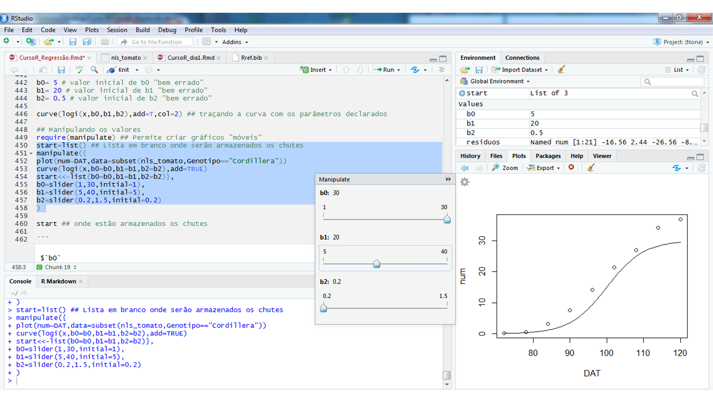

# Análise de regressão {#reg}
## Regressão Linear

A análise de regressão \indt{regressão simple} tem como objetivo verificar como uma variável independente influencia a resposta de uma variável dependente. A análise de regressão é amplamente utilizada em ciências agrárias e pode ser dividida em simples ou múltipla\indt{regressão múltipla}. Na regressão simples, apenas uma variável dependente é declarada no modelo:

$$
Y_i = {\beta _0} + {\beta _1}x + \varepsilon_i  
$$

Onde $Y_i$ é a variável dependente, $x$ é a variável independente, $\beta_0$ é o intercepto, $\beta_1$ é a inclinação da reta e $\varepsilon$ é o erro. Na regressão linear múltipla, mais de uma variável dependente é declarada no modelo:  

$$
Y_i = {\beta _0} + {\beta _1}x_1 + {\beta _2}x_2 + ... + {\beta _k}x_k + \varepsilon_i  
$$

Onde $Y_i$ é a variável dependente, $x_1$, $x_2$,...,$x_k$ são as variáveis independentes, $\beta_0$, $\beta_1$, $\beta_2$,...,$\beta_2$ são os parâmetros \indt{parâmetros}da regressão e $\varepsilon$ é o erro. Então, uma regressão por ser descrita genericamente por [@Draper1998] 

$$
Y_i = f(x)+\varepsilon_i 
$$

Onde $Y_i$ é a variável dependente, $f(x)$ é a função resposta do modelo e $\varepsilon$ é o erro. 

### Estimação

Uma das formas de estimar os parâmetros em regressão é minimizando os erros. Os erros são a diferença entre o valor estimado pela função resposta [(]$f(x)$] e o valor observado ($Y_i$), representados no gráfico abaixo por pontos vermelhos. Então, devemos encontrar valores para ${\boldsymbol{\beta}}$ que minimizem estes erros, representados pela distância entre a reta estimada e os valores observados. 

\indf{lm} \indf{ggplot2}
```{r, echo = TRUE, eval = TRUE, message = FALSE, warning = FALSE, error = FALSE, fig.height = 3, fig.width = 3.5, fig.align = "center", fig.cap = "Gráfico de dispersão de alguns dados com uma linha representando a tendência geral. As linhas verticais representam as diferenças (ou residuais) entre a linha e os dados observados."}
data_error = data.frame(x = seq(0, 20, 2),
                        y = c(3,9,4,10,12,9,14,16,18,16,14))
mod = lm(y ~ x, data = data_error)
ggplot(data_error, aes(x, y)) + 
       geom_segment(aes(x = x, y = y, xend = x, yend = fitted(mod))) +
       geom_point(color = "red") + 
       geom_smooth(se = FALSE, method = "lm")

```

Na figura abaixo, uma reta é traçada de modo que as distâncias entre ela e os pontos seja mínimo. Essa distância é obtida, pelo método dos mínimos quadrados\indt{mínimos quadrados}, minimizando a soma de quadrados dos resíduos \indt{resíduos} (uma vez que a soma dos resíduos é igual a zero). 

$$
S = {\boldsymbol{\varepsilon '\varepsilon }} = \sum\limits_{i = 1}^n {{{\left( {{Y_i} - {{\hat Y}_i}} \right)}^2}} = 0
$$

Para encontrar os valores dos parâmetros \indt{parâmetros}que minimiza essa soma de quadrados basta resolver o sistema de equações normais\indt{sistema de equações normais}, obtida após derivar $S$ em relação aos parâmetros. A resolução deste sistema fornece estimativas não viesadas dos parâmetros ${\boldsymbol\hat\beta}$.

$$
\begin{array}{c}{\boldsymbol{X'X\beta = X'Y}}\\{\boldsymbol{\hat\beta}} = {\left( {{\boldsymbol{X'X}}}\right)^{- 1}}{\boldsymbol{X'Y}}\end{array}
$$

Percebe-se que as estimativas dos parâmetros não tem nenhuma relação com os pressupostos \indt{pressupostos} de normalidade, homocedasticidade e independência dos resíduios. Porém, cumprir pressupostos é importante para testar hipóteses e construir intervalos de confiança. Outro aspecto importante na estimação é a necessidade da matriz $\boldsymbol{X'X}$ ser não singular, pois assim é possível inverter essa matriz e resolver o sistema de equações normais \indt{sistema de equações normais}  obtendo parâmetros \indt{parâmetros}únicos. O sistema de equações normais também pode ser resolvido utilizando a inversa generalizada. Neste último caso, os valores dos parâmetros que resolvem o sistema de equações não são únicos. Para maiores detalhes sobre como estimar os parâmetros de regressões lineares, ver @Draper1998, @Kutner2005 e @Rencher2008.

Vimos que uma matriz $\boldsymbol{X'X}$ não singular é necessária para obtermos os parâmetros da nossa regressão. A não singularidade da matriz está relacionada com quanto as variáveis independentes estão correlacionadas. Quando as variáveis independentes estão aproximadamente (ou perfeitamente, o que é praticamente impossível) relacionadas dizemos que há elevada **multicolinearidade**\indt{multicolinearidade}. O principal problema da multicolinearidade está relacionado com as estimativas dos parâmetros. Quando ela é elevada, um conjunto de funções resposta minimiza os erros e prediz, com precisão, os valores observados.

Quando há multicolinearidade é possível resolver o sistema de equações normais \indt{sistema de equações normais} utilizando a inversa generaliazada de Moore-Penrose, utilizando a função `ginv()` \indf{ginv} do pacote *MASS*. Utilizando a inversa generalizada minimiza-se a soma dos quadrados, porém não garante-se que os parâmetros \indt{parâmetros}sejam únicos. Então, qualquer inferências sobre como as variáveis se relacionam passa a ser duvidosa [@Kutner2005]. 

Para demonstrar como a multicolinearidade afeta a estimativa dos parâmetros, utilizamos um exemplo hipotético de @Kutner2005. Execute a programação em casa e veja os resultados.

```{r, echo = TRUE, eval = FALSE, message = FALSE, warning = FALSE, error = FALSE}
X1 = c(2,8,6,10)
X2 = c(6,9,8,10)
cor(X1,X2) # correlação entre as variávies independentes

## Minimizando a soma de quadrados
require (nls2)
resultados = data.frame(matrix(ncol = 4,nrow = 20))
names(resultados) = c("b0","b1","b2","sigma")

for(i in 1:20){
Y = c(23,83,63,103)
X1 = c(2,8,6,10)
X2 = c(6,9,8,10)
grid = expand.grid(list(
b0 = seq(-i,i, by = 0.1),
b1 = seq(-i, i, by = 0.1),
b2 = seq(-i, i, by = 0.1)
)) # Armazenando um conjunto de valores que quero dar aos parâmetros

Resp = nls2(Y~b0+b1*X1+b2*X2,
start = grid,
algorithm = "brute-force")

b0 = summary(Resp)$coefficients[1,1]
b1 = summary(Resp)$coefficients[2,1]
b2 = summary(Resp)$coefficients[3,1]
sigma = summary(Resp)$sigma
;
resultados$b0[i] = b0
resultados$b1[i] = b1
resultados$b2[i] = b2
resultados$sigma[i] = sigma
}
resultados
```

Quando há multicolinearidade\indt{multicolinearidade}, conjuntos de diferentes  parâmetros \indt{parâmetros}resolvem o sitema de equações normais e minimizam a soma de quadrados. Por isso, relacionar a resposta da variável dependente em função das variáveis independentes passa a ser impossível. Por isso, por exemplo, que a multicolinearidade é importante na [análise de trilha](#analise-de-trilha). A relação entre as variáveis na análise de trilha é determinada com base no valor dos coeficientes de trilha, que nada mais são do que parâmetros de uma regressão múltipla.


### Ajustando regressões com a função `lm()`

A função `lm()` \indf{lm} é utilizada para ajustar regresões lineares simples e múltipla. Os argumentos mais importantes desta função são a `formula`, onde indicamos a função resposta; e `data`, onde indicamos o banco de dados.  Vamos utiliza um exemplo simples retirado de @Schneider2009: 

```{r,  echo = TRUE, eval = TRUE, message = FALSE, warning = FALSE, error = FALSE}

reg <- import("https://github.com/TiagoOlivoto/e-bookr/raw/master/data/data_R.xlsx",
              sheet = "REG")
mod7 = lm(Y ~ X1 + X2 + X3, data = reg)
mod7.1 = lm(Y ~ 1, data = reg)
anova(mod7.1, mod7) # Verificar a significância do modelo
```

Através da função `anova(mod7.1, mod7)` \indf{anova} pode-se verificar se o modelo é ou não significativo. A hipótese $H_0 = 0$ é rejeitada e conclui-se que o modelo explica o comportamento da variável resposta. Através da função `summary()` \indf{summary} obtém-se o resultado do teste *t* para os parâmetros \indt{parâmetros}do modelo. A hipótese testada neste caso é $H_0:\boldsymbol{\beta} = 0$ *vs* $H_A:\boldsymbol{\beta}\ne 0$. Por fim, a função `anova()` retorna um teste F que possibilita verificar a contribuição de cada parâmetro em explicar a variabilidade da variável resposta.

```{r,  echo = TRUE, eval = TRUE, message = FALSE, warning = FALSE, error = FALSE}
summary(mod7)
```

Entre os parâmetros do modelo, apenas $\hat{\beta_3}$ não foi significativo, indicando que não há necessidade dele ser incluido no modelo. Através do teste F é possível verificar qual o modelo (com ou sem $\beta_3$) é o mais parcimonioso. O teste F é dado por:  

$$
F_{calc} = \frac{S{Q_{Erro}}(\Omega)- S{Q_{Erro}}(\omega)/G{L_{Erro}}(\Omega)- G{L_{Erro}}(\omega)} {Q{M_{Erro}}(\omega )}\
$$

Onde, $SQ_{Erro}(\Omega)$ e $SQ_{Erro}(\omega)$ são as somas de quadrados dos resíduos \indt{resíduos} nos modelos completo e reduzido, respectivamente; $G{L_{Erro}}(\omega)$ e $G{L_{Erro}}(\Omega)$ são os graus de liberdade do resíduo do modelo completo e reduzido, respectivamente; e $Q{M_{Erro}}(\omega )$ é o quadrado médio do resíduo do modelo completo. Podemos realizar o teste F utilizando a função `anova()`:

```{r,  echo = TRUE, eval = TRUE, message = FALSE, warning = FALSE, error = FALSE}
mod8 = lm(Y ~ X1 + X2, data = reg)
anova(mod8, mod7)
```

Como ambos modelos são estatisticamente iguais, opta-se pelo modelo reduzido. O modelo que melhor se ajustou aos dados foi $Y = 6.726 + 2.759X_1 - 1.937X_2$, $R^2_{Aj} = 0.93$ superior a 90%.

``````{r, echo = TRUE, eval = TRUE, message = FALSE, warning = FALSE, error = FALSE}
coefficients(mod8)
```


### Seleção de variáveis

Foi mostrado brevemente um exemplo de como ajustar e selecionar variáveis. Porém, no exemplo apresentado, utilizou-se somente três variáveis. No entanto, quando há um elevado número de variáveis, selecioná-las torna-se um trabalho um pouco mais complexo. Nestes casos é necessário utilizar algoritimos de seleção. Os mais comuns são o *Forward*, *Backward* e *Stepwise*.

**Forward** \indt{forward}

No método *forward* parte-se de um modelo com uma variável independente, que é aquela que possui maior correlação \indt{correlação} amostral com a variável dependente. Posteriormente, realiza-se o teste F para verificar se ela é realmente é significativa. A segunda variável independente com maior correlação amostral com a variável dependente é adicionada ao modelo, e um teste F parcial verifica a significância. As variávies são adicionadas enquanto o F parcial for significativo. 

``````{r, echo = TRUE, eval = TRUE, message = FALSE, warning = FALSE, error = FALSE}
cor(reg[1], reg[2:4]) # Correlação
mod_for1 = lm(Y ~ 1, data = reg)
mod_for2 = lm(Y ~ X1, data = reg) # Adiciona X1 
mod_for3 = lm(Y ~ X1 + X2, data = reg)  # Adiciona X2 
mod_for4 = lm(Y ~ X1 + X2 + X3, data = reg)  # Adiciona X3 
anova(mod_for1, mod_for2, mod_for3, mod_for4)  # Seleciona o modelo 
```

**Backward** \indt{backward}

No método *backward* parte-se do modelo completo. As variávies candidatas a serem eliminadas são determinadas através do teste F parcial, como se elas fossem (hipoteticamente) as últimas a serem incluidas no modelo. 

``````{r, echo = TRUE, eval = TRUE, message = FALSE, warning = FALSE, error = FALSE}
# F parcial para X3
mod_back.x3 = lm(Y~X1+X2+X3,data = reg)
mod_back.x3.1 = lm(Y~X1+X2,data = reg)
anova(mod_back.x3.1,mod_back.x3) # Menor F parcial

# F parcial para X2
mod_back.x2 = lm(Y~X1+X2+X3,data = reg)
mod_back.x2.1 = lm(Y~X1+X3,data = reg)
anova(mod_back.x2.1,mod_back.x2)

# F parcial para X1
mod_back.x1 = lm(Y~X1+X2+X3,data = reg)
mod_back.x1.1 = lm(Y~X2+X3,data = reg)
anova(mod_back.x1.1,mod_back.x1) # Maior F parcial 

# Elimina a 3, depois a 2 e depois a 1
mod_back1 = lm(Y~X1+X2+X3,data = reg)
mod_back2 = lm(Y~X1+X2,data = reg)
anova(mod_back2,mod_back1) # elimina X3

mod_back2 = lm(Y~X1+X2,data = reg)
mod_back3 = lm(Y~X1,data = reg)
anova(mod_back3,mod_back2) # não elimina X2 e seleciona
```

**Stepwise** \indt{stepwise}

O método *stepwise* utiliza características dos métodos *forward* e *backward*. Neste método parte-se de um modelo composto pela variável com maior correlação \indt{correlação} amostral. A cada variável adicionada por *forward*, é relizado um *backward* para retirar uma das variáveis previamente adicionadas.

``````{r, echo = TRUE, eval = TRUE, message = FALSE, warning = FALSE, error = FALSE}
# Passo 1
mod_step1.0 = lm(Y ~ 1, data = reg)
mod_step1 = lm(Y ~ X1, data = reg)
anova(mod_step1.0, mod_step1) # adiciona X1

# Passo 2
mod_step2 = lm(Y ~ X1, data = reg)
mod_step2.1 = lm(Y ~ X1 + X2, data = reg)
anova(mod_step2, mod_step2.1) # adiciona X2

mod_step2.2 = lm(Y ~ X2, data = reg)
anova(mod_step2.2, mod_step2.1) # mantém X1 no modelo

# Passo 3
mod_step3 = lm(Y ~ X1 + X2, data = reg)
mod_step3.1 = lm(Y ~ X1 + X2 + X3,data = reg)
anova(mod_step3, mod_step3.1) # não adiciona X3, seleciona o modelo
```


As análises acima foram demonstradas apenas para detalhar o funcionamento dos algoritimos de seleção, utilizando F parcial. O F parcial é muito rigoroso, e por isso muitas vezes o pesquisador usa valores de $\alpha$ maiores que 5%. Além disso, várias funções do *R* estão disponíveis para selecionar variáveis utilizando diferentes  diferentes critérios. As funções `ols_step_forward_p()`, `ols_step_backward_p()` e `ols_step_both_p()` do pacote [olsrr](https://rdrr.io/cran/olsrr/)^[https://rdrr.io/cran/olsrr/] selecionam variávies utilizando utilizado *forward*, *backward* ou *stepwise*, respectivamente, considerando p-valores para critério de decisão de inclusão/remoção de variáveis.

\indf{ols\_step\_forward\_p}, \indt{ols\_step\_backward\_p}
\indf{ols\_step\_both\_p}

``````{r, echo = TRUE, eval = FALSE, message = FALSE, warning = FALSE, error = FALSE}
olsrr::ols_step_forward_p(mod_for4)
olsrr::ols_step_backward_p(mod_for4)
olsrr::ols_step_both_p(mod_for4)

```


### Falta de ajuste

Quando várias observações são realizadas para cada variável independente (experimentos com repetição, por exemplo), é necessário verificar a falta de ajuste. Nestes casos, o erro é dividido em duas partes: a) o erro puro, \indt{erro puro} que consiste na diferença entre a média e as observações em cada variável; b) falta de ajuste, \indt{falta de ajuste} que é a diferença entre a média da variável independente e o valor ajustado pela regressão.

$$
{Y_{ij}} - {\hat Y_i} = \left( {{Y_{ij}} - {{\bar Y}{i.}}} \right) + \left( {{{\bar Y}{i.}} - {{\hat Y}_i}} \right)
$$


Onde $\hat{Y_{ij}}-Y_{ij}$ é o erro do modelo, $(Y_{ij}-\bar{Y_j})$ é o erro puro e $(\hat{Y_{ij}}-\bar{Y_j})$ é a falta de ajuste. 


``````{r, echo = TRUE, eval = TRUE, message = FALSE, warning = FALSE, error = FALSE}
mod10 = lm(RG ~ DOSEN, data = quantitativo) # Regressão linear
mod10.1 = lm(RG ~  factor(DOSEN), data = quantitativo) #falta de ajuste
anova(mod10, mod10.1) # Erro puro
```

A significância do teste F indica que o modelo linear não é adequado para representar a relação entre as variávies dependentes e independentes. Isso indica que o modelo ajustado "não se aproxima" satisfatoriamente da média das variávies independentes, e que a falta de ajuste \indt{falta de ajuste} é elevada quando comparado ao erro puro. Agora, vamos ajustar um modelo quadrático:

``````{r, echo = TRUE, eval = TRUE, message = FALSE, warning = FALSE, error = FALSE}
mod11 = lm(RG ~  DOSEN +I(DOSEN^2), data = quantitativo) #Regressão quadrática
anova(mod11, mod10.1)
```

A não significância do teste F indica que o modelo quadrático é adequado para representar a relação entre as variávies dependentes e independentes. Aqui o exemplo é apresentado para um ajuste de polinômios, mas sua aplicação se estende a qualquer regressão (linear simples, múltipla ou regressão não linear).


### Análise dos resíduos

Na análise de regressão, os resíduos \indt{resíduos} devem ser normalmente distribuídos, homocedásticos e independentes. O diagnóstico é realizado por testes estatísticos ou através de análise gráfica. 

``````{r, echo = TRUE, eval = TRUE, message = FALSE, warning = FALSE, error = FALSE,fig.height = 8, fig.width = 8, fig.align = "center"}

residuos = residuals(mod11)
shapiro.test(residuos) # Normalidade
bartlett.test(residuos ~ DOSEN, data = quantitativo) # Homocedasticidade
autoplot(mod11)# análise gráfica dos resíduos
```

A análise dos resíduos \indt{resíduos} também pode indicar a necessidade de adicionar variávies explicativas ao modelo. Por exemplo, vamos analisar os resíduos de um modelo linear ajustados a dados que tem (conhecidamente) comportamento quadrático.

``````{r, echo = TRUE, eval = TRUE, message = FALSE, warning = FALSE, error = FALSE,fig.height = 8, fig.width = 8, fig.align = "center"}
residuos = residuals(mod10)
autoplot(mod10) # análise gráfica dos resíduos
```

Percebe-se, pelo gráfico residuals *vs* fitted, que os resíduos não são aleatoriamente distribuídos em torno de zero. A distribuição sistemática dos resíduos indica que uma variável  que explica consideravelmente a variabilidade dos dados não foi incluída no modelo (no caso o termo quadrático do polinômio).


### Pontos influentes

\indt{pontos influentes}
As observações influentes podem ser mensuradas através da *distância de Cook*, *DFBETA* e *DFFITS*. O *DFFITS* e a *distância de Cook* medem a influência das observações sobre a predição das variávies; e o *DFBETA* mede a influência destas observações sobre as estimativas dos parâmetros.

Vamos utilizar as funções gráficas do pacote `olsrr` para fazer o diagnóstico dos pontos infuentes. 

```{r, echo = TRUE, eval = TRUE, message = FALSE, warning = FALSE, error = FALSE,fig.height = 3, fig.width = 4, fig.align = "center", fig.cap = "Distância de Cook representando a influencia dos pontos na predição das variávies"}
olsrr::ols_plot_cooksd_bar(mod11) # Distância de Cook
```

```{r, echo = TRUE, eval = TRUE, message = FALSE, warning = FALSE, error = FALSE,fig.height = 7, fig.align = "center"}
olsrr::ols_plot_dfbetas(mod11) # DFBetas
```

```{r, echo = TRUE, eval = TRUE, message = FALSE, warning = FALSE, error = FALSE,fig.height = 4, fig.width = 4, fig.align = "center"}
olsrr::ols_plot_dffits(mod11) # DFFits
```

As observações 8 e 12 são as que mais influenciam os valores preditos e as estimativas dos parâmetros. Os limites pela *distância de Cook*, *DFBETA* e *DFFITS* para realizar o diagnóstico são $\frac{4}{n} = \frac{4}{20} = 0,20$, $\frac{2}{\sqrt{n}} = \frac{2}{\sqrt{2}} = 0,45$ e $2 \times \sqrt {\frac{p}{n}}  = 2 \times \sqrt {\frac{3}{{20}}}  = 0,77$, respectivamente.


## Regressão não linear

Uma regressão é dita não linear quando os parâmetros \indt{parâmetros}não encontram-se de forma aditiva no modelo. Devido a isso, o sistema de equações normais ${\left( {{\boldsymbol{X'X}}} \right)^{{\boldsymbol{ - 1}}}}{\boldsymbol{\beta  = X'Y}}$ não pode ser resolvido analiticamente, e os parâmetros precisam ser estimados utilizando métodos iterativos. \indt{sistema de equações normais}

### Estimação

A estimação dos parâmetros é realizado pelo método dos mínimos quadrados \indt{mínimos quadrados}. O método iterativo utilizado nos softwares R e SAS, por exemplo, é o de *Gauss-Newton*. Este método utiliza aproximações lineares de Taylor de primeira ordem da função resposta, dada por 

$$
f\left( {x,{\boldsymbol{\theta }}} \right) = f\left( {x,{{\boldsymbol{\theta }}^0}} \right) + \frac{{\partial f\left( {x,{{\boldsymbol{\theta }}^0}} \right)}}{{\partial {\boldsymbol{\theta }}}}\left( {{\boldsymbol{\theta }} - {{\boldsymbol{\theta }}^0}} \right)	
$$

Essa aproximação linear de primeira ordem pode ser simplificada por $f\left( {\boldsymbol{\theta }} \right) = f\left( {{{\boldsymbol{\theta }}^0}} \right) + {\boldsymbol{F}}\left( {{\boldsymbol{\theta }} - {{\boldsymbol{\theta }}^0}} \right)$. Substituindo-a na função que minimiza a soma de quadrados, temos: 

$$
\begin{array}{c}S\left( {\boldsymbol{\theta }} \right) = \sum\limits_{i = 1}^n {{{\left( {y - f\left( {{\boldsymbol{\hat \theta }}} \right)} \right)}^2}} \\S\left( {\boldsymbol{\theta }} \right) = \sum\limits_{i = 1}^n {{{\left( {y - f\left( {{{\boldsymbol{\theta }}^0}} \right) - {\boldsymbol{F}}\left( {{\boldsymbol{\theta }} - {{\boldsymbol{\theta }}^0}} \right)} \right)}^2}} \\S\left( {\boldsymbol{\theta }} \right) = \sum\limits_{i = 1}^n {{{\left( {\varepsilon  - {\boldsymbol{F}}\left( {{\boldsymbol{\theta }} - {{\boldsymbol{\theta }}^0}} \right)} \right)}^2}} \end{array}
$$

Percebe-se que a matriz $\boldsymbol{F}$, que substitui $\boldsymbol{X}$, é sempre dependente de um dos parâmetros \indt{parâmetros}do modelo, e por isso o sistema de equações não tem resolução analítica. O sistema de equações não linear acima é resolvido por ${\boldsymbol{\theta }} - {{\boldsymbol{\theta }}^{\boldsymbol{0}}} = {\left( {{\boldsymbol{F}}'{\boldsymbol{F}}} \right)^{ - 1}}{\boldsymbol{F}}'{\boldsymbol{\varepsilon }}$, que reorganizada como ${\boldsymbol{\theta }} = {{\boldsymbol{\theta }}^{\boldsymbol{0}}} + {\left( {{\boldsymbol{F}}'{\boldsymbol{F}}} \right)^{ - 1}}{\boldsymbol{F}}'{\boldsymbol{\varepsilon }}$, corresponde ao primeiro passo do método iterativo de *Gauss-Newton*. Para algoritimo seja iniciado, um valor inicial para os parâmetros deve ser declarado. O processo é repetido até obter convergência, que ocorre quando os valores estimados em cada passo são próximos um dos outros.

### Ajustando o modelo com a função `nls()`

A função `nls()` \indt{nls} pode ser utilizada para ajustar modelos não lineares. Os principais argumentos da função são: i) `formula`, onde o modelo é declarado; ii) `data`, onde os dados são declarados e iii) `start` \indt{start}, que é uma lista com os valores iniciais dos parâmetros.

**Valores iniciais dos parâmetros**

O primeiro passo da análise é encontrar os valores iniciais dos parâmetros. O método gráfico é útil para cumprir esse objetivo. Valores dos parâmetros \indt{parâmetros}são declarados até o ponto em que a curva gerada se aproxime dos valores observados. A programação que será apresentada foi obtida no blog [Ridículas](https://ridiculas.wordpress.com/tag/nao-linear/), mantido pelo [LEG](http://www.leg.ufpr.br/doku.php/start) da UFPR. Utilizaremos como exemplo o modelo logístico (uma de suas parametrizações), dado por

$$
{Y_i} = \frac{{{\beta _1}}}{{1 + {e^{\left( {{\beta _2} - {\beta _3}{t_i}} \right)}}}} + {\varepsilon _i}
$$

```{r, echo = TRUE, eval = TRUE, message = FALSE, warning = FALSE, error = FALSE,fig.height = 7}
nls_tomato <- import("https://github.com/TiagoOlivoto/e-bookr/raw/master/data/data_R.xlsx",
                     sheet = "TOMATE")
nls_tomato_cord <- subset(nls_tomato,Genotipo  ==  "Cordillera") 
```

```{r,  echo = TRUE, eval=FALSE, results="hide", message = FALSE, warning = FALSE, error = FALSE,fig.height = 7}
# Modelo logístico
logi <- function(x, b1, b2, b3){
  b1 / (1 + exp(b2 - b3 * x))
}
start=list()
manipulate({
  plot(num~DAT,data = nls_tomato_cord)
  curve(logi(x, b1=b1,b2=b2,b3=b3),add=TRUE)
  start<<-list(b1=b1,b2=b2,b3=b3)},
  b1=slider(0,50,initial=10),
  b2=slider(0, 20,initial=5),
  b3=slider(0, 1,initial=0)
)

```





**Ajustando o modelo**

Os valores iniciais serão armazenados na lista `start`, e esta será declarada no argumento `start` da função `nls()` \indf{nls} . A função `summary()` \indf{summary} retorna o teste de Wald para os parâmetros.

```{r,  echo = FALSE, message = FALSE, warning = FALSE, error = FALSE,fig.height = 7}
start = list(b1 = 30, b2 = 20, b3 = 0.2)
```


```{r,  echo = TRUE, eval = TRUE, message = FALSE, warning = FALSE, error = FALSE,fig.height = 7}
nls1 = nls(num~b1/(1+exp(b2-b3*DAT)), 
         data = nls_tomato_cord, # indica os dados
         start = start) # indica os valores iniciais
summary(nls1)
```

### Análise dos resíduos

Os resíduos \indt{resíduos} dos modelos não lineares também deve ser normalmente distribuídos, homocedásticos e independentes. Os testes estatísticos e a análise dos resíduos seguem os mesmos princípios dos modelos lineares. 

```{r,  echo = TRUE, eval = TRUE, message = FALSE, warning = FALSE, error = FALSE,fig.height = 7}
require(lmtest) # pacote para carregar teste de Breusch-Pagan (homogeneidade)
require (car) # pacote para carregar teste de DW (independência)
### Normalidade
res_nls1 = residuals(nls1)
shapiro.test(res_nls1)
nls1_grad = attr(nls1$m$fitted(), "gradient") # obtem matriz gradiente
nls1_lm = lm(num~-1+nls1_grad, data = nls_tomato_cord) 
bptest(nls1_lm) # teste de Breusch-Pagan (homogeneidade)
durbinWatsonTest(nls1_lm) # teste de DW (independência)
```

O cumprimento dos pressupostos \indt{pressupostos} dos resíduos não afeta a estimativa dos parâmetros, mas é de extrema importância para construir intervalos de confiança e testar hipóteses.  Percebe-se, no nosso exemplo, que os pressuposto foram cumpridos (*p*-valor>0,05). Para realizar a análise gráfica dos resíduos pode-se utilizar a função `nlsResiduals()` \indf{nlsResiduals}  do pacote **nlstools**.  

```{r,  echo = TRUE, eval = TRUE, message = FALSE, warning = FALSE, error = FALSE,fig.height = 7}
require(nlstools)
res1_nls1 = nlsResiduals(nls1)
plot(res1_nls1)
```

No exemplo acima, apenas uma observação foi realizada para cada variável independente (dias após o transplante, no caso). Por isso optou-se por utilizar o teste de *Breusch-Pagan* para realizar o diagnóstico de homocedasticidade dos resíduos. Quando mais de uma observação é realizada em cada variável independente, pode-se utilizar os testes de *Bartlett* ou *Levene*.

```{r,  echo = TRUE, eval = TRUE, message = FALSE, warning = FALSE, error = FALSE,fig.height = 7}
nls_eggplant <- import("https://github.com/TiagoOlivoto/e-bookr/raw/master/data/data_R.xlsx",
                       sheet = "EGGPLANT")
nls_eggplant = subset(nls_eggplant, ESTUFA  ==  "E1") 
start = list(b1 = 10,b2 = 6.7,b3 = 0.073)
nls2 = nls(NUMERO ~ b1/(1+exp(b2-b3*DAT)), 
         data = nls_eggplant,
         start = start)

```


### Medidas de não linearidade

Conforme vimos acima, a estimação dos parâmetros \indt{parâmetros}é realizada pelo método dos mínimos quadrados \indt{mínimos quadrados} utilizando aproximações lineares de Taylor da função resposta. É esta aproximação linear que garante que os parâmetros estimados sejam proximos de não viesados (só serão não viesados assintoticamente). Modelos com aproximação linear pobre tendem a ter parâmetros muito viesados, o que impede que eles sejam utilizados para explicar determinado fenomeno biológico (eles tem ineterpretação biológica). As medidas de curvatura de Bates e Watts são amplamente utilizadas para avaliar o grau de não linearidade da função resposta. Para maiores detalhes, ver @Bates1988, cap. 7 e @Seber2003, cap. 4. Essas medidas são facilmente implementadas através da função `rms.curv()` \indf{rms.curv} do pacote *MASS*. Para isto, utilizaremos o modelo ajustado `nls1`

```{r,  echo = TRUE, eval = TRUE, message = FALSE, warning = FALSE, error = FALSE,fig.height = 7}

start = list(b1 = 30, b2 = 19, b3 = 0.2)
## Medidas de não linearidade
nls1_hess = deriv3(~b1/(1 + exp(b2 - b3 * DAT)), c("b1","b2","b3"),
                 function(DAT,b1,b2,b3)NULL) ## hessiana
nls1_hess.1 = nls(num ~ nls1_hess(DAT,b1,b2,b3),
                  data = nls_tomato_cord,
                  start = start)
rms.curv(nls1_hess.1)
```

Os valores que a função `rms.curv()` retorna são ${c^\theta } \times \sqrt {{F_{\alpha ;p,n - p}}}$ e ${c^\iota } \times \sqrt {{F_{\alpha ;p,n - p}}}$. Valores baixos destas duas medidas indicam que a função tem boa aproximação linear e, consequentemente, os parâmetros \indt{parâmetros}são próximos de ser não viesados.

### Comparação de parâmetros

Os parâmetros em um modelo podem ser comparados utilizando variávies *dummy*. Utilizando esta técnica, a ocorrência de um determinado fator é associado a um nova variável. Como os modelos são aninhados, pode-se utilizar o teste F para verificar a significância do parâmetro (e, consequentemente, do fator) associado a esta variável.

Vamos ao exemplo. Suponha que queiramos comparar a produção e a taxa de producão de frutos de dois genótipos de tomate. Sabemos que quando acumuladas, a podução de olerícolas tem comportamento sigmoide [@Lucio2015;  @Lucio2016], o que permite deteminar essas caracteristicas através dos parâmetros de um modelo logístico:

$$
{Y_i} = \frac{{{\beta _1}}}{{1 + {e^{\left( {{\beta _2} - {\beta _3}{t_i}} \right)}}}} + {\varepsilon _i}
$$

No modelo acima, $\beta_1$ representa a assíntota, e está associada a produção total dos genótipos; $\beta_3$ é a taxa de produção de frutos, e está associada a precocidade produtiva dos genótipos [@Sari2018]. Vamos testar as seguintes hipóteses:


$$
	\begin{array}{*{20}{c}}{{H_0} = {\beta _{11}} = {\beta _{12}}}&{{H_0} = {\beta _{31}} = {\beta _{32}}}\\{{H_A} = {\beta _{11}} \ne {\beta _{12}}}&{{H_A} = {\beta _{31}} \ne {\beta _{32}}}\end{array}
$$
	
	
**Testando a hipótese $H_0:\beta_{11} = \beta_{12}$**

Associamos os fatores a novas variávies através de uma nova coluna no banco de dados. No nosso caso, a coluna "Completo" associa o fator aos parâmetros \indt{parâmetros}do modelo logístico. Então, como o modelo logístico possui 3 parâmetros, ao associarmos variávies dummys ao fator genótipo (são dois genótipos), o modelo completo passa a ter 6 parâmetros. 

Para tertar esta hipótese, associamos variáveis dummy \indt{variáveis dummy}s apenas aos parâmetros $\beta_1$ e $\beta_3$. Neste caso, o modelo passa a ter 5 parâmetros (1 $\beta_1$, 2 $\beta_2$ e 2 $\beta_3$). Podemos comparar esse modelo reduzido com o modelo completo de 6 parâmetros. Se o teste F der significativo, concluímos que há influência do fator genótipo.

```{r,  echo = TRUE, eval = TRUE, message = FALSE, warning = FALSE, error = FALSE,fig.height = 7}
nls_dummy = nls_tomato %>%
  mutate_at(vars(Genotipo, Completo, Reduzido), as.factor)
## Modelo completo
tomato_completo = nls(num~b1[Completo]/(1+exp(b2[Completo]-b3[Completo]*DAT)), 
                    data = nls_dummy,
                    start = list(
                    b1 = c(18.94,39.68),
                    b2 = c(16.04,13.54),
                    b3 = c(0.17,0.13)))
## Modelo reduzido
tomato_reduzido.b1 = nls(num~b1[Reduzido]/(1+exp(b2[Completo]-b3[Completo]*DAT)), 
                    data = nls_dummy,
                    start = list(
                    b1 = c(18.94),
                    b2 = c(16.04,13.54),
                    b3 = c(0.17,0.13)))
anova(tomato_reduzido.b1, tomato_completo)
```

Os valores da assintota diferem estatisticamente entre si. Percebe-se claramente que o genótipo Cordillera foi mais produtivo que o genótipo Gaúcho.

**Testando a hipótese $H_0:\beta_{31} = \beta_{32}$**

```{r,  echo = TRUE, eval = TRUE, message = FALSE, warning = FALSE, error = FALSE,fig.height = 7}
## Modelo completo
tomato_completo = nls(num~b1[Completo]/(1+exp(b2[Completo]-b3[Completo]*DAT)), 
                    data = nls_dummy,
                    start = list(
                    b1 = c(18.94,39.68),
                    b2 = c(16.04,13.54),
                    b3 = c(0.17,0.13)))
## Modelo reduzido
tomato_reduzido.b3 = nls(num~b1[Completo]/(1+exp(b2[Completo]-b3[Reduzido]*DAT)), 
                    data = nls_dummy,
                    start = list(
                    b1 = c(18.94,39.68),
                    b2 = c(16.04,13.54),
                    b3 = c(0.16)))
anova(tomato_reduzido.b3, tomato_completo)
```

Os valores da taxa de produção de frutos não diferem estatisticamente entre si. 

### Representação gráfica dos modelos

Percebe-se claramente que um modelo comum aos dois genótipos não é possível (assintota diferem entre si). Por isso, optou-se por gerar um modelo em separado para cada genótipo. Podemos representar isso graficamente utilizando a função `ggplot()` \indf{ggplot} .

```{r,  echo = TRUE, eval = TRUE, message = FALSE, warning = FALSE, error = FALSE, fig.cap = "Representação gráfica em modelos não lineares", fig.width = 4, fig.height = 4, fig.align = "center"}
formula = as.formula("y ~ b1/(1 + exp(b2-b3*x))")
start = list(b1 = 10.224, b2 = 6.765, b3 = 0.0725)

ggplot(nls_tomato, aes(x = DAT, y = num, colour = Genotipo)) + 
geom_point() +
geom_smooth(method = "nls", 
            method.args = list(formula = formula, 
                                start = start),
                                se = F,
                                data = subset(nls_tomato, Genotipo == "Cordillera")) +
geom_smooth(method = "nls", 
            method.args = list(formula = formula, 
                                start = start),
                                se = F,
                                data = subset(nls_tomato, Genotipo == "Gaucho"))+
theme(legend.position = "bottom")+
labs(x = "Dias após o transplante", y = "Número de frutos")
```


## Regressão bisegmentada com platô

Continuaremos tomando como exemplo a produção de olerícolas de múltiplas colheitas para exemplificar o uso deste tipo de regressão. Os modelos com platô são modelos bi-segmentados cujo primeiro segmento descreve o crescimento da produção até determinado ponto, e um segundo segmento que descreve a estabilização da produção (platô). Podemos representar um modelo linear-platô por:

$$
{Y_i} = \left\{ \begin{array}{l}{\beta _0} + {\beta _1}x + {\varepsilon _i}{\rm{, se }}{X_i}{\rm{  <  }}{X_0}\\P{\rm{ se }}{X_i}{\rm{  >  }}{X_0}{\rm{ }}\end{array} \right.
$$

```{r,  echo = TRUE, eval = TRUE, message = FALSE, warning = FALSE, error = FALSE,fig.width = 4, fig.height = 4, fig.align = "center"}
plato_tomato <- import("https://github.com/TiagoOlivoto/e-bookr/raw/master/data/data_R.xlsx",
                       sheet = "PLATO")
plato_cordillera = nls(num~(b0+b1*DAT*(DAT<= P))+
                    (b1*P*(DAT>P)),
                     data = subset(plato_tomato, Genotipo == "Cordillera"),
                     start = list(b0 = 5, b1 = 11/8, P = 15))
plato_SantaCl = nls(num~(b0+b1*DAT*(DAT<= P))+
                    (b1*P*(DAT>P)),
                     data = subset(plato_tomato, Genotipo == "Santa.Clara"),
                     start = list(b0 = 5, b1 = 11/8, P = 15))
```

O genótipo Cordillera produz a uma taxa de 1,33 frutos dia$^-1$ até os ~9 dias após o início das colheitas, quando começa a estabilizar a produção (17,19 frutos). Já o genótipo Santa Clara produz a uma taxa de 0,71 frutos $^-1$ até os ~14 dias após o início das colheitas, quando começa a estabilizar a produção (12,69 frutos). Podemos verificar a taxa de produção e o ponto de estabilização através de variáveis dummy \indt{variáveis dummy}.  

```{r,  echo = TRUE, eval = FALSE, message = FALSE, warning = FALSE, error = FALSE,fig.height = 7}
plato_dummy = plato_tomato %>%
               mutate_at(vars(Genotipo, Completo, Reduzido), as.factor)
# Modelo completo
plato_completo = nls(num~(b0[Completo]+b1[Completo]*DAT*(DAT<= P[Completo]))+
                    (b1[Completo]*P[Completo]*(DAT>P[Completo])),
                     data = plato_dummy,
                     start = list(b0 = c(4.8,2.5), 
                                b1 = c(1.33,0.71), 
                                P = c(9.28,14.36)))

# Modelo reduzido (taxa de produção)
plato_reduzido.b1 = nls(num~(b0[Completo]+b1[Reduzido]*DAT*(DAT<= P[Completo]))+
                    (b1[Reduzido]*P[Completo]*(DAT>P[Completo])),
                     data = plato_dummy,
                     start = list(b0 = c(4.8,2.5), 
                                b1 = c(1), 
                                P = c(9.28,14.36)))
anova(plato_reduzido.b1, plato_completo)

# Modelo reduzido (Platô)
plato_reduzido.P = nls(num~(b0[Completo]+b1[Completo]*DAT*(DAT<= P[Reduzido]))+
                    (b1[Completo]*P[Reduzido]*(DAT>P[Reduzido])),
                     data = plato_dummy,
                     start = list(b0 = c(4.8,2.5), 
                                b1 = c(1.33,0.71), 
                                P = c(12)))
anova(plato_reduzido.P,plato_completo)
```

Percebe-se que a taxa de produção do genótipo Cordillera é significativamente superior a taxa de produção do genótipo Santa Clara. Como consequência, o momento de estabilização da produção ocorre mais precocemente no genótipo Cordillera. O exemplo foi realizado com dados de produção de olerícolas, mas pdoe ser adaptado para qualquer estudo (desde que tenha este comportamento).

**Representação gráfica dos modelos**

```{r,  echo = TRUE, eval = TRUE, message = FALSE, warning = FALSE, error = FALSE, fig.width = 4, fig.height = 4, fig.align = "center", fig.cap = "Representação gráfica de regressão bisegmentada com platô"}
plot(num~DAT,data = subset(plato_tomato,Genotipo == "Cordillera"),ylim = c(0,20),
     xlab = "Dias após o transplante (DAT)",
     ylab = "Número de frutos por planta",pch = 1,lwd = 2)
points(num~DAT,data = subset(plato_tomato,Genotipo == "Santa.Clara"),pch = 2,lwd = 2)
segments(y0 = 4.8385, x0 = 0, y1 = 17.2083, x1 = 9.28641,lty = 1,lwd = 2)
segments(y0 = 17.2083, x0 = 9.28641, y1 = 17.2083, x1 = 20,lty = 1,lwd = 2)
segments(y0 = 2.5000, x0 = 0, y1 = 12.7655, x1 = 14.3606,lty = 2,lwd = 2)
segments(y0 = 12.7655, x0 = 14.3606, y1 = 12.7655, x1 = 20,lty = 2,lwd = 2)


legend("bottomright", legend = c("Cordillera", "Santa Clara"), lty = c(1,2),
       pch = c(1,2), lwd = c(2,2),bty = "n")
```

