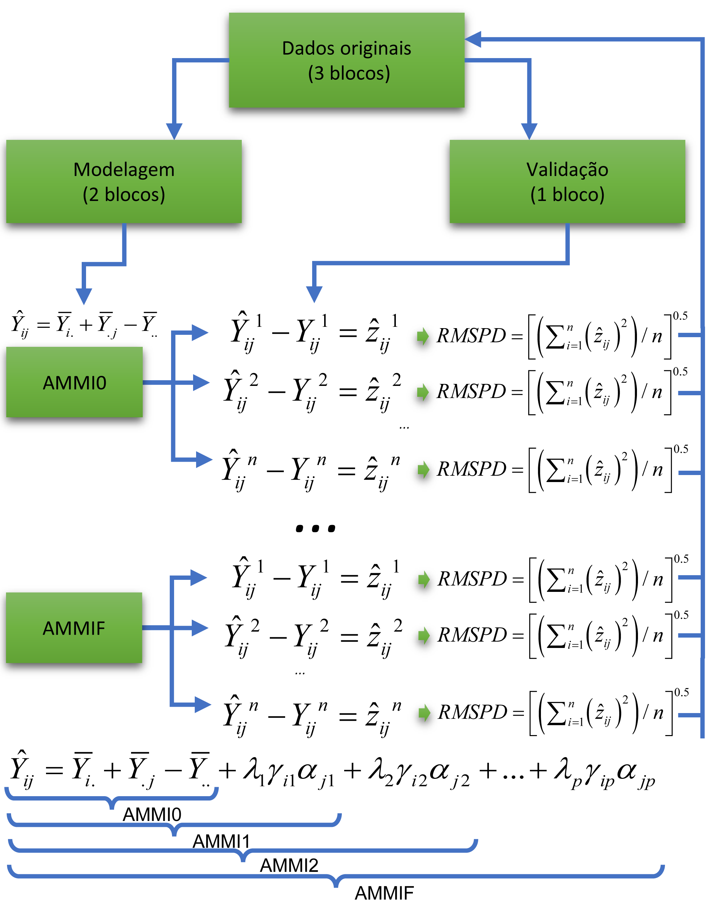

# Interação genótipo-*vs*-ambiente {#interaction}

Uma cultura pode ser vista como um sistema complexo com resultados (por exemplo, rendimento de grãos) que são afetados por informações genéticas, fisiológicas, pedoclimáticas e de manejo. Melhoristas e geneticistas se esforçam continuamente para aumentar a produtividade das culturas visando suprir a demanda mundial cada vez maior por alimentos. É na fase final de um programa de melhoramento de plantas que muito esforço e recursos precisam ser investidos na avaliação dos genótipos (_*g*_) a serem selecionados. Geralmente algumas centenas de genótipos precisam ser avaliados em um grande número de ambientes (_*e*_). Estes ensaios são conhecidos como ensaios multi-ambientes (\indt{EMA}) e os dados destes experimentos resultam em uma matriz __*M*__ de dimensões  $g  \times e$ . É nesta fase do processo que surge um dos maiores desafios da análise de \indt{EMA}: compreender a interação genótipo-*vs*-ambiente buscando novas formas de explorá-la e utilizá-la a favor da seleção de genótipos com estabilidade \indt{estabilidade} produtiva satisfatória.


Funções do pacote **metan**, acrônimo para **m**ulti **e**nvironment **t**rial **an**alysis serão utilizadas para análise de dados de ensaios multi-ambientes\indt{EMA}.  O foi desenvolvido em linguagem R e é distribuído sob a licença GPL (General Public Licence) 3.0. Isto significa que qualquer pessoa pode: (i) utilizar o código sem nenhuma restrição/pagamento; (ii) estudar o código e adaptá-lo às suas necessidades; (iii) sugerir modificações/melhorias no código de modo a aperfeiçoá-lo para uma comunidade maior de usuários, mantendo, porém, os direitos do autor. O pacote **metan** fornece funções úteis para analisar dados de ensaios multi-ambientes usando métodos paramétricos e não paramétricos, incluindo, mas não limitados a:

* Análise gráfica da interação genótipo-*vs*-ambiente;
* Análise de variância individual
* Procedimentos de validação cruzada para modelos da família AMMI e BLUP;
* Estimativas usando AMMI com diferentes números de termos multiplicativos;
* Índices de estabilidade baseados em AMMI;
* Biplots baseados no modelo GGE;
* Predição baseada em modelos de efeito misto;
* Índices de estabilidade baseados em BLUP;
* Componentes de variância e parâmetros genéticos em modelos de efeito misto;
* Ferramentas gráficas para confecção de biplots.
* Estatísticas de estabilidade paramétrica e não paramétrica.

Nesta seção, usaremos o conjunto de dados `data_ge` disponível no pacote **metan**. Para mais informações, por favor, consulte `?data_ge`. Outros conjuntos de dados podem ser usados desde que as seguintes colunas estejam no conjunto de dados: ambiente, genótipo, bloco e variável(eis) resposta.

## Análise gráfica da interação

A função `ge_plot()` \indf{ge\_plot} pode ser usada para visualizar o desempenho dos genótipos nos ambientes. O losângulo preto indica a média de cada ambiente.

```{r fig.height=4, fig.width=10}
p1 = ge_plot(data_ge, ENV, GEN, GY)
p2 = ge_plot(data_ge, ENV, GEN, GY) + theme_grey() + coord_flip()
plot_grid(p1, p2)
```

## Análise de variância individual

A função `anova_ind()` \indf{anova\_ind} pode ser utilziada para realizar uma análise de variância para cada ambiente, conforme o seguinte código.

```{r}
ind = anova_ind(data_ge, ENV, GEN, REP, GY)
print(ind$GY$individual)

```


## Baseada em regressão
@Eberhart1966 popularizaram a análise de estabilidade baseada em regressão. Nesse procedimento, a análise de adaptabilidade e estabilidade é realizada por meio de ajustes de equações de regressão onde a variável dependente é estimada em função de um índice ambiental, conforme o seguinte modelo:

$$
\mathop Y\nolimits_{ij}  = {\beta _{0i}} + {\beta _{1i}}{I_j} + {\delta _{ij}} + {\bar \varepsilon _{ij}}
$$


onde ${\beta _{0i}}$ é a média geral do genótipo *i* (*i* = 1, 2, ..., I); ${\beta _{1i}}$ é a respota linear do genótipo *i* ao índice ambiental; *Ij* é o índice ambiental (*j* = 1, 2, ..., *e*), onde ${I_j} = [(y_{.j}/g)- (y_{..}/ge)]$, ${\delta _{ij}}$ é o desvio da regressão, e ${\bar \varepsilon _{ij}}$ é o erro experimental.
O modelo é ajustado com a função `ge_reg()` \indf{ge\_reg}. Os métodos S3 `plot()` e `summary()` podem ser utilizados para explorar os resultados.


```{r, fig.width=5, fig.height=4, warning = FALSE, message = FALSE}
reg_model = ge_reg(data_ge, ENV, GEN, REP, GY)
reg_model$GY$anova
reg_model$GY$regression
plot(reg_model)
```


## Índice de confiança genotípico
@Annicchiarico1992 propôs um método de estabilidade em que o parâmetro de estabilidade é medido pela superioridade do genótipo em relação à média de cada ambiente, de acordo com o seguinte modelo:

$$
{Z_ {ij}} = \frac{{{Y_ {i}}}} {{{{\bar Y} _ {. J}}}} \times 100
$$

O índice de confiança genotípico do genótipo *i* ($W_i$) é então estimado da seguinte forma:

$$
W_i = Z_{i.} / E - \alpha \times sd (Z_{i.})
$$

Onde $\alpha$ é o quantil da distribuição normal padrão a uma dada probabilidade de erro ($\alpha \approx 1.64$ a 0.05). O método é implementado usando a função `Annicchiarico()` \indf{Annicchiarico}. O índice de confiança é estimado considerando todos os ambientes, os ambientes favoráveis (índice positivo) e os ambientes desfavoráveis (índice negativo), como segue:

```{r, fig.width=5, fig.height=4, warning = FALSE, message = FALSE}
ann = Annicchiarico(data_ge, ENV, GEN, REP, GY)
ann$GY$general
```


## Índice de superioridade genotípico
A função `superiority()`\indf{superiority} implementa o método não-paramétrico proposto por @Lin1988, que considera que a medida de superioridade geral da cultivar para dados de cultivar x localização é definida como quadrado médio da distância entre a resposta da cultivar e a média de resposta máxima em todas as localidades, de acordo com o seguinte modelo.

$$
P_i = \sum \limits_{j = 1} ^ n {(y_ {ij} - y _ {. J}) ^ 2 / (2n)}
$$
onde *n* é o número de ambientes. Da mesma forma que o índice de confiança genotípico, o índice de superioridade é calculado por todos os ambientes, para os favoráveis e para os desfavoráveis.


```{r, fig.width=5, fig.height=4, warning = FALSE, message = FALSE}
super = superiority(data_ge, ENV, GEN, REP, GY)
super$GY$index
```


## Estratificação ambiental
Um método que combina análise de estabilidade e estratificação ambiental usando análise fatorial foi proposto por @murakami2004. Este método é implementado com a função `ge_factanal()`\indf{ge\_factanal}, como segue:

```{r, fig.width = 5, fig.height = 4, aviso = FALSE, mensagem = FALSE}
fato = ge_factanal(data_ge, ENV, GEN, REP, GY)
plot(fato)
print(fato$GY$PCA)
print(fato$GY$FA)
print(fato$GY$env_strat)

```

A maneira mais fácil de calcular os índices de estabilidade acima mencionados é usando a função `ge_stats()`. \indf{ge\_stats}


```{r, eval=FALSE}
stat_ge = ge_stats(data_ge, ENV, GEN, REP, GY)
```

Se você deseja exportar um resumo dos resultados, a maneira mais simples é usando função `summary()`.

```{r, eval = FALSE}
summary(stat_ge, export = TRUE)
```

Este comando criará um arquivo de texto chamado *ge_stats summary.txt * no diretório de trabalho atual.


## O modelo AMMI

O modelo linear mais simples com efeito de interação usado na análise de EMA é

$$
{y_{ijk}} = {\rm{ }}\mu {\rm{ }} + \mathop \alpha \nolimits_i  + \mathop \tau \nolimits_j  + \mathop {(\alpha \tau )}\nolimits_{ij}  + \mathop \gamma \nolimits_{jk}  + {\rm{ }}\mathop \varepsilon \nolimits_{ijk}
$$

onde ${y_{ijk}}$ é a variável resposta observada no *k*-ésimo bloco do *i*-ésimo genótipo no *j*-ésimo ambiente (*i* = 1, 2, ..., *g*;  *j* = 1, 2, ..., *e*; *k* = 1, 2, ..., *b*); $\mu$ é a média geral; $\mathop\alpha\nolimits_i$ é o efeito principal do genótipo *i*; $\mathop \tau \nolimits_j$ é o principal efeito do ambiente *j*; $\mathop {(\alpha \tau )}\nolimits_{ij}$ é o efeito de interação do genótipo *i* com o ambiente *j*; $\mathop \gamma \nolimits_{jk}$  é o efeito do bloco *k* no ambiente *j*; e ${\rm{ }}\mathop \varepsilon \nolimits_{ijk}$ é o erro aleatório assumindo $i.i.d \sim N(0, \sigma^2 )$.


Métodos que combinam diferentes princípios estatísticos ganharam espaço na análise de \indt{EMA} por volta da década 1960, com destaque especial ao estudo de @Gollob1968, que propôs um método que combina os benefícios da análise de fatores e análise de variância em um único método para estudar a estabilidade \indt{estabilidade}. Naquela época este método era conhecido como FANOVA. Atualmente este mesmo método foi popularizado por @Gauch1988 com o acrônimo AMMI.


A análise AMMI \indt{AMMI}utiliza análise aditiva de variância aos fatores principais (genótipo e ambiente) e decomposição por valores singulares ao residual do modelo aditivo, isto é, o efeito da interação genótipo-*vs*-ambiente somado ao erro experimental. Esta matriz dos efeitos não aditivos, então, pode ser aproximadamente exibida por meio de biplots \indt{biplots} @Gabriel1971. Este método tem ganhado destaque nas últimas décadas, principalmente devido a rápida evolução computacional, o que tornou possível as complexas decomposições de matrizes de alta ordem.

De posse de uma matriz de dupla entrada oriunda de ensaios multiambientes, a estimativa da variável resposta do *i*-ésimo genótipo no *j*-ésimo ambiente é obtida utilizando AMMI \indt{AMMI}de acordo com o seguinte modelo:

$$
{y_{ij}} = \mu  + {\alpha_i} + {\tau_j} + \sum\limits_{k = 1}^k {{\lambda _k}{a_{ik}}} {t_{jk}} + {\rho _{ij}} + {\varepsilon _{ij}}
$$


onde ${\lambda_k}$ é o valor singular para o *k*-ésimo eixo do componente principal; $a_{ik}$ é o *i*-ésimo elemento do *k*-ésimo autovetor de genótipos;  $t_{jk}$ é o *j*-ésimo elemento do *k*-ésimo autovetor de ambientes. Um resíduo $\rho _{ij}$ permanece, se todos os *k*-PCAs não são considerados, onde *k* = $min(G-1; E-1)$.

### Ajuste do modelo

O modelo AMMI é ajustado com a função `waas()`\indf{waas}. O primeiro argumento é os dados, no nosso exemplo `data_ge`. Os próximos argumentos (`ENV`, `GEN` e `REP`) são os nomes das colunas que contém os níveis dos fatores ambiente, genótipo, repetição, respectivamente. No argumento `resp` são declaradas as variáveis resposta. Uma única variável pode ser analizada (como em nosso exemplo) ou, um vetor de variáveis, usando, por exemplo `resp = c(GY, HM)`.

```{r echo = TRUE}
AMMI_model = waas(data_ge, ENV, GEN, REP, GY)

```

\indt{Dicas}
```{block2, type = "dica"}
Note que os argumentos inseridos na função obedecem a ordem dos argumentos requiridos na função [veja `args(waas)`]. Se obedecida esta ordem de avaliação, não é necessário declarar qual argumento está sendo inserido. Por exemplo, se mudássemos a ordem de entrada, teríamos um código semelhante a `waas(data_ge, gen = GEN, env =  ENV, REP, resp = c(PH, ED, TKW, NKR))`. 

```


### Analise residual

O pacote **metan** conta com uma opção para análise residual do modelo AMMI ajustado. Gráficos podem ser obtidos utilizando o seguinte comando. 

```{r warning = FALSE, message = FALSE, echo=TRUE, fig.width=8, fig.height=8, fig.align="center"}
plot(AMMI_model)
```

A figura acima, obtida com a função `autoplot()`, mostra 4 gráficos. Os dois primeiros são os mais importantes. O primeiro (*Residual vs fitted*) pode ser utilizado para identificar a homogeneidade das variâncias. Uma distribuição aleatória dos pontos no gráfico deve ser observada. Quando um padrão de distibuição é observado --como, por exemplo, a distribuição dos pontos em forma de funil-- uma investigação deve ser realizada, pois este padrão indica a possiblidade de  heterogeneidade das variâncias. O segundo gráfico (*Normal Q-Q*) nos informa quanto a normalidade dos resíduos, ou seja, é desejado que os pontos sejam distribuídos ao redor da linha diagonal.

### Escolha do número de termos multiplicativos

Conforme já discutido, a análise AMMI \indt{AMMI}aplica a técnica de decomposição por valores singulares na matriz dos efeitos não aditivos do modelo (__*A*__). Logo, esta matriz pode ser aproximada pela pelo seguinte modelo: $A = U \lambda V^T$, onde onde **U** é uma matriz *g* $\times$ *e* contendo os vetores singulares de $AA^T$ e formam a base ortonormal para os efeitos de genótipos; $V^T$ é uma matriz *e* $\times$ *e* que contém os vetores singulares de  $\mathbf{A^TA}$ e formam a base ortonormal para os efeitos de ambientes; e $\lambda$ é uma matriz diagonal *e* $\times$ *e* contendo *k*-valores singulares de $A^TA$ , onde *k* = $min(G-1; E-1)$. Assim, diferentes modelos (dependendo do número de termos multiplicativos utilizados) podem ser utilziados para predizer o rendimento do genótipo *i* no ambiente *j*. A tabela abaixo mostra os possíveis modelos. No modelo AMMI0 apenas os efeitos aditivos são considerados. No modelo AMMI1, o primeiro termo multiplicativo é considerado, e assim por diante, até o modelo AMMIF, onde $min(G-1;E-1)$ termos são considerados. 

| Família AMMI     | Resposta esperado do genótipo *i* no ambiente *j*                             |
|:-----------------|:------------------------------------------------------------------------------|
| AMMI0            | $\hat{y}_{ij} = \bar{y}_{i.} + \bar{y}_{.j} - \bar{y}_{..}$                   |
| AMMI1            |$\hat{y}_{ij} = \bar{y}_{i.} + \bar{y}_{.j} - \bar{y}_{..} +\lambda_1 a_{i1}t_{j1}$ |
| AMMI2            |$\hat{y}_{ij} = \bar{y}_{i.} + \bar{y}_{.j} - \bar{y}_{..} +\lambda_1 a_{i1}t_{j1}+\lambda_2 a_{i2}t_{j2}$ |
| ...              |                                                                               |
| AMMIF            |$\hat{y}_{ij} = \bar{y}_{i.} + \bar{y}_{.j} - \bar{y}_{..} +\lambda_1 a_{i1}t_{j1}+\lambda_2 a_{i2}t_{j2}+...+\lambda_p a_{ip}t_{jp}$  

A escolha do número de termos multiplicativos a ser utilizado é baseada em basicamente dois critérios de sucesso de análise: **Postdiscritive sucess** e **Predictive sucess**. Por definição, **Predictive sucess** significa literalmente a afirmação prévia do que acontecerá em algum momento futuro. Neste contexto, testes de validação cruzada (cross-validation) podem ser utilizadas para avaliar o sucesso preditivo dos membros de modelos da familia AMMI [@Olivoto2019]. Por outro lado, **Postdiscritive sucess** significa fazer uma afirmação ou dedução sobre algo que aconteceu no passado. Na escolha do número de termos multiplicativos da análise AMMI \indt{AMMI}este sucesso pode ser calculado utilizando testes como o proposto por @Gollob1968.

* **Postdiscritive sucess**

\indt{postdiscritive sucess}
No objeto `anova` \indt{ANOVA} gerado pela função `waas()` \indf{waas} testes de hipóteses são realizados e probabilidades de erro são atribuídas para cada modelo considerando a distribuição de graus de liberdade proposto por @Gollob1968. Assim é possível identificar qual é o número ideal de termos a ser considerado na predição. Em nosso exemplo, dois termos foram significativos a 5% de probabilidade de erro.

* **Predictive sucess**

\indt{predictive sucess}
O pacote **metan** fornece uma solução completa para validaçao cruzada do modelo AMMI. Utilizando a função `cv_ammif()` \indf{cv\_ammif}, por exemplo, é possível realizar um teste de *cross-validation* para a família de modelos AMMI \indt{AMMI}(AMMI0-AMMIF) usando dados com repetições. Automaticamente, a primeira validação é realizada considerando a AMMIF (todos possíveis IPCAs são usados). Considerando esse modelo, o conjunto de dados original é dividido em dois conjuntos de dados: dados de modelagem e dados de validação, conforme o esquema ao lado.



O conjunto de dados "modelagem" possui todas as combinações (genótipo *vs* ambiente) com R-1 repetições. O conjunto de dados "validação" tem uma repetição. O diagrama abaixo representa o procedimento realizado.


A divisão do conjunto de dados em dados de modelagem e validação depende do design informado. Considerando um delineamento de blocos completos casualizados (DBC)\index{DBC}, blocos completos são aleatoriamente selecionados dentro de ambientes, como mostrado por @Olivoto2019. O bloco restante serve dados de validação. Se `design = "CRD"` for informado, assim declarando que um delineamento intericamente casualizado (DIC) \index{DIC} foi usado, observações são aleatoriamente selecionadas para cada tratamento (combinação genótipo-*vs*-ambiente). Este é o mesmo procedimento sugerido por @Gauch1988. Os valores estimados para o membro da família AMMI \index{AMMI}em estudo são então comparados com os dados de "validação" e um erro de predição $\hat{z}_{ij}$ é estimado para cada tratamento. A raiz quadrada do quadrado médio da diferença de predição (RMSPD) é calculado. Este procedimento é repetido *n* vezes, utilizando o argumento `nboot = n`. Ao final do procedimento, o algorítimo armazena as *n* estimativas do RMSPD para o modelo em questão, e um novo modelo é então testado seguindo os mesmos passos.

\End{multicols}
\setlength{\parindent}{3em}


```{r}
AMMIF = cv_ammif(data_ge, ENV, GEN, REP, GY, nboot = 20)
```

Os valores das estimativas de RMSPD \indt{RMSPD} obtidos no processo de validação cruzada podem ser plotados usando a função `plot()`. \indf{plot}

```{r fig.height=5, fig.width=10}
p1 = plot(AMMIF)
p2 = plot(AMMIF,
          width.boxplot = 0.6,
          col.boxplot = "cyan",
          order_box = TRUE)
plot_grid(p1, p2)
```

Cinco estatísticas são mostradas neste boxplot. A mediana, o primeiro e terceiro quartis (comprimento da caixa) e os valores que não ultrapassam 1.5 $\times$ a amplitude interquartílica (linhas que se extendem além da caixa). Dados além do fim dos bigodes são considerados outliers. Se a condição `violin = TRUE`, um gráfico de violino é adicionado ao boxplot. Um gráfico de violino é uma exibição compacta de uma distribuição contínua.


### Valores estimados pelo modelo AMMI
Em nosso exemplo, o modelo AMMI2 foi o que apresentou o menor RMSPD, sendo então o mais indicado para estimar a variável GY. A estimativa considerando dois termos multiplicativos pode realizada utilizando a função `predict()`, tendo como argumentos o modelo AMMI ajustado (`AMMI_model`) e o número de termos multiplicativos considerados na estimação (`naxis`). \indf{predict}

```{r fig.height=5, fig.width=10}
predicted = predict(AMMI_model, naxis = 2)
predicted$GY
```

As seguintes variáveis são retornadas: **ENV** é o ambiente; **GEN** é o genótipo; **Y** é o valor observado; **resOLS** é o residual ($\hat{z}_{ij}$) estimado pelos Mínimos Quadrados Ordinários, onde $\hat{z}_{ij} = y_{ij} - \bar{y}_{i.} - \bar{y}_{.j} + \bar{y}_{..}$; **Ypred** é o valor estimado pelos mínimos quadrados ordinários ($\hat{y}_{ij} = y_{ij} -\hat{z}_{ij}$); **ResAMMI** é o residual estimado pelo modelo AMMI \index{AMMI}($\hat{a}_{ij}$) considerando o número de termos multiplicativos informado na função (neste caso 2), onde $\hat{a}_{ij} = \lambda_1a_{i1}t_{j1}$; **YpredAMMI** é o valor estimado pelo modelo AMMI $\hat{ya}_{ij} = \bar{y}_{i.} + \bar{y}_{.j} - \bar{y}_{..}+\hat{a}_{ij}$; e **AMMI0** é o valor estimado quando nenhum termo multiplicativo é usado, ou seja, $\hat{y}_{ij} = \bar{y}_{i.} + \bar{y}_{.j} - \bar{y}_{..}$.


### Índices de estabilidade baseados em AMMI

[@Olivoto2019] demonstraram que a média ponderada dos escores absolutos (WAAS, **W**eighted **A**verage of **A**bsolute **S**cores), pode ser utilizada como um índice quantitativo de estabilidade na análise AMMI. Utilizando a função `get_model_data()` é possível obter facilmente este índice para diversas variáveis com poucas linhas de código. Veja o exemplo abaixo, com quatro variáveis. Este índice também é computado em uma estrutura de modelo misto. [Veja o exemplo aqui](#wsb).

```{r}
waas(data_ge2, ENV, GEN, REP,
     resp = c(PH, ED, TKW, NKR)) %>%
 get_model_data(what = "WAASB")
```


Além do índice WAAS mostrado acima, os seguintes índices de estabilidade baseados em AMMI podem ser calculados usando a função `AMMI_indexes()`:

* **AMMI stability value, ASV, [@Purchase2000].**

$$
ASV = \sqrt {{{\left[ {\frac{{IPCA{1_{ss}}}}{{IPCA{2_{ss}}}} \times \left( {IPCA{1_{score}}} \right)} \right]}^2} + {{\left( {IPCA{2_{score}}} \right)}^2}}
$$


* **Soma dos valores absolutos dos escores IPCA, SIPC**

$$
SIP{C_i} = \sum\nolimits_{k = 1}^P {\left| {\mathop {\lambda }\nolimits_k^{0.5} {a_{ik}}} \right|}
$$

* **Média dos autovetores elevados ao quadrado, EV**

$$
E{V_i} = \sum\nolimits_{k = 1}^P {\mathop a\nolimits_{ik}^2 } /P
$$


descritos por @Sneller1997, onde *P* é o número de IPCA retido por meio de testes F

* **valor absoluto da contribuição relativa dos IPCAs para a interação [@Zali2012].**

$$
Z{a_i} = \sum\nolimits_{k = 1}^P {{\theta _k}{a_{ik}}}
$$

Onde ${\theta _k}$ é o percentual da soma de quadrados explicada pelo *k* -ésimo IPCA. índices de selecção simultâneas (SSI) são calculados pela soma dos ranques dos índices Za ASV, SIPC e EV e o ranque da variável dependente [@Farshadfar2008] que resulta em ssiASV, ssiSIPC, ssiEV, e ssiZa, respectivamente.

A função `AMMI_index ()` tem dois argumentos. O primeiro (x) é o modelo, que deve ser um objeto da classe `waas`. O segundo, (order.y) é a ordem para a variável resposta. Por padrão, ele é definido como nulo, o que significa que a variável resposta é ordenada em ordem decrescente. Se `x` é uma lista com mais de uma variável, então `order.y` deve ser um vetor com o mesmo comprimento de x. Cada elemento do vetor deve ser um dos "h" ou "l". Se "h" for usado, a variável resposta será ordenada em ordem decrescente. Se "l" for usado, a variável resposta será ordenada em ordem crescente da média dos genótipos. Usando o operador *%>% * é possível estruturar uma sequência lógica de operações. Vamos construir esse modelo.

```{r }
stab_indexes = data_ge %>%
               waas(ENV, GEN, REP, GY, verbose = FALSE) %>%
               AMMI_indexes() %>%
               print(digits = 2)
    ```


### Biplots


O pacote **metan** conta com gráficos gerados pelo pacote **ggplot2**, o que lhe confere um alto nível de personalização. A função utilizada para obtenção dos diferentes tipos de biplots será a `plot_scores()`. \indf{plot\_scores}Para maiores detalhes veja `?plot_._scores`.

#### biplot tipo 1: IPCA1 x IPCA2

O biplot conhecido como **AMMI2** é confeccionado utilizando o argumento `type = 1` (padrão) na função `plot_scores()`. O biplot **AMMI2** representa os dois primeiros IPCAs oriundos da decomposição por valor singular da matriz dos efeitos da interação e é utilizado para realizar inferências quanto aos padrões da interação genótipo *vs* ambiente. Neste caso, os dois primeiros IPCAs explicam 66.2% da da soma de quadrados da interação. 

```{r warning = FALSE, message = FALSE, echo=TRUE, fig.height=5, fig.width=10, fig.align="center", fig.cap="Biplot AMMI2, gerado pelo pacote metan"}

p1 = plot_scores(AMMI_model)
p2 = plot_scores(AMMI_model,
                 col.gen = "black",
                 col.env = "gray70",
                 col.segm.env = "gray70",
                 axis.expand = 1.5)
plot_grid(p1, p2, labels = c("p1","p2"))

```

#### Biplot tipo 2: GY x PC1
O biplot conhecido como **AMMI1** é confeccionado utilizando o argumento `type = 2` na função `plot_scores()`. O biplot **AMMI1** é utilizado para identificar tanto a estabilidade quando a produtividade dos genótipos. Neste tipo de biplot, os genótipos com escores do PC1 próximos de zero e à direita da linha vertical, são considerados os mais estáveis e com rendimento superior a média geral.\indf{plot\_scores}


```{r warning = FALSE, message = FALSE, echo=TRUE, fig.height=5, fig.width=10, fig.align="center", fig.cap="Biplot AMMI1 gerado pelo pacote metan"}
p3 = plot_scores(AMMI_model, type = 2)
p4 = plot_scores(AMMI_model,
                 type = 2,
                 polygon = TRUE,
                 col.segm.env = "transparent") +
                 theme_gray() +
                 theme(legend.position = c(0.1, 0.9),
                       legend.background = element_rect(fill = NA))

plot_grid(p3, p4, labels = c("p3","p4"))

```


#### Rendimento nominal x IPCA1

Com o objetivo de identificar possíveis mega-ambientes, bem como visualizar o padrão *which-won-where* do conjunto de dados, um gráfico com o rendimento nominal ($\mathop {\hat y} \nolimits_ {ij}^*$ ) em função dos escores PCA1 dos ambientes é também confecionado pela função `plot_scores()` utilizando o argumento `type = 4`. Neste gráfico, cada genótipo é representado por uma linha reta com a equação $\hat y_{ij}^*  = \mu_i + PCA1_i \times PCA1_j$ , onde $\hat y_{ij}^*$ é o rendimento nominal para o genótipo *i* no ambiente *J*; $\mu$ é a média geral do genótipo *i*; $PC{1_i}$ é o escore PCA1 do genótipo *i* e $PC{1_j}$ é o escore PCA1 do ambiente *j*. O genótipo vencedor em um determinado ambiente possui o maior rendimento nominal nesse ambiente.\indf{plot\_scores}


```{r warning = FALSE, message = FALSE, echo=TRUE, fig.height=3.5, fig.width=4, fig.align="center", fig.cap="Gráfico do tipo 'which-won-where' baseado no modelo AMMI"}
plot_scores(AMMI_model,
            type = 4,
            size.tex.pa = 2,
            x.lab = "Rendimento nominal (Mg/ha)",
            y.lab = "Escore dos ambientes no PCA1")

```


## O modelo GGE

\indt{GGE}
O modelo GGE (Genotype plus Genotype-vs-Environment interaction) tem sido amplamente utilizado para avaliação de genótipos e identificação de mega-ambientes em ensaios multi-ambientais (MET). Este modelo considera um biplot que é construído pelos dois primeiros componentes principais (PC1 e PC2) derivados da decomposição por valores singulares de dados oriundos de um MET centrados no ambiente [@Yan2007].

Comunmente, o rendimento médio do genótipo *i* no ambiente *j* é descrito pelo seguinte modelo linear geral, ignorando quaisquer erros aleatórios

$$
\hat y_{ij} + \mu + \alpha_i + \beta_j + \phi_{ij}
$$

onde $\hat y_{ij}$ é o rendimento médio do genótipo *i* no ambiente *j*, $i = 1, ... g; j = 1, ... e$ sendo *g* e *e* o número de genótipos e ambientes, respectivamente; $\mu$ é a média geral; $\alpha_i$ é o efeito principal do genótipo *i*; $\beta_j$ é o efeito principal do ambiente *j* e $\phi_{ij}$ é o efeito de interação entre genótipo *i* e o ambiente *j*. Quando $\phi_{ij}$ é submetido a Decomposição por Valor Singular (SVD), temos o bem conhecido modelo AMMI, visto anteriormente. No modelo GGE, o termo $\alpha_i$ é deletado do modelo acima, permitindo que a variação explicada por este termo seja absorvida por $\phi_{ij}$. Em seguida, esta matriz de dados --agora centrada no ambiente-- é submetida a SVD [@Yan2007; @Yan2003]. Explicitamente, temos


$$
{\phi_{ij} =  \hat y_{ij}} - \mu - \beta_j  = \sum\limits_{k = 1}^p \xi_{ik}^*\eta_{jk}^*
$$

onde $\xi_{ik}^* = \lambda_k^ \alpha \xi_{ik}$; $\eta_{jk}^* = \lambda_k^{1-\alpha}\eta_{jk}$ sendo $\lambda_k$ o *k*-ésimo autovalor da SVD ($k = 1, ... p$), com $p \le min (e, g)$; $\alpha$ é o fator de partição do valor singular para o Componente Principal (PC) *k* [@Yan2002b]; $\xi_{ik}^*$ e $\eta_{jk}^*$ são os escores do PC *k* para genótipo *i* e ambiente *j*, respectivamente.

A função `gge()` do pacote **metan** é usada para ajustar o modelo GGE. De acordo com @Yan2003, a função suporta quatro métodos de centralização de dados, dois métodos de escalonamento de dados e três opções para particionamento de valor singular:

### Data centering

* 0 ou `none`: para dados não centralizados;
* 1 ou `global`: para dados centralizados globalmente (E + G + GE);
* 2 ou `environment`: (padrão), para dados centrados no ambiente (G + GE);
* 3 ou `double`: para dados centrados duplamente (GE). Um biplot não pode ser produzido sem modelos produzidos sem centralização.

###  Data scaling

* 0 ou `none`: (padrão) para nenhum escalonamento;
* 1 ou `sd`: Cada valor é dividido pelo desvio padrão do seu ambiente correspondente (coluna). Isso colocará todos os ambientes com aproximadamente o mesmo intervalo de valores.

###  Singular value partition
\indf{gge}
* 1 ou `genotype`: O valor singular é inteiramente particionado nos autovetores de Genótipo ($\alpha = 1$), Também chamado de *row metric preserving*;
* 2 ou `environment`: (padrão) O valor singular é inteiramente particionado nos autovetores de ambiente ($\alpha = 0$), também chamado de *column metric preserving*;
* 3 ou `symmetrical`: O valor singular é simetricamente dividida nos autovetores de genótipo e ambiente ($\alpha = 0,5$). Esta partição é mais frequentemente usada na análise AMMI.


### Ajustando o modelo GGE

Para ajustar o modelo GGE, usaremos os dados em `data_ge`, que contém dados do rendimento de grãos avaliados em 10 genótipos conduzidos em 14 ambientes. Primeiro de tudo, vamos criar uma tabela bidirecional para esses dados usando a função `make_mat()`. \indf{make\_mat}

```{r echo = TRUE}
ge_table = make_mat(data_ge, GEN, ENV, GY)
print.data.frame(ge_table, digits = 3)

```

A função `gge()` ajusta um modelo GGE baseado em uma tabela bidirecional (`ge_table` em nosso caso) com genótipos nas linhas e ambientes em colunas, ou em um data.frame contendo pelo menos as colunas para genótipos, ambientes e variável(is) resposta.
\indf{gge}
```{r echo = TRUE}
# Usando um data frame
gge_model = gge(data_ge,
                gen = GEN,
                env = ENV,
                resp = GY)

# Usando uma tabela bidirecional
gge_model = gge(ge_table, table = TRUE)

```


O modelo acima foi ajustado considerando (i) *column metric preserving* (onde o valor singular é inteiramente particionado nos autovetores do ambiente); (ii) *environment centered* (o biplot conterá uma informação mista de G + GEI); e nenhum método de escalonamento. Para alterar estas configurações padrão, use os argumentos `svp`, ` centering` e `scaling`, respectivamente. Por favor, note que no segundo exemplo o argumento `table` foi definido como ` TRUE` para indicar que os dados de entrada são uma tabela bidirecional.

### Valores estimados pelo modelo GGE

```{r echo = TRUE}
predict(gge_model, naxis = 2) %>%
  print(digits = 3)

```


### Visualizando o Biplot
A função genérica `plot()` é usada para gerar um biplot usando como entrada o modelo ajustado da classe `gge`. O tipo de biplot é escolhido pelo argumento `type` na função. Dez tipos de biplots estão disponíveis de acordo com @Yan2003.

* `type = 1` Um biplot básico.
* `type = 2` Desempenho médio vs. estabilidade
* `type = 3` Que ganhou onde.
* `type = 4` Descriminação vs. representatividade
* `type = 5` Examinar um ambiente.
* `type = 6` Ranquear os ambientes.
* `type = 7` Examinar um genótipo.
* `type = 8` Ranquear os genótipos.
* `type = 9` Comparar dois genótipos.
* `type = 10` Relação entre os ambientes.

Neste material, para cada tipo de biplot, dois gráficos são produzidos. Um com as configurações padrão e outro para mostrar algumas opções gráficas da função.

#### Biplot tipo 1: Um biplot básico
Esta é a configuração padrão no gráfico da função, portanto, este biplot é produzido apenas chamando `plot(model) `, como mostrado abaixo.
\indt{biplot}
```{r echo = TRUE, fig.width=10, fig.height=5, fig.align = "center", message=F, warning=F}
p1 = plot(gge_model)
p2 = plot(gge_model,
          col.gen = "blue",
          size.text.env = 2)
plot_grid(p1, p2)

```


#### Biplot tipo 2: Desempenho médio vs. estabilidade

Neste biplot, a visualização da média e da estabilidade dos genótipos é obtida desenhando uma coordenada média de ambiente (AEC) no biplot obtido com *row metric preserving*. Primeiro, um ambiente médio, representado pelo pequeno círculo, é definido pelas médias dos escores PC1 e PC2 dos ambientes. A linha que passa pela origem do biplot e pelo AEC pode ser chamada de média. As projeções de marcadores genotípicos nesse eixo deve, portanto, aproximar o rendimento médio dos genótipos. Assim, o G8 foi claramente o genótipo de maior rendimento, em média.

A ordenada de AEC é a linha que passa pela origem do biplot e é perpendicular à abscissa do AEC. Portanto, se a abscissa AEC representa o G, a ordenada AEC deve aproximar o GEI associado a cada genótipo, que é uma medida de variabilidade ou instabilidade dos genótipos [@Yan2007]. Uma projeção maior na ordenada AEC, independentemente da direção, significa maior instabilidade. Em nosso exemplo, o G3 foi o mais estável e o segundo genótipo mais produtivo, enquanto o G9 apresentou alta instabilidade.
\indt{biplot}
```{r echo = TRUE, fig.width=10, fig.height=5, fig.align = "center", message=F, warning=F}
gge_model = gge(ge_table, table = TRUE, svp = "genotype")
p1 = plot(gge_model, type = 2)
p2 = plot(gge_model,
          type = 2,
          col.gen = "black",
          col.env = "gray",
          axis_expand = 1.5)
plot_grid(p1, p2)

```


#### Biplot tipo 3: quem ganhou onde

Neste biplot (obtido com particionamento de valores singulares simétrico) um polígono é desenhado juntando os genótipos (G7, G8, G9, G10 e G4) que estão localizadas mais distante da origem do biplot fazendo com que todos os outros genótipos fiquem contidos no polígono. Os *genótipos vértex* têm os vetores mais longos, em suas respectivas direções, que é uma medida da capacidade de resposta aos ambientes. Estes genótipos estão, portanto, entre os genótipos mais responsivos. Todos os outros genótipos são menos responsivos em suas respectivas direções.

As linhas perpendiculares aos lados do polígono dividem o biplot em setores. Cada setor tem um genótipo vértice. Por exemplo, o setor com o genótipo-vértice G4 pode ser referido como o setor G4. Um ambiente (E9), foi enquadrado neste setor. Como regra geral, o genótipo vértex é o genótipo de mais alto rendimento em todos os ambientes que compartilham o setor com ele [@Yan2007]. Neste caso, G4 teve o maior rendimento em E9, como mostrado na tabela acima.
\indt{biplot}
```{r echo = TRUE, fig.width=10, fig.height=5, fig.align = "center", message=F, warning=F}
gge_model = gge(ge_table, table = TRUE, svp = "symmetrical")
p1 = plot(gge_model, type = 3)
p2 = plot(gge_model,
          type = 3,
          size.shape.win = 5,
          large_label = 6,
          col.gen = "black",
          col.env = "gray",
          annotation = FALSE,
          title = FALSE)
plot_grid(p1, p2)

```

#### Biplot tipo 4: Discriminação vs. representatividade
\indt{biplot}
```{r echo = TRUE, fig.width=10, fig.height=5, fig.align = "center", message=F, warning=F}
p1 = plot(gge_model, type = 4)
p2 = plot(gge_model,
          type = 4,
          plot_theme = theme_gray())+
  theme(legend.position = "bottom")
plot_grid(p1, p2)

```

#### Biplot tipo 5: Examinar um ambiente

A identificação de genótipos mais adaptados a um ambiente pode ser facilmente alcançada utilizando o biplot GGE. Por exemplo, para visualizar o desempenho de diferentes genótipos em um dado ambiente, por exemplo, E10, simplesmente desenhe uma linha que passa pela origem biplot e o marcador do E10. Os genótipos podem ser classificados de acordo com suas projeções no eixo E10 com base em seu desempenho neste ambiente, na direção apontada pela seta. Em nosso exemplo, no E10, o genótipo de maior rendimento foi o genótipo G8 e o genótipo de menor rendimento foi G10. A ordem dos genótipos foi G8 > G7 > G3 > G2 > G4 > G1 > G6 > G5 > G9 > G10.
\indt{biplot}
```{r echo = TRUE, fig.width=10, fig.height=5, fig.align = "center", message=F, warning=F}
gge_model = gge(ge_table, table = TRUE, svp = "symmetrical")
p1 = plot(gge_model, type = 5, sel_env = "E10")
p2 = plot(gge_model,
          type = 5,
          sel_env = "E10",
          col.gen = "black",
          col.env = "black",
          size.text.env = 10,
          axis_expand = 1.5)
plot_grid(p1, p2)

```


#### Biplot tipo 6: ranquear os ambientes

Neste biplot o ambiente "ideal" é usado como o centro de um conjunto de linhas concêntricas que servem para medir a distância entre um ambiente e o ambiente "ideal". Como o foco principal neste biplot são os ambientes, a partição de valor singular usada é "ambiente" (padrão). Pode ser visto que E13 é o mais próximo do ambiente ideal e, portanto, é o mais desejável de todos os 14 ambientes. E4 e E9 foram os ambientes de teste menos desejados.
\indt{biplot}
```{r echo = TRUE, fig.width=10, fig.height=5, fig.align = "center", message=F, warning=F}
gge_model = gge(ge_table, table = TRUE)
p1 = plot(gge_model, type = 6)
p2 = plot(gge_model,
          type = 6,
          col.gen = "black",
          col.env = "black",
          size.text.env = 10,
          axis_expand = 1.5)
plot_grid(p1, p2)

```

#### Biplot tipo 7: examinar um genótipo

Semelhante à visualização dos desempenhos genotípicos em um determinado ambiente (biplot 5), a visualização da média e da estabilidade dos genótipos é obtida desenhando-se uma AEC no biplot com foco no genótipo, ou *row metric preserving* [@Yan2007].
\indt{biplot}
```{r echo = TRUE, fig.width=10, fig.height=5, fig.align = "center", message=F, warning=F}
gge_model = gge(ge_table, table = TRUE, svp = "genotype")
p1 = plot(gge_model, type = 7, sel_gen = "G8")
p2 = plot(gge_model,
          type = 7,
          sel_gen = "G8",
          col.gen = "black",
          col.env = "black",
          size.text.env = 10,
          axis_expand = 1.5)
plot_grid(p1, p2)

```


#### Biplot tipo 8: ranquear os genótipos

Este biplot compara todos os genótipos com o genótipo "ideal". O genótipo ideal, representado pelo pequeno círculo com uma seta apontando para ele, é definido como tendo o maior rendimento em todos os ambientes. Ou seja, tem o maior rendimento médio e é absolutamente estável. Os genótipos são classificados com base em sua distância do genótipo ideal [@Yan2007]. Em nosso exemplo, o G3 e o G8 superaram os outros genótipos.
\indt{biplot}
```{r echo = TRUE, fig.width=10, fig.height=5, fig.align = "center", message=F, warning=F}
gge_model = gge(ge_table, table = TRUE, svp = "genotype")
p1 = plot(gge_model, type = 8)
p2 = plot(gge_model,
          type = 8,
          col.gen = "black",
          col.env = "gray",
          size.text.gen = 6)
plot_grid(p1, p2)

```

#### Biplot tipo 9: comparar dois genótipos

Para comparar dois genótipos, por exemplo, G10 e G8, desenhe uma linha de conexão para conectá-los e trace uma linha perpendicular que passa pela origem do biplot e é perpendicular à linha de conexão. Vemos que um ambiente, E9, está do mesmo lado da linha perpendicular do G10, e os outros 13 ambientes estão do outro lado da linha perpendicular, junto com o G8. Isso indica que G10 produziu mais do que o G8 no E9, mas G8 produziu mais que o G10 nos outros 13 ambientes [@Yan2007].
\indt{biplot}
```{r echo = TRUE, fig.width=10, fig.height=5, fig.align = "center", message=F, warning=F}
gge_model = gge(ge_table, table = TRUE, svp = "symmetrical")
p1 = plot(gge_model, type = 9, sel_gen1 = "G8", sel_gen2 = "G10")
p2 = plot(gge_model,
          type = 9,
          sel_gen1 = "G8",
          sel_gen2 = "G10",
          col.gen = "black",
          title = FALSE,
          annotation = FALSE)
plot_grid(p1, p2)

```

#### Biplot tipo 10: relação entre os ambientes
\indt{biplot}
```{r echo = TRUE, fig.width=10, fig.height=5, fig.align = "center", message=F, warning=F}
gge_model = gge(ge_table, table = TRUE)
p1 = plot(gge_model, type = 10)
p2 = plot(gge_model,
          type = 10,
          col.gen = "black",
          title = FALSE,
          annotation = FALSE)
plot_grid(p1, p2)

```


## Modelos mistos na avaliação de MET

Assumindo $\mathop\alpha\nolimits_i$ e $\mathop {(\alpha \tau )}\nolimits_{ij}$ como sendo de efeitos aleatórios, o modelo em \ref{eu_eqn} pode ser convenientemente reescrito utilizando o seguinte modelo linear misto:
$$ \label{meq}
{\boldsymbol{y  = X\beta  + Zu + \varepsilon }}
$$

onde  **y** é um vetor $n[ = \sum\nolimits_{j = 1}^e {(gb)]}  \times 1$, ${\boldsymbol{y}} = {\rm{ }}{\left[ {{y_{111}},{\rm{ }}{y_{112}},{\rm{ }} \ldots ,{\rm{ }}{y_{geb}}} \right]^\prime }$; $\boldsymbol{\beta}$ é um vetor $eb \times 1$ de efeitos fixos, ${\boldsymbol{\beta }} = [\mathop \gamma \nolimits_{11} ,\mathop \gamma \nolimits_{12} ,...,\mathop \gamma \nolimits_{eb} ]'$; **u** é um vetor $m[ = g + ge] \times 1$ de efeitos aleatórios, ${\boldsymbol{u}} = {\rm{ }}{\left[ {{\alpha _1},{\alpha _2},...,{\alpha _g},\mathop {(\alpha \tau )}\nolimits_{11} ,\mathop {(\alpha \tau )}\nolimits_{12} ,...,\mathop {(\alpha \tau )}\nolimits_{ge} } \right]^\prime }$; **X** é uma matriz delineamento de dimensão \(n \times eb\)  relacionando **y** a ${\boldsymbol{\beta }}$; **Z** é uma matriz delineamento de dimensão $m\times n$ relacionando **y** a $\boldsymbol{u}$; e ${\boldsymbol{\varepsilon }}$ é um vetor n×1 de erros aleatórios, ${\boldsymbol{\varepsilon }} = {\rm{ }}{\left[ {{y_{111}},{\rm{ }}{y_{112}},{\rm{ }} \ldots ,{\rm{ }}{y_{geb}}} \right]^\prime }$

Os vetores aleatórios ${\boldsymbol{\beta }}$ e $\boldsymbol{u}$ são assumidos como normais e independentemente distribuídos com média zero e matrizes de  variância-covariância **G** e **R**, respectivamente, de tal forma que

$$
\left[ \begin{array}{l}{\boldsymbol{u}}\\{\boldsymbol{\varepsilon }}\end{array} \right]\sim N\left( {\left[ \begin{array}{l}{\boldsymbol{0}}\\{\boldsymbol{0}}\end{array} \right]{\boldsymbol{,}}\left[ {\begin{array}{*{20}{c}}{\boldsymbol{G}}&{\boldsymbol{0}}\\{\boldsymbol{0}}&{\boldsymbol{R}}\end{array}} \right]} \right)
$$

A matriz de variância-covariância **G** tem muitas formas possíveis. A estrutura mais simples -e a opção padrão na maioria dos pacotes estatísticos para modelos mistos- são os componentes de variância, de modo que

$$
{\boldsymbol{G}} = \left[ {\begin{array}{*{20}{c}}{\mathop {\hat \sigma }\nolimits_\alpha ^2 {{\boldsymbol{I}}_g}}&0\\0&{\mathop {\hat \sigma }\nolimits_{\alpha \tau }^2 {{\boldsymbol{I}}_{ge}}}\end{array}} \right]
$$

e ${\boldsymbol{R}} = \mathop {\hat \sigma }\nolimits_\varepsilon ^2 {{\boldsymbol{I}}_n}$, sendo $\mathop {\hat \sigma }\nolimits_\alpha ^2$, $\mathop {\hat \sigma }\nolimits_{\alpha \tau }^2$ e $\mathop {\hat \sigma }\nolimits_\varepsilon ^2$ as variâncias para genótipo, interação genótipo-ambiente e erros aleatórios, respectivamente.


Os vetores ${\boldsymbol{\beta }}$ e $\boldsymbol{u}$ são estimados considerando a bem conhecida equação de modelo misto @Henderson1975.

$$ \label{ad}
\left[ {\begin{array}{*{20}{c}}{{\boldsymbol{\hat \beta }}}\\{{\boldsymbol{\hat u}}}\end{array}} \right]{\boldsymbol{ = }}{\left[ {\begin{array}{*{20}{c}}{{\boldsymbol{X'}}{{\boldsymbol{R}}^{ - {\boldsymbol{1}}}}{\boldsymbol{X}}}&{{\boldsymbol{X'}}{{\boldsymbol{R}}^{ - {\boldsymbol{1}}}}{\boldsymbol{Z}}}\\{{\boldsymbol{Z'}}{{\boldsymbol{R}}^{ - {\boldsymbol{1}}}}{\boldsymbol{X}}}&{{\boldsymbol{Z'}}{{\boldsymbol{R}}^{ - {\boldsymbol{1}}}}{\boldsymbol{Z + }}{{\boldsymbol{G}}^{ - {\boldsymbol{1}}}}}\end{array}} \right]^ - }\left[ {\begin{array}{*{20}{c}}{{\boldsymbol{X'}}{{\boldsymbol{R}}^{ - {\boldsymbol{1}}}}{\boldsymbol{y}}}\\{{\boldsymbol{Z'}}{{\boldsymbol{R}}^{ - {\boldsymbol{1}}}}{\boldsymbol{y}}}\end{array}} \right]
$$
	
Onde o sobescrito $^{-1}$ e $^-$ representam as inversas e inversas generalizadas das matrizes, respectivamente. A estimativa dos componentes de variância em ${\boldsymbol{\hat G}}$ e ${\boldsymbol{\hat R}}$, pode ser realizada sem maiores problemas utilizando ANOVA \indt{ANOVA} convencional quando os dados são balanceados. Quando este pressuposto não é cumprido, a estimativa baseada em Restricted Maximum Likelihood (REML) \indt{REML} utilizando o algoritmo Expectation-Maximization [@Dempster1977] é a mais indicada.

Desde a década de 1990, os modelos mistos vêm ganhando cada vez mais espaço na avaliação de MET, pois permitem a estimativa de parâmetros genéticos \indt{parâmetros genéticos} e ambientais, bem como a predição dos valores genotípicos de forma não-viciada [@Smith2005]. Da mesma forma, modelos mistos reduzem os ruídos de análises realizadas com dados desbalanceados e também de variáveis que não assumem aditividade, características frequentemente observadas em MET [@Hu2015]. Na avaliação dos dados oriundos de MET é de interesse do pesquisador predizer o "verdadeiro" rendimento $w_{ij}$ dado os rendimentos observados $y_{ij}$. Quando um fator é considerado fixo, as inferências são limitadas apenas aos níveis testados deste fator e os efeitos são estimados por Best Linear Unbiased Estimator, ou BLUE \indt{BLUE}. Para efeitos aleatórios, onde deseja-se expandir as inferências para uma população de tratamentos (ou ambientes), a predição é realizada por Best Linear Unbiased Predictor, ou BLUP \indt{BLUP} [@Henderson1975].
Eq. \ref{ad}


### Ajustando o modelo

A função `waasb()` \indf{waasb} do pacote **metan** será utilizada para a análise dos dados de nosso exemplo utilizando o modelo misto descrito acima, considerando como aleatório os efeitos de genótipo e da interação genótipo-*vs*-ambiente. 


```{r echo = TRUE}

BLUP_model = waasb(data_ge, ENV, GEN, REP,
                   resp(GY, HM),
                   verbose = FALSE)

```

A função `get_model_data()` pode ser utilizada para extrair importantes informações do modelo ajustado com a função `waasb()`.

* Resumo do experimento

```{r warning = F, message = F}
get_model_data(BLUP_model, "details")

```


* Teste de razão de máxima verossimilhanças (LRT)

```{r warning = F, message = F}
get_model_data(BLUP_model, "lrt") # estatística
get_model_data(BLUP_model, "pval_lrt") # p-valor

```

O teste LRT \indt{LRT} indicou diferenças significativas para os efeitos aleatórios de genótipo e interação genótipo-*vs*-ambiente. Assim, a utilização de modelos mistos é indicada para predição do rendimento em nosso exemplo.

* Componentes da variância

```{r warning = F, message = F}
get_model_data(BLUP_model, "vcomp") 

```


### Análise dos resíduos

A função `autoplot()` também pode ser utilizada para a investigação dos pressupostos do modelo neste exemplo. Dois gráficos que são gerados mas não mostrados por padrão são vistos neste exemplo.
```{r warning = FALSE, message = FALSE, echo=TRUE, fig.width=8, fig.height=8, fig.align="center"}
plot(BLUP_model)
```


### Parâmetros genéticos

```{r }
get_model_data(BLUP_model, "genpar")


    ```


Além dos componentes de variância \indt{componentes de variância} para os efeitos aleatórios declarados, alguns importantes parâmetros genéticos \indt{parâmetros genéticos} são mostrados. **Heribatility** é a herdabilidade no sentido amplo ($\mathop h\nolimits_g^2$) estimada por $\mathop h\nolimits_g^2  = \mathop \sigma \nolimits_g^2 /\left( {\mathop \sigma \nolimits_g^2  + \mathop \sigma \nolimits_i^2  + \mathop \sigma \nolimits_e^2 } \right)$ onde $(\mathop \sigma \nolimits_g^2 )$ é a variância genotípica; $(\mathop \sigma \nolimits_i^2 )$ é a variância da interação GE; e $(\mathop \sigma \nolimits_e^2 )$ é a variância residual. **GEIr2** é o coeficiente de determinação do efeito da interação GE ($\mathop r\nolimits_i^2$ ) estimado por $\mathop r\nolimits_i^2  = \mathop \sigma \nolimits_i^2 /\left( {\mathop \sigma \nolimits_g^2  + \mathop \sigma \nolimits_i^2  + \mathop \sigma \nolimits_e^2 } \right)$; **Heribatility of means** é a herdabilidade da média assumindo ausência de valores perdidos $(\mathop h\nolimits_{gm}^2 )$, estimada por $\mathop h\nolimits_{gm}^2  = \mathop \sigma \nolimits_g^2 /\left[ {\mathop \sigma \nolimits_g^2  + \mathop \sigma \nolimits_i^2 /a + \mathop \sigma \nolimits_e^2 /\left( {ab} \right)} \right]$, onde *a* e *b* são o número de ambientes e blocos, respectivamente; **Accuracy** é a acurácia de seleção (*Ac*), estimada por $Ac = \sqrt{\mathop h\nolimits_{gm}^2}$ ;   **rge** é a correlação genótipo-ambiente $(\mathop r\nolimits_{ge})$ estimada por $\mathop r\nolimits_{ge} = \mathop \sigma \nolimits_g^2 /\left({\mathop \sigma \nolimits_g^2  + \mathop \sigma \nolimits_i^2} \right)$; **CVg** é o coeficiente de variação genotípico, estimado por ${\left({\mathop \sigma \nolimits_g^2 /\mu } \right)^{0.5}} \times 100$, onde $\mu$ é a média geral;  **CVr** é o coeficiente de variação residual, estimado por ${\left( {\mathop \sigma \nolimits_e^2  /\mu} \right)^{0.5}} \times 100$ ; **CV ratio** é a razão entre o coeficiente de variação genotípico e residual.


### Médias preditas

* Imprimindo os BLUPs preditos para genótipos

\indt{BLUP}

```{r }

print(BLUP_model$GY$blupGEN) 


    ```

`blupGEN` mostra a média predita para os genótipos testados. **BLUPg** é o efeito genotípico $(\hat{g}_{i})$ estimado por $\hat{g}_{i} = h_g^2(\bar{y}_{i.}-\bar{y}_{..})$ onde $h_g^2$ é o efeito *shrinkage* para genótipo, estimado por $\mathop h\nolimits_g^2  = (\mathop {\hat \sigma }\nolimits_i^2  + E\mathop {\hat \sigma }\nolimits_g^2 )/(\mathop {\hat \sigma }\nolimits_i^2  + \mathop {\hat \sigma }\nolimits_\varepsilon ^2  + E\mathop {\hat \sigma }\nolimits_g^2 ).$. **Predicted** é a média predita por $\hat{g}_{i}+\mu$ onde $\mu$ é a média geral. **LL** e **UL** são os limites inferiore e superior, respectivamente estimado por $(\hat{g}_{i}+\mu)\pm{CI}$. $CI$ é o intervalo de confiança para predição BLUP, assumindo uma dada probabilidade de erro, onde $CI = t\times\sqrt{((1-Ac)\times{\mathop \sigma \nolimits_g^2)}}$ onde $t$ é o valor *t*-Student para um teste bilateral a uma dada probabilidade de erro; $Ac$ é a acurácia de seleçao; e $\mathop \sigma \nolimits_g^2$ é a variância genotípica.

* plotando os BLUPs preditos para genótipos

```{r echo = TRUE, fig.height = 4, fig.width = 10, fig.align = "center", message = F, warning = F, fig.cap = "Médias preditas para genótipos considerando um modelo misto"}
p1 = plot_blup(BLUP_model)
p2 = plot_blup(BLUP_model, 
               col.shape  =  c("gray20", "gray80"),
               y.lab = "Genótipos",
               x.lab = "Rendimento de grãos predito") + coord_flip()

plot_grid(p1, p2, labels = c("p1", "p2"))

```

* Imprimindo os BLUPs estimados para as combinações genótipo x ambiente (primeiras 10 entradas)

```{r}

print(BLUP_model$GY$BLUPgge)

```

A saída acima os BLUPs \indt{BLUP} estimados para as combinações genótipo x ambiente. **BLUPg** é o efeito genotípico, descrito acima; **BLUPge** é o efeito genotípico do genótipo *i* no ambiente *j* $(\hat{g}_{ij})$ estimado por $\hat{g}_{ij} = h_g^2(\bar{y}_{i.}-\bar{y}_{..})+h_{ge}^2(y_{ij}-\bar{y}_{i.}-\bar{y}_{.j}+\bar{y}_{..})$, onde $h_{ge}^2$ é o efeito *shrinkage* para a interação GE, estimado por $\mathop h\nolimits_{ge}^2  = \mathop {\hat \sigma }\nolimits_i^2 /(\mathop {\hat \sigma }\nolimits_i^2  + \mathop {\hat \sigma }\nolimits_\varepsilon ^2)$; **BLUPg+ge** é $BLUP_g+BLUP_{ge}$; **Predicted** é a média predita ($\hat{y}_{ij}$) estimada por $\hat{y}_{ij} = \bar{y}_{.j}+BLUP_{g+ge}$.

Para obter os valores acima para cada variável do modelo basta utilizar a função `get_model_data()`, por exemplo:
 * `get_model_data(BLUP_model, "blupg")` para as médias preditas de genótipos;
 * `get_model_data(BLUP_model, "blupge")` para as médias preditas de genótipos em ambientes;


### Índices de estabilidade baseados em BLUP
#### O índice WAASB {#wsb}
Recentemente, [@Olivoto2019] propuseram um índice de estabilidade, WAASB (**W**eighted **A**verage of **A**bsolute **S**cores), que combina as características do modelo AMMI e BLUP. O índice é baseado na média ponderada dos escores absolutos obtidos pela decomposição por valores singulares da matriz BLUP dos efeitos da interação em um modelo de efeito misto, conforme a seguite equação.

$$
        WAASB_i  = 
        \sum_{k = 1}^{p} |IPCA_{ik} \times EP_k|/ \sum_{k = 1}^{p}EP_k
$$

onde $WAASB_i$ é a média ponderada dos escores absolutos do genótipo *i*; $IPCA_{ik}$ é o escore do genótipo *i* no *k*-esimo IPCA; e $EP_k$ é a variância explicada pelo *k* IPCA para $k = 1,2, .., p$, sendo $p = min (g-1; e-1)$. O genótipo mais estável é aquele com o menor valor de WAASB [@Olivoto2019].


Devido a aplicação da ténica de decomposição por valores singulares, é possível a confecção de biplots semelhantes ao método AMMI, considerando agora, um modelo de efeito misto. Para isto, a função `plot_scores` \indf{plot\_scores} é utilizada utilizando como argumento de o modelo ajustado `BLUP_model`. @Olivoto2019 e @Olivoto2019a propuseram a utilização do índice WAASB na ordenada do biplot AMMI1, substituindo os valores do IPCA1 pelos valores do WAASB. Este biplot é criado utilizando `type = 3` na função.


```{r warning = FALSE, message = FALSE, echo=TRUE, fig.height=5, fig.width=10, fig.align="center", fig.cap="Biplot AMMI2 gerado pelo pacote metan"}
p5 = plot_scores(BLUP_model, type = 3)
p6 = plot_scores(BLUP_model, type = 3) +
                 theme_gray() +
                 theme(legend.position = c(0.1, 0.9),
                       legend.background = element_rect(fill = NA))

plot_grid(p5, p6, labels = c("p5","p6"))

```

Os quadrantes propostos nesta interpretação representam as quatro classificações propostas por @Olivoto2019 em relação à interpretação conjunta da produtividade e estabilidade. Os genótipos ou ambientes incluídos no quadrante I podem ser considerados genótipos instáveis --ou ambientes com alta capacidade de discriminação, mas com produtividade abaixo da média geral. No quadrante II estão incluídos os genótipos instáveis, embora com produtividade acima da média geral. Os ambientes incluídos neste quadrante merecem atenção especial, pois, além de fornecerem altas magnitudes da variável resposta, apresentam boa capacidade de discriminação. Os genótipos dentro do quadrante III têm baixa produtividade, mas podem ser considerados estáveis devido aos valores mais baixos do WAASB. Quanto menor esse valor, mais estável o genótipo pode ser considerado. Os ambientes incluídos neste quadrante podem ser considerados pouco produtivos e com baixa capacidade de discriminação. Os genótipos dentro do quadrante IV são altamente produtivos e estáveis.

#### O índice WAASBY

Um novo índice de superioridade que considera tanto a estabilidade quanto a produtividade para a classificação dos genótipos também foi proposto por  @Olivoto2019, considerando a seguinte equação.

$$
WAASB{Y_i} = \frac{{\left( {r{G_i} \times {\theta _Y}} \right) + \left( {r{W_i} \times {\theta _S}} \right)}}{{{\theta _Y} + {\theta _S}}}
$$

onde $WAASBY_i$ é o índice de superioridade para o genótipo *i* que pondera entre desempenho e estabilidade; $rG_i$ e $rW_i$ são os valores escalonados (0-100) para GY e WAASB, respectivamente; $\theta_Y$ e $\theta_S$ são os pesos para GY e WAASB, respectivamente.


Este índice permite atribuir pesos para estabilidade e produtividade na classificação dos genótipos. Para isto, o argumento `wresp` da função `waasb()` \indf{waasb} é usado. Por exemplo, se o objetivo é selecionar genótipos com alto rendimento (independentemente de sua estabilidade), então o `wresp = 100` deve ser usado. Nesse caso, a classificação do índice WAASBY corresponderá perfeitamente à classificação da variável de resposta. Por outro lado, visando selecionar genótipos altamente estáveis (independentemente da produtividade), então o `wresp = 0` deve ser usado. Nesse caso, a classificação do índice WAASBY corresponderá perfeitamente à classificação do índice WAASB. Qualquer valor entre 0 e 100 pode ser usado no argumento `wresp` para ponderar entre o desempenho médio e a estabilidade. Em nosso exemplo, o índice WAASBY foi calculado considerando `wresp = 50` (padrão da função), o que significa pesos iguais para desempenho e estabilidade médios. Para plotar os valores de WAASBY, o código a seguir é usado.

```{r fig.height = 5, fig.width = 50, fig.align = "center", message = F, warning = F }
p1 = plot_waasby(BLUP_model)
p2 = plot_waasby(BLUP_model,
                 col.shape = c("black", "gray")) +
  coord_flip()


```


\indt{Dicas}
```{block2, type = "dica"}
O reescalonamento da variável resposta e do índice WAASB é necessário para que eles sejam diretamente comparáveis. Por padrão, a variável resposta é reescalonada de forma que o valor máximo (genótipo com a maior média) seja 100 e o valor mínimo (genótipo com a menor média) seja 0. Digamos que para uma determinada variável, menores valores são desejados, então o argumento `mresp = 100` (padrão) deve ser ajustado para `mresp = 0`. 

```


Par obter o índice WAASBY para múltiplas variáveis, por exemplo, basta utilizar a função `get_model_data()`, como mostrado abaixo.

```{r}
waas(data_ge2, ENV, GEN, REP,
     resp = c(PH, ED, TKW, NKR),
     wresp = rep(65, 4)) %>%
 get_model_data(what = "WAASBY")
```


#### Diferentes cenários para a estimativa do WAASBY
No exemplo a seguir, aplicaremos a função `wsmp()` \indf{wsmp} (**w**eighting the **s**tability and the **m**ean **p**erformance) ao modelo previamente ajustado `BLUP_model` visando planejar diferentes cenários de estimação do WAASBY alterando os pesos atribuídos à estabilidade e ao desempenho médio. O número de cenários é definido pelo argumento `increment`. Por padrão, vinte e um cenários diferentes são simulados. Neste caso, o índice de superioridade WAASBY é calculado considerando os seguintes pesos: estabilidade = 100; desempenho médio = 0. Em outras palavras, apenas a estabilidade é considerada para a classificação dos genótipos. Na próxima iteração, os pesos se tornam 95/5 (uma vez que `increment = 5`). No terceiro cenário, os pesos se tornam 90/10, e assim por diante até esses pesos se tornarem 0/100. Na última iteração, a classificação do genótipo para o WAASBY corresponde perfeitamente às classificações da variável resposta.


```{r}
scenarios = wsmp(BLUP_model)
```


A função genérica `plot()` \indf{plot} é então usada para plotar o objeto. Dois *heatmaps* são criados. O primeiro tipo mostra a classificação do genótipo dependendo do número de eixos de componentes principais usados para estimar o índice WAASB. Um dendrograma baseado na distância euclidiana é usado para agrupar a classificação dos genótipos. O segundo tipo mostra a classificação do genótipo dependendo da relação WAASB/GY. As classificações obtidas no cenário 100/0 consideram exclusivamente a estabilidade para o ranking de genótipos. Por outro lado, o cenário 0/100 considera exclusivamente a produtividade para o ranking de genótipos.

#### Performance e média harmônica dos valores genotípicos
A função `Resende_indexes()` computa os índices Média Harmônica dos Valores Genotípicos (MHVG), Performance Relativa dos Valores Genotípicos (PRVG) e Média Harmônica da Performance Relativa dos Valores Genotipicos (MHPRVG), conforme descrito em @ColombariFilho2013. Estes índices são calculados para cada genótipo de acordo com as seguintes equações.


$$
MHVG_i = \frac{1}{e}\sum\limits_{j = 1}^e {\frac{1}{{G{v_{ij}}}}}
$$

$$
PRVG_i = \frac{1}{e}\sum\limits_{j = 1}^e {G{v_{ij}}/{\mu_j}}
$$

$$
MHPRVG_i = \frac{1}{e}\sum\limits_{j = 1}^e {\frac{1}{{G{v_{ij}}/{\mu_j}}}}
$$

onde *e* é o número de ambientes incluídos na análise, $Gv_{ij}$ é o valor genotípico (BLUP) para o genótipo *i* no ambiente *j*.


```{r}
Indexes = Resende_indexes(BLUP_model)
print(Indexes$GY)
```


## AMMI ou BLUP? Decisão em cada caso!

Vimos anteriormente que um membro da família de modelos AMMI \indt{AMMI}(AMMI2) é o mais preciso na predição da variável resposta em nosso exemplo. Após analizar-mos os mesmos dados utilizando modelos mistos, nos surge a seguinte questão. Qual é o método mais preciso para predizer a variável resposta em nosso exemplo? A resposta a esta pergunda será dada agora. O pacote **metan** também conta com uma função para *cross-validation* considerando o modelo misto acima. A idéia é simples. Relizaremos uma validação cruzada semelhante àquela realizada no modelo AMMI e compararemos o RMSPD dos valores preditos utilizando BLUP com aqueles obtidos pelo modelo AMMI.

A função `cv_blup()` realiza uma validação cruzada para experimentos com repetição usando modelos mistos. Por padrão,  blocos completos são selecionados aleatoriamente em cada ambiente. O procedimento para calcular o RMSPD é idêntico ao apresentado na análise AMMI.

```{r }
valida_blup = cv_blup(data_ge, ENV, GEN, REP, GY, nboot = 20)

```
Para unir os resultados obtidos pelas funções `cv_ammif()` e `cv_blup()` a função `bind_cv()`. Usando o argumento `bind = "means"` é possível concatenar os valores médios obtidos por cada modelo. \indf{cv\_ammif} \indf{cv\_blup} \indf{bind\_cv}

```{r }
val_means = bind_cv(AMMIF, valida_blup, bind = "means")
val_means$RMSPD
    ```


Um gráfico boxplot também pode ser obtido utilizando o argumento `bind = "boot"` (padrão).
```{r, fig.width=10, fig.height=5 }
val_plot = bind_cv(AMMIF, valida_blup)
p1 = plot(val_plot)
p2 = plot(val_plot,
          width.boxplot = 0.6,
          col.boxplot = "cyan")
plot_grid(p1, p2)

```

